# 💡 헷갈려하는 정의나 개념을 정리하는 곳


- [**1. 서블릿**](#Servlet)
- [**2. 서블릿 컨테이너**](#Servlet-Container)
- [**3. Was VS ServletContainer**](#Was-vs-Servlet-Container)
- [**4. Web.xml이 사라진 이유**](#Web.xml)
- [**5. Ant**](#ANT)
- [**6. MultiModule**](#Multi-Module)
- [**7. Spring Profile**](#Profile)
- [**8. Async**](#비동기-프로그래밍)
- [**9. Feign Client**](#Feign-Client)
- [**10. 배포파일 원격 전송**](#SCP)
- [**11. Base64**](#base64)

----------------


## Servlet

  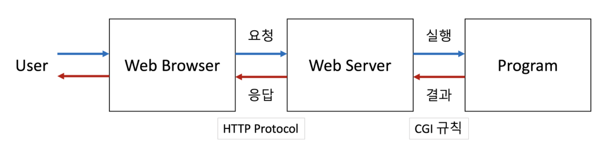

  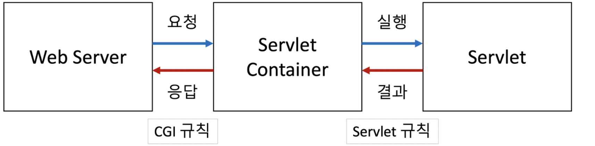

  - 자바 서블릿은 웹 서버와 직접 데이터를 주고 받지 않고 전문 프로그램에의해 관리<br> 이를 서블릿 컨테이너 라고 한다
  - 서블릿 컨테이너 : 서블릿의 생성, 실행 그리고 소멸 등 LifeCycle을 관리하는 CGI프로그램
  - 서블릿 : **Servlet 인터페이스를 구현한 프로그램으로 서버측 프로그램이다**

- ### Servlet(자바로 구현된 CGI)
  - 클라이언트가 어떠한 요청을 하면 그에 대한 결과를 다시 전송해주어야 하는데, <br> 이러한 역할을 하는 자바 프로그램
  - 자바에서 웹 애플리케이션을 만드는 기술(서블릿은 여러개)
  - 자바에서 동적인 웹페이지를 구현하기 위한 표준
  - 클라이언트의 요청을 처리하고, 그 결과를 반환하는 Servlet클래스의 구현 규칙을 지킨 자바 웹 프로그래밍 기술이다

    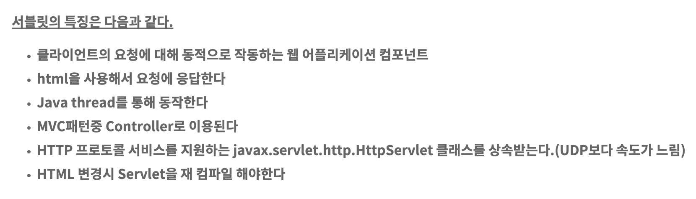

- ### CGI
  - 웹서버와 애플리케이션 사이에 데이터를 주고받는 규약
  - 프로그램 종류로는 컴파일방식(C, C++, java)과 인터프리터 방식(php, python)방식이 존재한다
  - 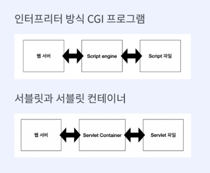
  - 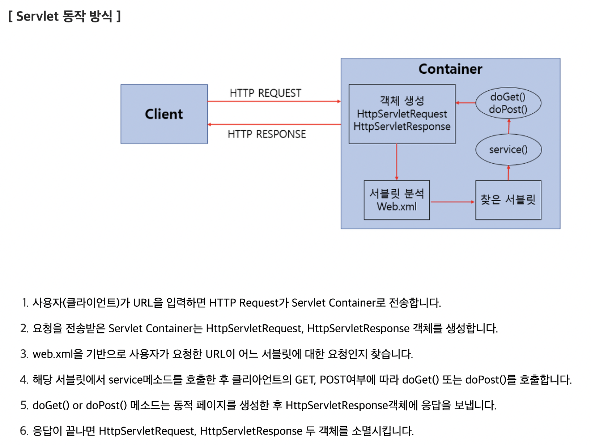

**우리는 cgi규칙을 몰라도 된다**  

**웹서버와 cgi규칙으로 데이터를 주고받는 스크립트 엔진, 서블릿 컨테이너**

## Servlet Container
  - 서블릿의 생성부터 소멸까지의 라이프 사이클을 관리하는 역할
  - 서블릿 컨테이너는 웹 서버와 소켓을 만들고 통신하는 과정을 대신 처리해준다
  - **개발자는 비즈니스 로직에만 집중하면 된다**
  - 서블릿 객체를 싱글톤으로 관리(인스턴스 하나만 생성하여 공유하는 방식)
  - 상태를 유지하게 설계하면 안됨
  - 쓰레드 safety(어떤 공유자원에 여러 쓰레드가 동시에 접근해도 프로그램 실행에 문제가 없는 상태를 의미한다)하지 않다 <br> -> **쓰레드끼리 서로 경쟁한다**

    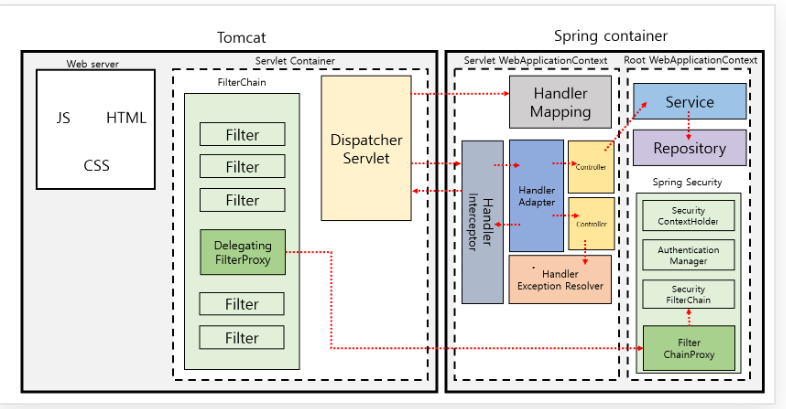

    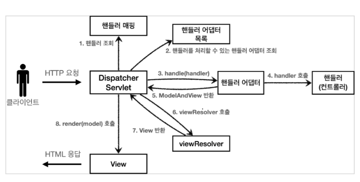

    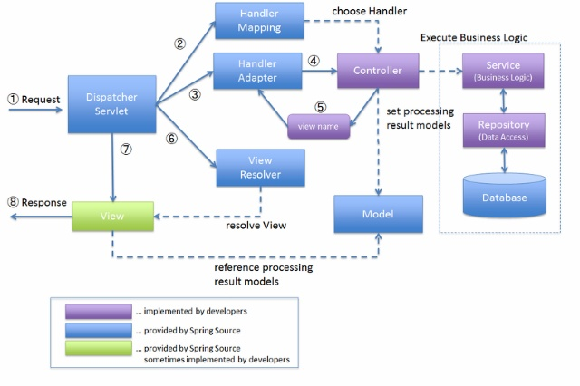

    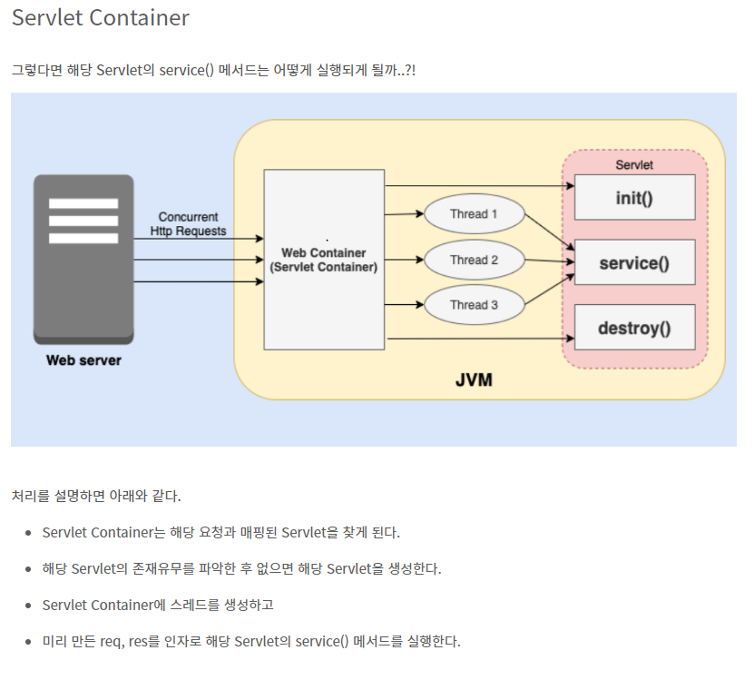

  - Spring MVC
    - Spring MVC는 spring에서 제공하는 웹 모듈로 Model, View, Controller 세가지 구성요소를 사용해 <br> 사용자의 다양한 HTTP Request를 처리하고 단순한 텍스트 형식의 응답부터 REST형식의 응답은 물론 <br> View를 표시하는 html을 return하는 응답까지 다양한 응답을 할 수 있도록 하는 프레임 워크

    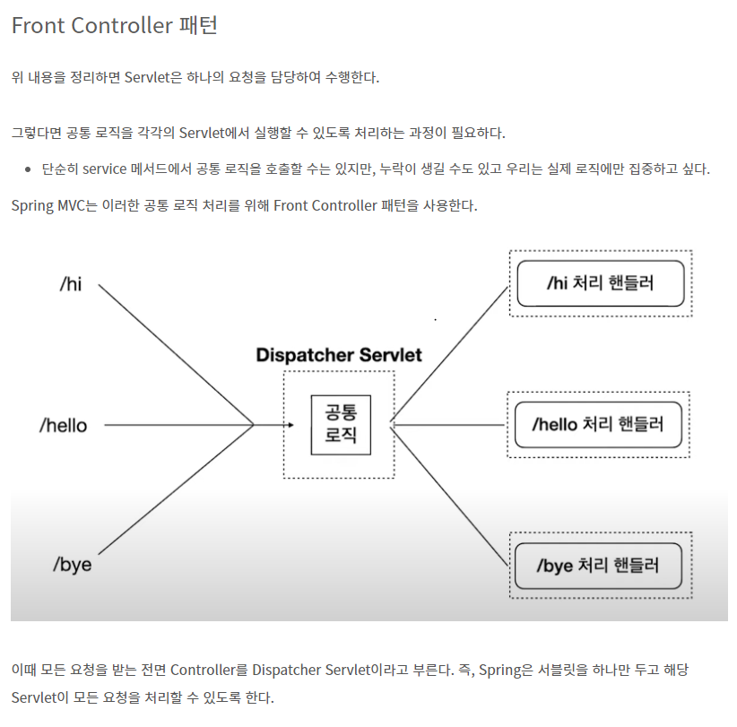

    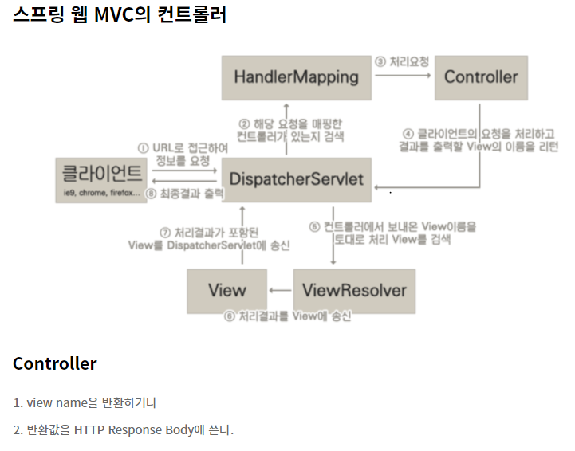

    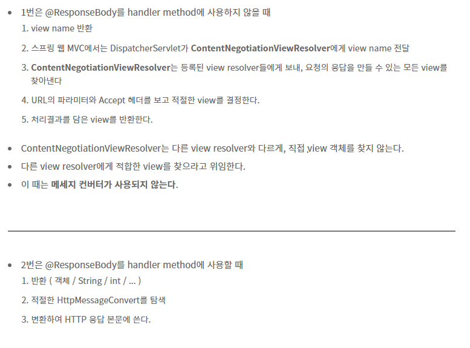

    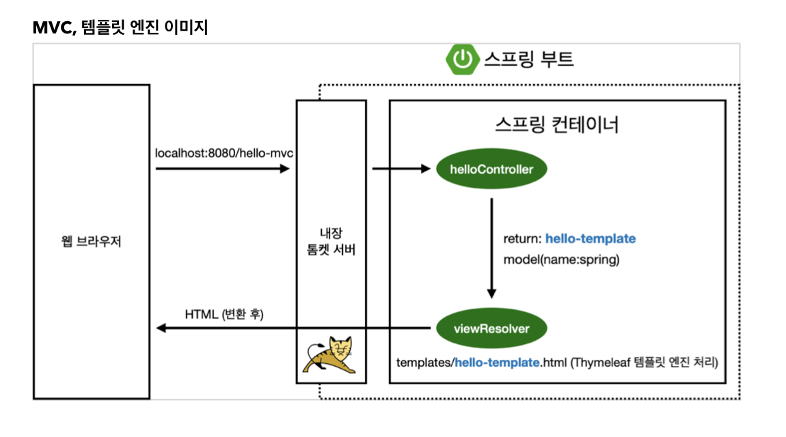

    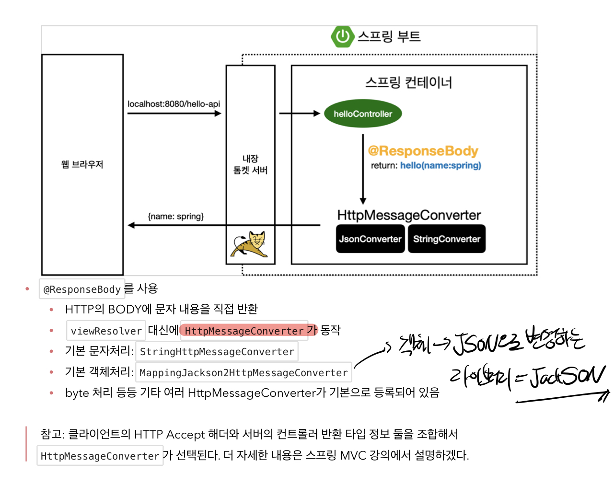


### JSP
  - HTML내에 자바 코드를 삽입하여 웹 서버에서 동적으로 웹페이지를 생성하여 웹브라우저를 돌려주는 언어
  - JSP(Java Server Pages)는 서블릿 기술을 활용하여 동작하는 웹 프로그래밍 기술입니다.
  - JSP는 서블릿 코드를 자동으로 생성하고, 이를 서블릿 컨테이너에서 실행시킵니다.<br> 따라서 JSP는 사실상 서블릿으로 변환되어 실행되는 것이 맞습니다.
  - 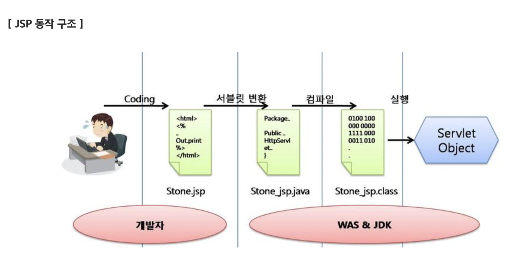


### Was vs Servlet Container
  - **Was는 서블릿 컨테이너를 포함하는 개념**
  - Was는 매 요청마다 스레드 풀에서 기존스레드를 사용한다
  - Was의 주요 튜닝 포인트는 max thread수
  - 대표적인 Was는 톰캣이 있다
  - 프론트, 백엔드 모두` Was`에 들어간다
  - **스프링 부트는 내장톰캣을 가지고 있기 때문에 서블릿 같은 경우에는 톰캣을 따로 설치후 구동해야 한다**
  - (외장 Was) 개발 툴들이 특정한 구조로 개발이 용이하게 프로젝트를 설정해주고 그것을 빌드하면 `war` 나 `jar`파일이 만들어지며 그 파일들을 톰캣에다가(톰캣 내부 폴더에) 모든 파일들을 다 넣는것이 아닌 jar이나 war 파일들만 넣어서 실행시키면 된다
  - jar파일 내부를 확인해 보면 tomcat이 인식할 수 있는 구조로 변환되어 있는 것을 알 수 있다
  - 내장 톰캣이 있으므로 단순히 스프링부트에서 `war`파일을 만든다음 터미널에서 실행시키기만 하면 된다.

  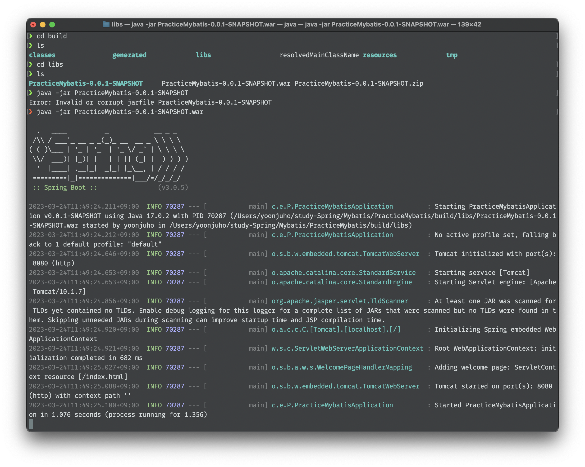

  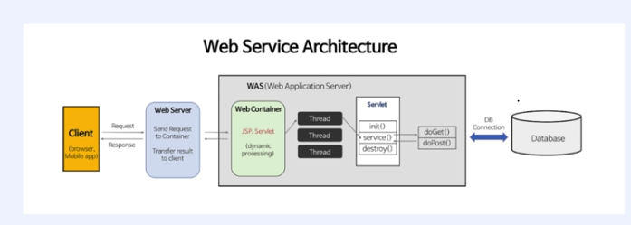


### JDBC
  - 자바에서 DB프로그래밍을 하기위해 사용되는 API
  - **DBCP** : 미리 일정량의 DB커넥션을 생성해서 풀에 저장해 두고있다가 HTTP 요청에 따라 필요할 때 **풀에서 커넥션을 가져다 사용하는 기법**
  - 참고로 스프링 부트 2.0부터는 디폴트 커넥션 풀로 **HikariC**P사용
    - 커넥션 풀 사용시 유의사항 : 커넥션의 사용 주체는 WAS 스레드이므로 커넥션 개수는 WAS 스레드 수와 함께 고려해야 한다
    - 커넥션 수를 크게 설정하면 메모리 소모가 큰 대신 동시 접속자 수가 많아지더라도 사용자 대기시간이 상대적으로 줄어들게 되고, <br>반대로 커넥션 개수를 작게 설정하면 메모리 소모는 적은 대신 그만큼 대기시간이 길어질 수 있다 따라서 **적정량의 커넥션 객체를 생성해 두어야 한다**
  - **DataSource** : 커넥션 흭득하기 위한 표준 인터페이스
  - **HikariCP의 DataSource 사용한다**

    


### Web.xml
  - `web.xml`에서 서블릿 맵핑 되는 방법, 인증이 필요한 URL등의 정보를 확인한다
  - `web.xml`은 WebApplication의 Deployment Descriptor(배포 설명자)로써 XML형식의 파일
  - 모든 Web application은 반드시 하나의 Web.xml파일을 가져야 하고 위치는 WEB-INF폴더 아래에 있다
  - web.xml 파일의 설정들은 Web application 시작시 메모리에 로딩된다
  ``` xml
  <web-app>
    <servlet>
      <servlet-name>welcome</servlet-name>
      <servlet-class>servlets.Servlet</servlet-class>
    </servlet>

    <servlet-mapping>
      <servlet-name>welcome</servlet-name>
      <url-pattern>/welcome</url-pattern>
    </servlet-mapping>
  </web-app>
  ```


### Servlet/Spring 에서 Web.xml은 어떻게 사라졌을까?
- Servlet에서는 web.xml은 SPI(**Service Provider Interface**) 기술을 통해 xml을 없앨 수 있었다
- Spring-Legacy에서는 HandlesTypes 어노테이션에 <br> WebApplicationInitilizer을 지정하여 효율적으로 사용할 수 있었다
- Spring-Boot에서는 Auto-Configuration, Spring Container 대체, 빈 설정 등으로 간편하게 사용할 수 있었다.


## 빌드 도구 종류와 차이점
  - 앤트(Ant)
    - 자바 프로젝트 빌드 도구
    - 이클립스라는 IDE에 기본적으로 탑재되어있다(XML 스크립트를 기반) -> **build.xml**
    - 최근에 나온 빌드 도구들과 달리 자동으로 라이브러리를 업데이트 하는 기능이 <br>없기 때문에 현재는 주로 레거시 시스템에서만 사용
    - Ant는 핵심 Maven 플러그인으로써 사용 가능하다.
    - 수정된 Maven플러그인은 Ant에 구현될 수 있으며, <br>Maven프로젝트는 Maven프로젝트 생명주기 안에서 Ant스크립트를 실행하도록 설정하는것이 가능하다

  - 메이븐(Maven)
    - 메이븐은 Ant이후에 나온 자바 빌드 도구로 **자동**으로 라이브러리와 의존성을 관리하는 기능이 있다
    - Ant와 마찬가지로 **XML스크립트**를 기반으로 하며, pom.xml 파일로 의존성을 관리한다
  
  - 그래들(Gradle)
    - 그래들은 가장 최근에 나온 자바 빌드 도구로 그루비 문법을 사용한다
    - Build.gradle에 스크립트를 작성하며, 대규모 프로젝트에서 복잡해지는 경향이 있는 XML기반 스크립트에 비해 관리가 편하다
## ANT
  - 자바 기반의 빌드 툴
    - Ant는 자바기반으로 플랫폼에 독립적으로 실행(운영체제에 구애받지 않고 프로젝트 진행가능)
    - Ant의 빌드 파일은 xml문서의 구조이며, Ant가 작업을 수행할 프로젝트에 대한 정보를 담고 있다
      ```xml
      <project name="프로젝트이름" default="기본타겟이름" basedir="." > 
       <!--빌드파일의 루트태그.--> 
   
      <target name="타겟이름"> <!--실제 프로젝트가 수행할 작업(Task지정) -->
      <property name="프로퍼티이름1" value="프로퍼티값1"/> 
      <property name="프로퍼티이름2" value="프로퍼티값2"/>
      </target>
    
      <target name="타겟이름1">
      <태스크명/>
      <태스크명1 dir="${build}"/>
      <property name="프로퍼티이름3" value="프로퍼티값3"/>
      </target>
    
      <target name="타겟이름2" depends="타겟이름1">
        <태스크명2 속성1="값1" 속성2="값2"/> 
      <!--타겟 내에서 실제로 수행할 작업 -->
      </target>
      </project>
      ```


## Git Flow
  - Main(= Master)
    - 실제 운영환경에 담겨있는 코드 브랜치<br>
    (조심스럽게 다뤄야 하고 안정적인 코드만 존재해야한다)
  - Dev
    - 모든 작업내용을 담고있는 브랜치
  - Feature
    - 기능 단위의 브랜치
  - Release
    - 배포할 것들을 스냅샷 찍는 느낌
  - Hotfix
    - 급하게 고쳐야할 버그사항들의 빠른 수정을 위한 브랜치


  - Situation
    - **Release Branch 생성 후 추가작업이 필요해질 경우**
      - Dev branch를 기준으로 Release branch를 생성
      - Release Branch를 기준으로 추가 작업을 위한 Branch 생성
      - 추가 작업이 끝나면 Release Branch에 Merge 후 <br> Release Branch를 Master Branch에 Merge한다
      - Merge에 추가된 작업 내용을 Dev Branch에 Mastter Branch를 Merge하여 Master와 Dev의 **Sync**를 맞춘다
      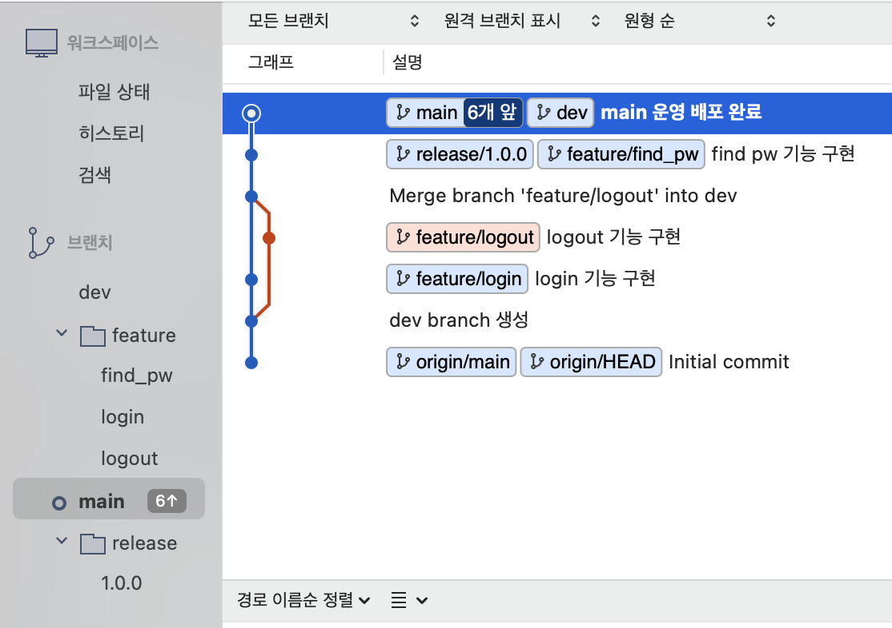

    - **Hotfix가 나가야 할 상황이라면**
      - 운영에서 장애가 발생하여 Hotfix로 이슈를 수정하여 배포가 나가야 한다면<br> Master Branch를 기준으로 Hotfix Branch를 생성한다
      - Hotfix Branch에 수정 작업을 진행한다
      - Hotfix 작업이 끝나면 Master Branch에 Merge한다
      - Dev Branch에 Master Branch를 **merge**하여 Master와 Dev의 Sync를 맞춘다
      - 이후 신규 작업은 Dev Branch를 Base로 새로운 Feature Branch를 생성한다

## Multi Module
  - **Multi Module이란**
    - 필요한 기능별로 Module을 생성한다
    - 레고를 조립하듯 필요한 Module을 조립한다
    - N개의 Module이 조립되어 있는 프로젝트를 **Multi Module** 프로젝트라 부른다
      - ex) 로그인 Module, 인증 Module, DB엔티티 Module 등
      - 예를 들어
        - API서버에서도 DB Entity가 필요하고,
        - Batch서버에서도 동일한 DB Entity가 필요하다면
        - **중복된 Entity를 Module화 시켜 사용하기 위해 Multi Module 프로젝트를 사용한다**
        - 독립적으로 관리한다면 중복해서 관리해야하므로 Risk가 늘어난다
  - **Exception 핸들링**
    - 언어 혹은 프레임워크에서 발생한 Exception은 반드시 **Custom하게 Wrapping**하여 처리한다
    - `@RestControllerAdvice`어노테이션을 사용하여 모든 예외를 해당 클래스에서 클라이언트와 사전에 정의한 값으로 재정의 한다
    - ex) NPE일 경우 Error Code를 4001로 내린다
      - 발생하는 에러에 대한 응답을 일관성 있게, <br> 본인이 원하는 포맷으로 전달할 수 있게 되었습니다.
      - try-catch문으로 작성했을때 지저분한 부분을 없애준다
  - 다른 모듈의 빈을 주입받을 경우
    - 컴포넌트 스캔의 범위를 고려해야한다(`@SpringBootApplication`의 패키지 위치부터 스캔의 대상)
    - 자주쓰는 방식
      ``` java

      @SpringBootApplication(
		      scanBasePackages = {"dev.be.moduleapi", "dev.be.modulecommon"}
      )
      public class ModuleApiApplication {

	      public static void main(String[] args) {
		      SpringApplication.run(ModuleApiApplication.class, args);
	      }

      }

      ```
  - DB연동시 모듈 별 build.gradle에 디펜던시를 추가해 주어야 한다
    - 추가적으로 Entity, Repository 빈들을 주입받을 수 있게끔 컴포넌트 스캔 정의 필요
      ``` java
      //repository 와 Entity 스캔범위 또한 지정해 주어야 한다
      @SpringBootApplication(
          scanBasePackages = {"dev.be.moduleapi", "dev.be.modulecommon"}
      )
      @EntityScan("dev.be.modulecommon.domain")
      @EnableJpaRepositories(basePackages = "dev.be.modulecommon.repository")
      public class ModuleApiApplication {

          public static void main(String[] args) {
            SpringApplication.run(ModuleApiApplication.class, args);
          }

      }

      ```

    - `❯ curl localhost:8080/find`로 빠르게 검증 가능

  - Gradle을 사용해 빌드 및 배포
    ``` groovy
    tasks.register("prepareKotlinBuildScriptModel") {}	//중요하지 않은 오류 처리
    // 모든 모듈들의 settings.gradle을 삭제함으로써 추가한 사항

    tasks.bootJar {enabled = false  }   //xxx.jar파일을 만드는데 common모듈은 실행가능한 jar파일이 필요하지 않다(Main클래스가 없다)
    tasks.jar { enabled = true }    //xxx-plain.jar 파일로 생성된다, plain이 붙으면 디펜던시를 가지고있지않다 클래스와 리소스만을 포함하고 있다 -> 실행시킬수 없는 파일

    ```

    `./gradlew clean :module-api:buildNeeded --stacktrace --info --refresh-dependencies -x test`
    - Module build(test 제외)

  - ### Profile
    - 실제 프로젝트에서는 밑의 사진과 같은 파일로 환경별 Property를 구분한다
      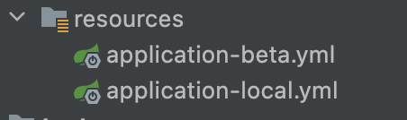
        - 인텔리제이 상에서는 Active profiles를 원하는 환경으로 바꿔주고 구동하면 되고,
        - 인텔리제이같은 IDE를 사용하지않는경우<br> `java -jar -Dspring.profiles.active=local module-api-0.0.1-SNAPSHOT.jar`로 환경변수를 지정한 채 실행 가능
    ``` groovy
        //application-beta.yml 내부

        profile-name : beta
        spring:
          datasource:
            driver-class-name: com.mysql.cj.jdbc.Driver
            url: jdbc:mysql://localhost:3306/multimodule?serverTimezone=Asia/Seoul
            username: root
            password: dbswngh!990
          jpa:
            hibernate:
              ddl-auto: create
            show-sql: true
      ```

## 비동기 프로그래밍
  - 실시간성 응답을 필요로 하지 않는 상황에서 사용한다
    - Email 전송, Push 알림
  - **Thread Pool**
    - 비동기는 `Main Thread`가 아닌 `Sub Thread`에서 작업이 진행
    - JAVA에서는 `ThreadPool`을 생성하여 `Async`작업을 처리한다
    - ThreadPool 생성옵션
      ``` java
      public ThreadPoolExecutor(int corePoolSize, int maximumPoolSize, long keepAliveTime, TimeUnit unit, BlockingQueue<Runable> workQueue){
        this(corePoolSize, maximumPoolSize, keepAliveTime, unit, workQueue, Executors.defaultThreadFactory(), defaultHandler);
      }

      ThreadPoolExecutor executorPool = new ThreadPoolExecutor(5, 10, 3, TimeUnit.SECONDS, new ArrayBlockingQueue<Runable>(50));
      // 적어도 5개의 많게는 10개까지의 쓰레드를 생성 3초동안 일을하지 않으면 자원을 반납하고, 큐에는 50개까지의 Task를 담고 있는구나
      ```
      - CorePoolSize
        - 쓰레드 풀의 최소 쓰레드를 몇개 가지고 있을 것이냐
      - MaxPoolSize
        - 최대 몇개까지의 쓰레드를 할당할 것이냐
      - WorkQueue
        - 먼저들어온 요청을 먼저 처리할수있게끔 자료구조 큐를 이용(요청을 담아놓는 곳)
      - KeepAliveTime
        - CorePoolSize보다 더 많은양의 쓰레드들을 점유하고있을때 <br> 지정한 시간만큼 쓰레드들이 일을하고있지않으면 자원을 반납하겠다라는 옵션
      - 순서
        - 처음, CorePoolSize만큼 쓰레드를 생성해 놓는다
        - CorePoolSize가 3인데 request가 4가 들어온다면,
        - 바로 하나를 더 생성하는것이 아니라 우선 WorkQueue에 담아 놓는다
        - WorkQueue의 크기만큼 새로운 요청을 받아 들이다가 다 차면
        - MaxPoolSize만큼 쓰레드를 생성하게 된다.
  - `@EnableAsync` : Async를 쓸수 있는 어노테이션

  - 특정 로직의 실행이 끝날때까지 기다리는 것이 아닌 다른일을 먼저 처리하는 것
  - 스프링에서의 비동기
    - `AppConfig`(쓰레드 풀 생성)
      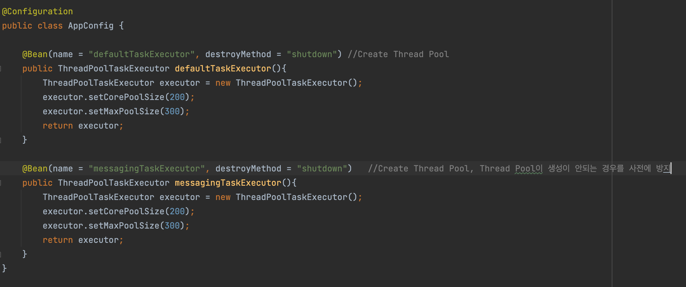

    - `EmailSerivce`(쓰레드 풀 설정)
      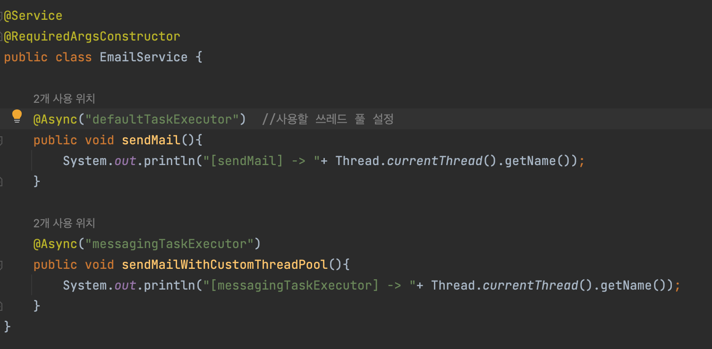
    
    - `AsyncConfig`(**Async를 사용할 수 있게끔 구성하는 것**)
      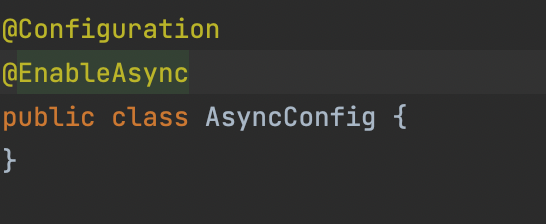

    
    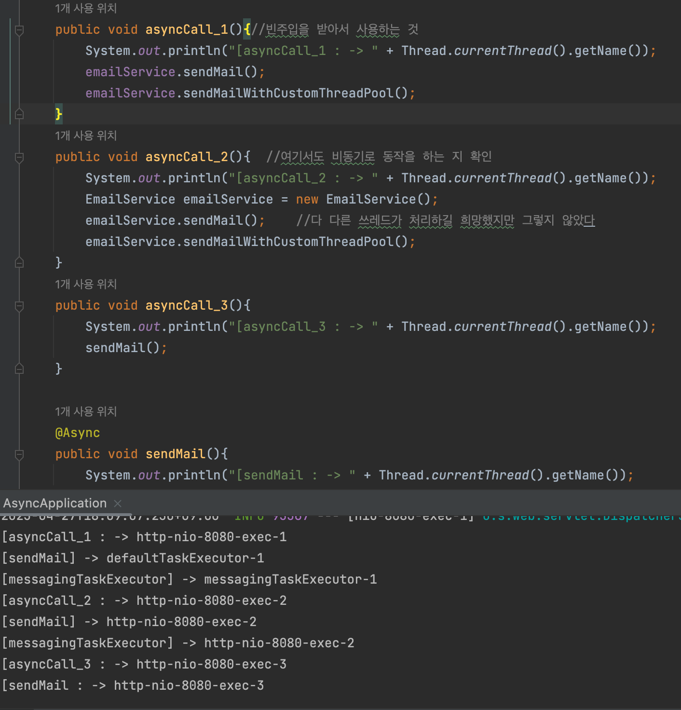

    - `asyncCall_1`은 빈주입을 받아서 사용하는 것
      - 모두 다른 쓰레드가 처리 -> 비동기적 방식
    - `asyncCall_2`는 일반적으로 인스턴스를 생성
      - 모두 같은 쓰레드가 처리 -> 동기적 방식
    - `asyncCall_3`은 내부 클래스안에 Async애노테이션으로 구성
      - 모두 같은 쓰레드가 처리 -> 동기적 방식
    - 기본적으로 스프링에서 **비동기적**으로 처리하기 위해서는 스프링의 도움이 필요하다
    - 스프링 프레임워크가 내가 비동기로 처리하고자 하는 메서드(**그 메서드 들을 가지고있는 `EmailService`는 빈으로 등록이 되어있다**)
    <br> 그 빈을 가지고 왔을때 순수한 빈을 `AsyncService`에 반환하는 것이 아니다
    - `EmailService`같은경우는 Async하게 동작을 해야 하므로 한번더 프록시 객체로 Wrapping 해준다 
      
    - `emailService.sendMail()` 이때, 비동기로 동작할 수 있게 Sub Thread에게 위임해준다
    - 3번째의 경우 이미 AsyncService는 빈(자신)을 가지고 왔다
      - 이 경우 메서드에 다이렉트로 접근하므로, Wrapping된 빈을 사용해야하는데 그러지 못한다<br> -> 동기적 처리
    - **중요한것은 스프링컨테이너에 등록된 빈을 사용해야 한다**

## Feign Client
  - 프로그래밍을 하다보면 외부 컴포넌트와 통신을 하는 일이 발생한다
    - 예) `RestTemplate`, 요즘은 `Feign Client`를 더 많이 쓴다
    ``` groovy
    feign:
      url:
        prefix: http://localhost:8080/target_server #DemofeignClient에서 사용할 url prefix 값
      client:
        config:
          default:
            connectTimeout: 1000
            readTimeout: 3000
            loggerLevel: NONE
          demo-client: # DemoFeignClient에서 사용할 Client 설정 값
            connectTimeout: 1000
            readTimeout: 10000
            loggerLevel: HEADERS  # 여기서 설정한 값은 FeignCustomerLogger -> Logger.Level logLevel 변수에 할당됨
        
    
    ```
  - **Feign Feature**
    - **Connection/Read Timeout**
      - 외부 서버와 통신 시 Connection/Read Timeout설정이 가능하다
      ``` java
        @FeignClient(
        name = "demo-client"
        , url = "${feign.url.prefix}",   // 요청을 보내고자 하는 타켓 URL
        configuration = DemoFeignConfig.class
        )
        public interface DemoFeignClient {

        @GetMapping("/get")
        ResponseEntity<BaseResponseInfo> callGet(@RequestHeader("CustomHeaderName") String customHeader,
                                             @RequestParam("name") String name,
                                             @RequestParam("age") Long age);
                                              }

       ```
      - `DemoController` -> `DemoService` -> `DemoFeignClient` -> `DemoFeignClient.callGet` ->  `TargetController`
    - **Feign Interceptor**
      - 외부로 요청이 나가기 전에 만약 공통적으로 처리해야 하는 부분이 있다면 <br> Interceptor를 재정의 하여 처리가 가능하다
      ``` java
      @Bean
      public DemoFeignInterceptor feignInterceptor() {
        return DemoFeignInterceptor.of();
      }


      @RequiredArgsConstructor(staticName = "of") // return DemoFeignInterceptor.of();
      public class DemoFeignInterceptor implements RequestInterceptor {
        @Override
        public void apply(RequestTemplate template) {
          //Get 요청의 경우
          if(template.method() == Request.HttpMethod.GET.name()){
              System.out.println("[GET] [DemoFeignInterceptor] queries :" + template.queries());
              return;
          }

          //Post 요청의 경우
          String encodedRequestBody = StringUtils.toEncodedString(template.body(), StandardCharsets.UTF_8); //Apache Commons Lang3  
          //Encoding : binary data -> String
          System.out.println("[POST] [DemoFeignInterceptor] requestBody: " +encodedRequestBody);

          // 추가적으로 본인이 필요한 로직을 추가
          String convertRequestBody = encodedRequestBody;
          template.body(convertRequestBody);
        }
      }
      ```
    - Feign Logger
      - Request/Response등 운영을 하기 위한 적절한 Log를 남길 수 있다<br>
      -생략-

    - Feign ErrorDecoder
      - 요청에 대해 정상응답이 아닌 경우 핸들링이 가능하다<br> -생략-

## Apache Commons Lang 3
  - Apache CommonsLang 3라이브러리는 자바의 API의 핵심 클래스의 **조작에 대한 자원을 제공한다** <br> 이 자원에는 문자열, 숫자, 날짜, 동시성, 개체반사등을 처리하는 메서드가 포함된다
  - `StringUtils`
    - `StringUtils`클래스는 문자열에 대한 `null-safe` 작업을 위한 메서드를 제공한다
    - 이 클래스의 많은 메서드에는 클래스 `java.lang.String`에 정의된 해당 메서드가 있다. 
    - 이것은 `null-safe`가 아니다. 그러나 `String` 클래스에 동등한 항목이 없는 여러 메서드에 중점을 둔다.


## 배포파일 원격 전송
  - ### SCP
    - allows you to securely copy files and directories between two locations.
    <br> (비슷한 예로는 `FTP`가 존재)
    - 사용되는 상황
      - local -> remote
        - HTTPS 통신을 할때 필요한 SSL 인증서를 보낼때 사용
      - remote -> local
        - Heap Dump 파일과 같은 로그 파일들을 분석하기 쉽게 보낼때 사용
      - remote -> remote
        - Server Config 파일
    - `SSH`를 사용하므로 **SSH key** 혹은 Password가 필요하다
      - 처음 접속은 `key`로 그 후 `Password`로 접속하게끔 수정 가능
      - `SSH`:네트워크 프로토콜 중 하나로 컴퓨터와 컴퓨터가 인터넷과 같은 Public Network를 통해서 서로 통신을 할 때<br> 보안적으로 안전하게 통신을 하기 위해 사용하는 프로토콜이다.
    - 일반적인 상황
      - `scp file.txt remote_username@1.1.1.1:/remote/directory`


## AWS
  - **CI/CD란?**
    - CI(`Continuous Integration`) : 자동으로 프로젝트에 코드가 머지된다
    - CD(`Continuous Deployment`) : 자동으로 코드가 배포된다
    - 개발을 좀 더 수월하게 하기 위해 사용한다
  - **EC2**
  - **IAM**
    - `IAM`(`AWS Identity and Access Management`)은 AWS리소스(`EC2, S3, RDS` 등)를 사용하도록 인증 및 권한 부여된 대상을 제어합니다.
  - **Code Deploy**
    - `AWS CodeDeploy`는 Amazon EC2 인스턴스 및 온프레미스에서 실행 중인 인스턴스를 비롯하여 모든 인스턴스에 대한 **코드 배포**를 자동화하는 서비스입니다.
    - 
  - **RDS**
    - 원격 DB를 설정하는 것
  - **S3**
    - 원격 저장소

## GitHub Actions
  - **GitHub Actions**는 GitHub에서 제공하는 서비스로, 빌드, 테스트, 배포 파이프라인을 자동화할 수 있는 <br> `CI(Continuous Integration, 지속 통합)`와 `CD(Continuous Deployment, 지속 배포)` 플랫폼입니다.


## Base64
  - **인코딩**
    - 인코딩은 정보의 형태나 형식을 표준화, 보안, 처리 속도 향상, 저장 공간 절약 등을 위해서 다른 형태나 형식으로 변환하는 처리 혹은 그 처리 방식을 의미
    - **BinaryData -> Text = Base64 Encoding**
  - **Base64란**
    - **Binary Data**를 **Text**로 바꾸는 Encoding의 하나로써 Binary Data를 Character set에<br> 영향을 받지 않는 공통 ASCII 영역의 문자로만 이루어진 문자열로 바꾸는 Encoding이다
    - 변경하는 방식은 BinaryData를 6bit씩 자른 뒤 6bit에 해당하는 문자를 Base64색인표에서 찾아 치환한다
      - Base62는 바이너리 데이터를 문자집합 62개를 기준으로 인코딩/디코딩하는 것을 의미

    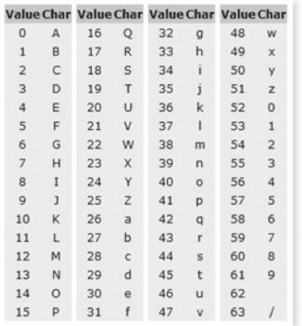
    > Base64 색인표

    - **왜 사용하는가?**
      - Base64 Encoding을 하게되면 전송해야 될 데이터의 양도 33% 증가한다 <br> **6bit당 2bit의 overhead가 발생하기 때문에**
      - 플랫폼 독립적으로 BinaryData를 전송 할 필요가 있을 때, ASCII로 Encoding하여 전송하게 되면 여러가지 문제가 발생할 수 있다
      - **따라서, 포함된 BinaryData가 시스템 독립적으로 동일하게 전송 또는 저장되는걸 보장하기 위해 사용한다**
