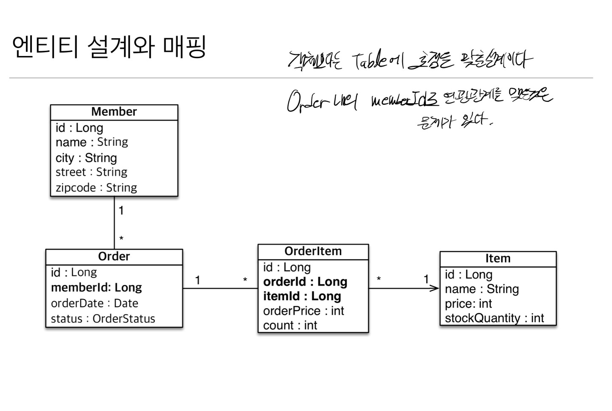
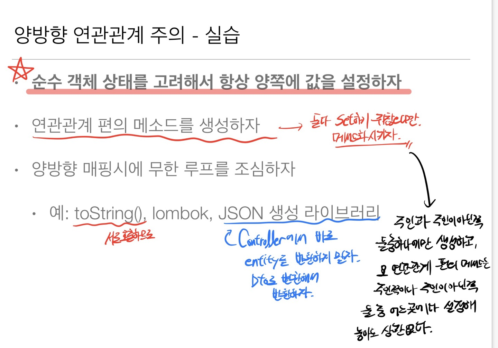
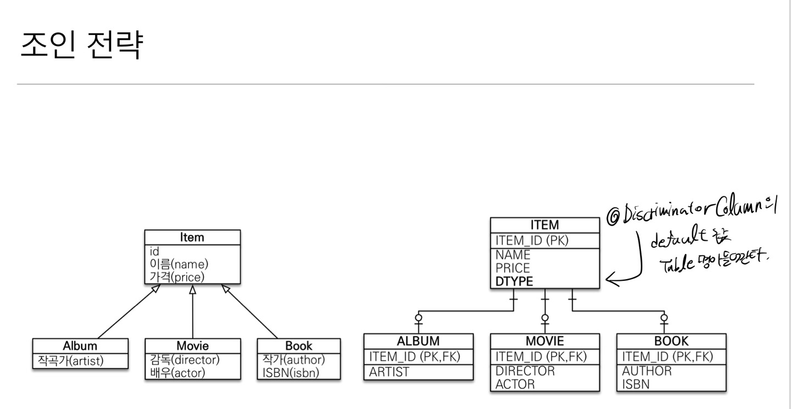

# JPA

 ## 목차
  - ### JPA 기본
    - [**Init(배경 지식)**](#init(배경-지식))
    - [**영속성 관리**](#영속성-관리)
    - [**엔티티 매핑**](#엔티티-매핑)
    - [**연관관계 매핑**](#연관관계-매핑)
    - [**다양한 연관관계 매핑**](#다양한-연관관계-매핑)
    - [**고급 매핑**](#고급-매핑)
    - [**프록시와 연관관계 관리**](#프록시와-연관관계-관리)
    - [**값 타입**](#값-타입)
    - [**JPQL**](#jpql)

  - ### JPA 활용
    - [**프로젝트 구성**](#프로젝트-구성)
    - [**도메인 분석 설계**](#도메인-분석-설계(중요))
    - [**애플리케이션 구현**](#애플리케이션-구현)
  


-------------------

### JPA 기본
- 지금 시대는 객체를 관계형 DB에 관리한다
- **객체 -> SQL변환 -> RDB**

## Init(배경 지식)
  - ### 객체와 관계형 데이터베이스의 차이
    - 상속
      - DB에 저장할 객체에는 상속관계 안쓴다
    - 연관관계
      - 객체는 참조를 사용
      - 테이블은 외래키를 사용 
      - -> 즉 , **서로 연관관계를 바라보는 시선이 다르다**
      - 
    - 데이터 타입
    - 데이터 식별 방법
    - **객체를 자바 컬렉션에 저장하듯이 DB에 저장할 수는 없을까??** <br> -> **JPA**
  
  - ### JPA
    - 자바 진영의 ORM 기술 표준
    - **ORM** : 객체 관계 매핑, 객체는 객체대로 설계, RDB는 RDB대로 설계 <br> ORM프레임워크가 중간에서 매핑 -> **패러다임의 불일치를 해결**
    - **SQL 중심적인 개발에서 객체 중심으로 개발**

      
      
      
      

    - ```java 
      jpa.persist(member) // 저장
      Member member = jpa.find(memberId)  // 조회 -> 객체 그래프 탐색
      //동일한 트랜잭션에서 조회한 엔티티는 같음을 보장
      member.setName("변경할 이름")   //수정
      jpa.remove(member)  //삭제

      SQL은 JPA가 처리
      ```
    - JPA의 성능 최적화 기능
      - 1차캐시와 동일성 보장(영속성 컨텍스트)
      - 트랜잭션을 지원하는 쓰기 지연(커밋할때까지 INSERT SQL을 모음)
      - 지연로딩과 즉시로딩(객체가 실제사용될때 로딩, 한번에 연관된 객체까지 미리 조회)  

    - JPA는 특정 데이터베이스에 종속적이지 않다
      - 
      - javax : 표준 패키지
      - hibernate : 전용옵션 (hibernate가 아닌 다른 JPA구현체를 사용해도 된다, <br>      내부적으로 JDBC API를 쓴다)
      - jdbc : java 어플리케이션에서 db에 접속할 수 있도록 도와주는 API<br> 현재 javax.  sql패키지에 포함되어 있다

    - JPA 구동 방식
      - 
      - `EntityManagerFactory`는 하나만 생성해서 애플리케이션 전체에서 공유(DB당 하나)
      - `EntityManager`는 쓰레드간에 공유 X
      - JPA의 모든 데이터변경은 트랜잭션 안에서 실행
    
    - JPQL
      - JPA를 사용하면 엔티티 객체를 중심으로 개발
      - **애플리케이션이 필요한 데이터만 DB에서 불러오려면 <br> 결국 검색조건이 포함된 SQL이 필요하다**
      - JPA는 SQL을 추상화한 JPQL이란는 객체지향 쿼리 언어를 제공
      - JPQL은 엔티티 객체를 대상으로 쿼리
      - SQL은 데이터베이스 테이블을 대상으로 쿼리

## 영속성 관리
  - **JPA에서 가장 중요한 2가지**
    - 객체와 관계형 DB 매핑
    - 영속성 컨텍스트

  - ### 영속성 컨텍스트
    - 엔티티를 영구저장하는 환경이라는 뜻

      

    - `EntityManger.persist(entity);`

      
    
    - 엔티티의 생명 주기
      - 비영속
        - 영속성 컨텍스트와 전혀 관계가 없는 새로운 상태
        - JPA와 관계없는 상태
      - 영속
        - 영속성 컨텍스트에 관리되는 상태
        - **persist**
      - 준영속(**detached**)
        - 영속성 컨텍스트에 저장되었다가 분리된 상태
      - 삭제
        - 삭제된 상태

    - 영속성 컨텍스트의 이점
      - 1차 캐시
        - 1차 캐시는 한 트랜잭션 내에서만 이점이 있다 (전체적인 성능향상은 X)
        - 1차 캐시에 없으면 DB조회 후 1차캐시에 저장한다
      - 동일성 보장
      - 트랜잭션을 지원하는 쓰기 지연
        - 엔티티 매니저는 데이터 변경시 트랜잭션을 시작해야한다
          ```java
          EntityManager em = emf.createEntityManager();
          EntityTransaction transaction = em.getTransaction();

          //엔티티 매니저는 데이터 변경시 트랜잭션을 시작해야 한다

          transaction.begin();

          ...

          transaction.commit();
          ```
      - 변경 감지
        
      - 지연 로딩

    - 플러시(`flush`)
      - 영속성 컨텍스트의 변경내용을 디비에 반영
      - 발생
        - 변경 감지
        - 수정된 엔티티 쓰기지연 SQL 저장소에 등록
        - 쓰기 지연 SQL 저장소의 쿼리를 데이터베이스에 전송
      - 기준
        - `em.flush : 직접호출` 
        - 트랜잭션 커밋 : 플러시 자동 호출
        - JPQL 쿼리 실행 : 플러시 자동 호출
      - 영속성 컨텍스트를 비우지 않는다
      - 영속성 컨텍스트의 변경내용을 데이터베이스에 동기화

    - 준영속 상태로 만드는 방법
      - `em.detach(entity) : 특정 엔티티만 준영속 상태로 전환`
      - `em.clear() : 영속성 컨텍스트를 완전히 초기화, 1차캐시를 전체 삭제`
      - `em.close() : 영속성 컨텍스트를 완전히 종료` 

## 엔티티 매핑
  - ### 객체와 테이블 매핑
    - `@Entity`가 붙은 클래스는 JPA가 관리
    - 기본 생성자 필수
    - `final클래스, enum, interface, inner클래스` 사용 불가
  
  - ### 데이터베이스 스키마 자동 생성
    - DDL : 데이터베이스 스키마를 정의하거나 조작하기 위한 언어
    - DDL을 애플리케이션 실행 시점에 자동 생성
    - 테이블 중심 -> 객체 중심
    - 데이터베이스 방언을 활용해서 데이터베이스에 맞는 적절한 DDL생성
      - Oracle -> `varchar2`, H2 -> `varchar`
    - 속성
      - `hibernate.hdm2ddl.auto.create` : 기존 테이블 삭제후 다시 생성
      - `hibernate.hdm2ddl.auto.create-drop` : create와 같으나 종료시점에 테이블 drop
    - 운영장비에서는 절대 create, create-drop, update 사용하면 안된다
    - 스테이징과 운영서버는 validate 또는 none속성을 사용하자
    - DDL 생성기능
      - 제약조건 추가 : `@Column(nullable=false, length=10)`
      - **DDL생성 기능은 DDL을 자동생성할 때만 사용되고, JPA의 실행로직에는 영향을 주지 않는다**

  - ### 필드와 컬럼 매핑
    - 매핑 어노테이션 정리
      - `@Column` : 컬럼 매핑
      - `@Temporal` : 날짜 타입 매핑
      - `@Enumerated` : enum 타입 매핑 -> **ORDINAL속성 사용 X**
      - `@Lob` : BLOB, CLOB 매핑 -> 큰 데이터를 넣고 싶다면
      - `@Transient` : 매핑 무시 -> 메모리에서만 쓰겠다는 뜻

  - ### 기본 키 매핑
    - `@Id` : 기본키 직접 할당
    - `@GeneratedValue` : 자동 생성
      - `IDENTITY` : 데이터베이스에 위임
        - 기본 키 생성을 데이터베이스에 위임하는 것
        - 주로 MySQL, SQL Server 에서 사용
        - ex) MySQL의 AUTO_INCREMENT
        - JPA는 보통 트랜잭션 커밋 시점에 INSERT SQL 실행
        - AUTO_INCREMENT는 데이터베이스에 INSERT SQL을 실행한 이후에 ID값을 알수 있다
        <br> PK값이 DB에 저장된 후에야 알수 있기 때문에 영속성 컨텍스트에 저장되어야 하므로 `em.persist`시점에 즉시 INSERT SQL 실행하고 DB에서 식별자를 조회한다
        - `@Id @GeneratedValue(strategy = GenerationType.IDENTITY)`

      - `SEQUENCE` : 데이터베이스 시퀀스 오브젝트 사용
        - 데이터베이스 시퀀스는 유일한 값을 순서대로 생성하는 특별한 데이터베이스
       오브젝트
        - 주로 오라클, h2 등에서 사용
            ``` java
            @Entity
            @SequenceGenerator(
                    name = "MEMBER_SEQ_GENERATOR",
                    sequenceName = "MEMBER_SEQ",  //매핑할 데이터베이스 시퀀스 이름
                    initialValue = 1, allocationSize = 1)
            public class Member {
            @Id
            @GeneratedValue(strategy = GenerationType.SEQUENCE, generator = "MEMBER_SEQ_GENERATOR")
            private Long id;
            }
      
            ```
            
            
    
      - `TABLE` : 키 생성용 테이블 사용
        - 키 생성 전용 테이블을 하나 만들어서 데이터베이스 시퀀스를 흉내내는 전략
        - 성능 이슈 발생
      - `AUTO` : 자동지정(기본값)

    - **권장하는 식별자 전략**
      - 기본키 제약조건 : null x, 유일, 변하면 안된다
      - 예를 들어 주민등록번호도 기본키로 적절하지 않다
      - **권장 : Long형 + 대체키(UUID, 순차키) + 키 생성전략 사용**

    
    

  - ### 데이터 중심 설계의 문제점
    - 현재 방식은 객체 설계를 테이블 설게에 맞춘 방식 -> **XXXXXXX**
    - 테이블의 외래키를 객체에 그대로 가져옴
    - **객체 그래프 탐색**이 불가능하다(외래키를 그대로 가지고 있으므로)


## 연관관계 매핑
  - **목표**
    - 객체와 테이블 연관관계의 차이를 이해
      - 객체는 N:N매핑이 가능하지만 테이블은 그러지 못한다.
    - 객체의 참조와 테이블의 외래키를 매핑

  - ### 객체지향 설계의 목표는 자율적인 객체들의 협력 공동체를 만드는 것이다
  
  - ### 단반향 연관관계
    

    

    

  - ### 양방향 연관관계와 연관관계의 주인
    - 테이블은 방향이라는 개녕이 없고(양쪽으로 조인), 객체만 방향이라는 개념이 있지만<br>이것또한 양방향이라는 단어보다는 단뱡향이 2개라는 개념으로 받아들여야한다
      
      

    - 양방향 매핑(반대 방향으로 객체 그래프 탐색)
      ```java
      //조회 
      Team findTeam = em.find(Team.class, team.getId());

      //Team으로 객체그래프를 탐색할 수 있다
      int memberSize = findTeam.getMembers().size(); //역방향 조회
      ```
      
      
      - 객체의 양방향 관게는 사실 양방향관계가 아니라 서로 다른 단방향 관계 2개이다
      - 테이블은 외래 키 하나로 두 테이블의 연관관계를 관리

      

      - 연관관계의 주인
        - 양방향 매핑 규칙
          - 객체의 두 관계중 하나를 연관관계의 주인으로 지정
            - 객체는 단방향 2개, 테이블은 양방향 1개의 개념이므로 서로 상충된다
            - 즉, 연관관계의 주인을 지정해주어야 한다
          - 연관관계의 주인만이 외래키를 관리한다(등록, 수정)
          - 주인이 아닌쪽은 읽기만 가능해야 한다
          - 주인은 `mappedBy` 속성 사용 x
          - 주인이 아니면 `mappedBy` 속성으로 주인을 지정해 주어야 한다


      

      

      - **정리**
        - 단방향 매핑만으로도 이미 **연관관계 매핑**은 완료된 상태이다 
        - 양방향 매핑은 반대방향으로 조회(**객체 그래프 탐색**)기능이 추가된 것 뿐
          - 양방향 매핑은 테이블에 영향을 주지 않는다
        - JPQL에서 역방향으로 탐색할 일이 많다 

        즉, 
        1. 처음 설계시 모두 단방향으로 설계를 완료하자
        2. 필요하다면 양방향으로 추가 설계를 하자
      
      - 연관관계의 주인을 정하는 기준
        - **비즈니스 로직을 기준으로 연관관계의 주인을 선택하면 안된다**
        - 연관관계의 주인은 **외래 키**의 위치를 기준으로 정해야 한다
        - 외래키를 관리하는 참조가 주인


## 다양한 연관관계 매핑
  - ### 연관관계 매핑시 고려사항 3가지
    - 다중성
      - 다대일(`@ManyToOne`)
      - 일대다(`@OneToMany`)
      - 일대일(`@OneToOne`)
      - 다대다(`@ManyToMany`) -> 쓰지 말자
    - 단방향, 양방향
    - **연관관계의 주인**
      - 다대일 -> 보통 이렇다

      - 일대다
        
        - 엔티티가 관리하는 외래 키가 다른 테이블에 있다
        - 연관관계 관리를 위해 추가로 `UPDATE SQL` 실행
        - 쓰지말자.

      - 일대일
        - 주 테이블(`Member`)이나 대상 테이블(`Locker`) 중에 외래 키 선택 가능
          - 어디에 상대방에 외래키가 들어가도 상관 없다
        - 외래 키에 데이터베이스 유니크 제약조건 추가
          
          
          
          
          
          
          
          
          

      - 다대다
        - 관계형 데이터베이스는 정규화된 테이블 2개로 다대다 관계를 표현할 수 없다
        - 연결테이블을 추가해서 일대다, 다대일 관계로 풀어내야 한다
        - `@JoinTable`로 연결 테이블을 지정
          - 연결테이블이 단순하게 연결만하고 끝나지않고<br> 주문시간, 수량같은 데이터가 들어올 수 있으므로 지양하자 
        - 아니면, 연결 테이블용 엔티티를 추가로 생성한다(연결테이블을 엔티티로 승격)

    
## 고급 매핑
  - ### 상속관계 매핑
    - 관계형 디비는 상속관계가 없다
    - 슈퍼타입 서브타입 관계라는 모델링 기법이 객체 상속과 유사하다
    - 상속관계 매핑 : **객체의 상속과 구조**와 **DB의 슈퍼타입 서브타입관계**를 매핑
    - 구현하는 방법(논리모델을 물리모델로)
      - 각각 테이블로 변환 (**조인 전략**)
      - 통합 테이블로 변환 (**단일 테이블 전략**)
      - 서브타입 테이블로 변환 (**구현 클래스마다 테이블 전략**) - XXXX
        - **구현 클래스마다 테이블 전략**은 쓰지말자 **(비추천)**

    - 주요 어노테이션
      - `@Inheritance(strategy = InheritanceType.JOINED)` - > 조인전략
      - `@Inheritance(strategy = InheritanceType.SINGLE_TABLE)` -> 단일 테이블 전략
      - `@Inheritance(strategy = InheritanceType.TABLE_PER_CLASS)` -> 구현 클래스마다 테이블 전략
      - `@DiscriminatorColumn(name="DTYPE")`
      - `@DiscriminatorValue("B")`
        
        
        
        

  - **@MappedSuperclass**
    - 상속관계랑은 상관 없고, 단지 공통 매핑정보가 필요할 때 사용
    - `Member`랑 `Seller` 가 공통 속성을 `id`, `name`을 가진다면 <br>`BaseEntity`를 두어 거기에 공통으로 사용하는 매핑정보를 모으는 역할
    - 상속관계 매핑도 아니고,
    - 엔티티도 아니다 -> 조회, 검색 불가하다
    - 직접 생성해서 사용할 일이 없으므로 추상클래스 권장
      ``` java
      @MappedSuperclass
      public abstract class BaseEntity {

      private String createdBy;
      private LocalDateTime createDate;
      private String lastModifiedBy;
      private LocalDateTime lastModifiedDate;
      }

      public class Item extends BaseEntity{
        ...
        }
      // Item 테이블에 BaseEntity 속성들이 컬럼으로 들어간다 그뿐.
      ```


## 프록시와 연관관계 관리
  - ### 프록시
    - 빈 껍데기
      
      

    - 프록시 객체는 실제 객체의 참조를 보관
    - 프록시 객체를 호출하면 프록시 객체는 실제 객체의 메소드 호출

      

      

      

    - 프록시 확인
      - 프록시 인스턴스의 초기화 여부 확인
        - `PersistenceUnitUtil.isLoaded(Object entity)` `entity`에 `proxy`인스턴스가 들어가면 된다
      - 프록시 클래스 확인 방법
        - `entity(= proxy).getClass.getName()` 출력
      - 프록시 강제 초기화
        - `org.hibernate.Hibernate.initialize(entity(= proxy))`


    - 프록시와 즉시로딩 주의
      - 가급적 지연로딩만 사용
      - 즉시로딩을 적용하면 예상하지 못한 SQL이 발생한다
      - 즉시로딩은 JPQL에서 N+1문제를 일으킨다
        - 지연로딩 또한 일으키는 경우도 존재한다
        - N+1 문제 : 각 `Member`에 대한 `Team`을 찾기위한 Query가 또 한번 나가는 경우 <br> 한번 `Member`를 찾는 Query가 나가고 그로 인해 조회된 N명의 `Member`들의 팀을 찾는 Query가 나가는 경우를 의미한다


  - ### 즉시로딩과 지연로딩
    - 지연로딩 사용시 -> `Proxy`객체로 조회한다
      - `Proxy`객체 예 : `class hellojpa.Team$HibernateProxy$yChkvCrz`
      - 실제 객체를 사용할 시점에 초기화된다(-> DB조회)
    - 즉시로딩은 말그대로 즉시 연관된 모든 엔티티들을 조회한다
      - JPA구현체(`Hibernate`)는 가능하면 조인을 사용해서 SQL한번에 함께 조회한다
      ```java
      @ManyToOne(fetch = FetchType.LAZY)
      @ManyToOne(fetch = FetchType.EAGER)
      ```

  - ### 영속성 전이(CASCADE)
    - 특정 엔티티를 영속상태로 만들 때 연관된 엔티티도 함께 영속 상태로 만들고 싶을 때
    - **Persist에 해당한다**
    - 예시 : `@OneToMany(mappedBy="parent", cascade=CascadeType.PERSIST)`
    - **영속성 전이는 연관관계를 매핑하는 것과는 아무런 관련이 없다**
    - 엔티티를 영속화할때 연관된 엔티티도 함께 영속화하는 **편리함**을 제공할 뿐이다
    - 단일 엔티티에 종속적인 경우에만 사용하도록 하자
    - 부모와 자식의 관계가 끊어졌다 해서 자식을 삭제하지 않는다

    - CASCADE의 종류
      - ALL : 모두 적용
      - PERSIST : 영속
      - REMOVE : 삭제(부모가 자식의 삭제 생명주기를 관리한다)
      - MERGE : 병합
      - REFRESG : refresh
      - DETACH : detach

  - ### 고아 객체
    - 고아 객체 제거 : 부모 엔티티와 연관관계가 끊어진 자식 엔티티를 자동으로 삭제한다
    - `orphanRemoval = true`
    - 참조가 제거된 엔티티는 다른 곳에서 참조하지 않는 고아 객체로 보고 삭제하는 기능
    - **참조하는 곳이 하나일 때 사용가능하다**
    - 즉, **특정 엔티티가 개인 소유 할 때** (`@OneToOne`, `@OneToMany`만 가능)
    - 참고: 개념적으로 부모를 제거하면 자식은 고아가 된다 <br> 따라서 고아 객체 제거 기능을 활성화 하면, 부모를 제거할 때 자식도 함께 제거된다<br> 이것은 `CascadeType.REMOVE`처럼 동작한다
      ``` java
      // Team.java
      @Entity
      public class Team {

      @Id @GeneratedValue(strategy = GenerationType.IDENTITY)
      private Long id;

      private String name;

      @OneToMany(
        mappedBy = "team",
        fetch = FetchType.LAZY,
        cascade = CascadeType.PERSIST,
        orphanRemoval = true
      )
      private List<Member> members = new ArrayList<>();
      }
      ```

    - ### 영속성 전이 + 고아 객체, 생명주기
      - `CascadeType.ALL + orphanRemoval = true`
      - 부모엔티티를 통해서 자식의 생명주기를 관리할 수 있다
        


## 값 타입
  - ### 기본 값 타입
    - JPA의 데이터 타입 분류
      - 엔티티 타입
        - Entity
      - 값 타입
        - 기본값 타입(`int, Integer, String`)
        - 임베디드 타입(`embedded type`)
          - `@Embeddable` : 값 타입을 정의하는 곳에 표시
          - `@Embedded` : 값 타입을 사용하는 곳에 표시
          - 한 엔티티에서 같은 값 타입을 사용한다면(`Address` 2개 (집주소, 회사주소))
            - `@AttributeOverride` : 속성 재정의
          - 공유를 목적으로 한다면 `Entity`를 이용하자 <br> 임베디드는 공유가 목적이 아니다
        - 컬렉션 값 타입(`collection value type`)
    - **엔티티 타입**
      - `@Entity` 로 정의하는 객체
      - 데이터가 변해도 식별자로 지속해서 추적 가능
      - 예) 회원 엔티티의 키나 나이 값을 변경해도 식별자로 인식가능
    - **값 타입**
      - int, Integer, String 처럼 단순히 값으로 사용하는 자바 기본 타입이나 객체
      - 식별자가 없고 값만 있으므로 변경시 추적 불가
      - 예) 숫자 100을 200으로 변경하면 완전히 다른값으로 대체
        

        

        

    
  - ### 값 타입의 비교
    - 동일성 비교 : 인스턴스의 참조 값을 비교
      - `==` 사용
    - 동등성 비교 : 인스턴스의 값을 비교
      - `equals()` 사용
  
  - ### 값 타입 컬렉션
      

    - 값 타입을 하나이상 저장할 때 사용
    - `@ElementCollection` , `@CollectionTable` 사용
    - 데이터베이스는 컬렉션을 같은 테이블에 저장 할 수 없다
      - 컬렉션들은 1:N 개념이기 때문에 한 Table안에 다 넣을 수 있는 방법이 없다
        - 별도의 테이블로 나누어야 한다
    - 컬렉션을 저장하기 위한 별도의 테이블이 필요하다

    ```java
    @ElementCollection
    @CollectionTable(name = "Favorite_Food" , joinColumns = @JoinColumn(name = "member_Id"))
    @Column(name = "food_Name")
    private Set<String> favoriteFoods = new HashSet<>();

    @ElementCollection
    @CollectionTable(name = "Address" , joinColumns = @JoinColumn(name = "member_Id"))
    private List<Address> addressHistory = new ArrayList<>();
    ```

    - 값 타입 컬렉션은 영속성 전이(Cascade) + 고아 객체 제거기능을 필수로 가진다고 볼 수 있다
    - 값 타입 수정시
      - `findMember.setAddress(new Address("newCity", a.getstreet(), a.getzipCode()));`
    - 값 타입 컬렉션에 변경 사항이 발생하면, 주인 엔티티와 연관된 모든 데이터를 삭제하고,<br> 값 타입 컬렉션에 있는 현재 값을 모두 다시 저장한다
    - 값 타입 컬렉션을 매핑하는 테이블은 모든 컬럼을 묶어서 기본 키를 구성해야함
      - null 입력 X, 중복 저장 X

  - ### 값 타입 컬렉션 대안
    - 값 타입 컬렉션 대신에 `Entity`를 이용
    - 일대다 관계를 위한 엔티티를 만들고, 여기에서 값 타입을 사용한다
    - 새로 만든 `Entity`에다가 영속성 전이(Cascade) + 고아객체 제거를 사용해서 값 타입 컬렉션 처럼 사용
    
  
  - ### 정리
    - **엔티티 타입의 특징**
      - 식별자 O
      - 생명 주기 관리
      - 공유

    - **값 타입의 특징**
      - 식별자 X
      - 생명주기를 엔티티에 의존한다
      - 공유하지 않는 것이 안전
      - 불변 객체로 만드는 것이 안전하다

    - **웬만하면 값타입말고 Entity를 이용하자**
    - 식별자가 필요하고 지속해서 값을 추적, 변경 해야한다면 그것은 값타입이 아닌 엔티티다
    

  - ### 잘 설계한 ORM 애플리케이션은 매핑한 테이블의 수보다 클래스의 수가 더 많다


  

## JPQL
  - JPA는 다양한 쿼리 방법을 지원
    - JPQL
    - JPA Criteria
    - **QueryDSL**
    - 네이티브 SQL -> DB에 종속적인 Query
    - JDBC API직접 사용, MyBatis, SpringJdbcTemplate 함께 사용
  
  - ### JPQL(객체 지향 SQL)
    - JPA를 사용하면 엔티티 객체를 중심으로 개발
    - 검색을 할 때도 테이블이 아닌 엔티티 객체를 대상으로 검색
    - 모든 DB데이터를 객체로 변환해서 검색하는 것은 불가능
    - **애플리케이션이 필요한 데이터만 DB에서 불러오려면 결국 검색 조건이 포함된 SQL이 필요**
    - JPQL은 엔티티 객체를 대상으로 쿼리
    - SQL은 데이터베이스 테이블을 대상으로 쿼리
    ``` java
    String jpql = "select m From Member m where m.name like '%hello%'";
    List<Member> result = em.createQuery(jpql, Member.class).getResultList();
    ```

  - ### JPA Criteria
    - 동적 Query
    - 문자가 아닌 자바 코드로 JPQL을 작성할 수 있다
    - JPA 공식기능
    - 실용성 없다

  - ### QueryDSL
    ```java
    //JPQL
    //select m from Member m where m.age>18
    JPAFactoryQuery query = new JPAQueryFactory(em);
    QMember m QMember.member;

    List<Member> list = 
                query.selectFrom(m)
                     .where(m.age.gt(18))
                     .orderBy(m.name.desc())
                     .fetch();
    ```
    - 문자가 아닌 자바코드로 JPQL을 작성할 수 있다
    - JPQL빌더 역할
    - 동적쿼리 작성 편리함


  - ### 네이티브 SQL
    - JPA가 제공하는 SQL을 직접 사용하는 기능
    - JPQL로 해결 할 수 없는 특정 데이터베이스에 의존적인 기능
    - 예)  오라클 CONNECT_BY, 특정 DB만 사용하는 SQL 힌트
    

  - ### JDBC API 직접 사용 등
    


  - ### 기본 문법과 기능
    - 집합과 정렬
      - Group By, Having
      - Order By

    - `TypeQuery, Query`
      - `TypeQuery`: 반환 타입이 명확 할 때 사용
        - `TypedQuery<Member> query = em.createQuery("SELECT m From Member m", Member.class);`
      - `Query` : 반환 타입이 명확하지 않을 때 사용
        - `Query query = em.createQuery("SELECT m.username, m.age From Member m");`

    - 결과 조회 API
      - `.getResultList()`
        - 결과가 하나 이상일때 리스트 반환
        - 결과가 없다면 빈 리스트 반환
      - `.getSingleResult()`
        - 결과가 정확히 하나, 단일 객체 반환
        - 결과가 없거나 둘이상이면 예외발생
    
    - 파라미터 바인딩
      
    
    - 프로젝션
      - SELECT 절에 조회할 대상을 지정하는 것

        
        
        

    - 페이징 API
      - `setFirstResult(int startPosition)` : 조회 시작 위치
      - `setMaxResults(int maxResult)` : 조회할 데이터 수
      - 각 DB사마다 Query가 날라가는 문법이 다르다

    - 조인
      - 내부조인
        - `select m from Member m INNER JOIN m.team t`
      - 외부조인
        - `select m from Member m LEFT[OUTER] JOIN m.team t`
        - 빈테이블도 같이 반환된다
      - 세타조인
        - 연관관계가 없는 것들끼리 비교할 때
        - `select count(m) from Member m, Team t where m.username = t.name`

      - ON 절
        - `select m, t from Member m LEFT JOIN m.team t on t.name = 'A'`
          - 회원과 팀을 조인하면서 팀이름이 A인 팀만 조인

      - 서브쿼리
        - 나이가 평균보다 많은 회원
          - `select m from Member m where m.age > (select avg(m2.age) from Member m2)`
          - 서브쿼리와 메인쿼리는 서로 연관이 없어야 성능이 높다
        - EXISTS : 서브쿼리에 결과가 존재하면 참
          - `select m from Member m where exists (select t from m.team t where t.name = '팀A')`
        - IN : 서브쿼리의 결과 중 하나라도 같은 것이 있으면 참

      - JPQL 타입 표현 

        
      
      - JPQL 기타

        

      - 조건식
        - CASE 식
          ```sql
          selct
            case t.name
              when '팀A' then '인센티브 110%'
              when '팀B' then '인센티브 120%'
              else '인센티브105%'
            end
          from Team t
          ```

      - JPQL 기본함수(DB와 관계없이 쓸 수 있다 -> 종속적이지 않다)
        - CONCAT
        - SUBSTRING
        - TRIM
        - LOWER, UPPER
        - LENGTH
        - LOCATE
        - ABS, SQRT, MOD
        - SIZE, INDEX(JPA 용도)
      - 사용자 정의 함수 호출
        

  - ### JPQL 경로 표현식
    - 점을 찍어 객체 그래프를 탐색하는 것
    - 상태필드(state field) : 단순히 값을 저장하기 위한 필드
    - 연관필드(association field) : 연관관게를 위한 필드
      - 단일 값 연관 필드(묵시적 내부 조인 발생, 탐색 O)
        - `@ManyToOne`, `@OneToOne`, 대상이 엔티티(ex: `m.team`)
      - 컬렉션 값 연관 필드(묵시적 내부 조인 발생, 탐색 X)
        - `@OneToMany`, `@ManyToMany`, 대상이 컬렉션(ex: `m.orders`) 

    - 명시적 조인, 묵시적 조인(**가급적 묵시적 조인 대신에 명시적 조인을 사용하자**)
      - 명시적 조인 : join 키워드 직접 사용
        - `select m from Member m join m.team t`
      - 묵시적 조인 : 경로표현식에 의해 묵시적으로 SQL 조인 발생(내부 조인만 가능)
        - `select m.team from Member m`

  - ### JPQL - 페치 조인(fetch join)
    - SQL 조인종류가 아니다
    - **JPQL에서 성능 최적화를 위해 제공하는 기능**
    - **연관된 엔티티나 컬렉션을 SQL한번에 함께 조회하는 기능**
    - `select m from Member m join fetch m.team` : 회원을 조회하면서 연관된 팀도 함께 조회(SQL한번에)
      

      
    
      


    - 페치조인과 DISTINCT
      - SQL의 DISTINCT는 중복된 결과를 제거하는 명령
      - JPQL의 DISTINCT 2가지 기능 제공
        - SQL에 DISTINCT를 추가
        - 애플리케이션에서 엔티티 중복 제거

          

          

    - 패치조인과 일반 조인의 차이
      - 단지 SELECT절에 지정한 엔티티만 조회하냐 안하냐의 차이
      - 패치 조인을 사용할 때만 연관된 엔티티도 함꺠 조회(**즉시 로딩**)
      - 패치 조인은 객체 그래프를 SQL한번에 조회하는 개념


    - 패치조인의 특징과 한계
      - 패치조인 대상에는 별칭을 줄 수 없다(`alias`) -> 5개중 3개만 가지고 올 수 없다
      - 둘이상의 컬렉션은 패치 조인 할 수 없다
        - 1 : N : N
      - 컬렉션을 패치조인하면 페이징 API를 사용할 수없다
        - 일대다를 fetch join하면 데이터가 뻥튀기가 되고 거기서 paging을 한다는 것은 의미 없다
        - 다대일의 경우 데이터가 뻥튀기가 될리가 없다
      - 연관된 엔티티들을 SQL한번에 조회(성능 최적화)
      - 엔티티에 직접 적용하는 글로벌 로딩전략(`LAZY`)보다 우선
    
    - 정리
      - 모두 지연로딩 사용
      - 최적화가 필요한 곳에만 패치조인을 적용하자(N+1)이 터지는 곳만
        - 지연로딩을 사용해도 N+1 문제가 발생할 수 있다

          

          

          

  - ### JPQL 다형성 쿼리
    - TYPE(조회 대상을 특정자식으로 한정)
      - Item중에 Book, Movie를 조회해라
        - `select i from Item i where type(i) IN (Book, Movie)`
    - TREAT(캐스팅)
      - 부모인 Item과 자식 Book이 있다
        - `select i from Item i where treat(i as Book).author = 'kim'`

  - ### JPQL 엔티티 직접 사용
    - JPQL에서 엔티티를 직접 사용하면 SQL에서 해당 엔티티의 기본 키 값을 사용
      - `select count(m.id) from Member m //엔티티의 아이디를 사용`
      - `select count(m) from Member m //엔티티를 직접 사용`
  
  - ### JPQL Named 쿼리
    - 미리 정의해서 이름을 부여해두고 사용하는 JPQL
    - **정적쿼리**
    - 어노테이션, XML에 정의
    - 애플리케이션 로딩 시점에 초기화 후 재사용(캐싱효과)
    - 애플리케이션 로딩 시점에 쿼리를 검증
    - spring data jpa 에서는 `@Query`로 사용

      

  - ### JPQL 벌크 연산
    - JPA 변경감지기능으로 실행할려면 너무 많은 SQL이 들어가는 경우
    - 쿼리 한번으로 여려 테이블 로우를 변경할 수 있다(한번에 UPDATE하는 것과 같다)

      


-----------------


## JPA활용 1(웹 애플리케이션 개발)
- 도메인 분석 설계
- 애플리케이션 구현 준비
- 회원 도메인 개발
- 상품 도메인 개발
- 주문 도메인 개발
- 웹 계층 개발

<br/>

## 프로젝트 구성
  - Gradle - Groovy -> Build Tool(라이브러리를 땡겨온다)
  - Dependencies : `Spring Web`, `Thymeleaf` <br> spring-boot-starter(공통) : 스프링 부트 + 스프링 코어 + 로깅(log)
      - `Spring Web` : 웹지향 통합기능을 제공(서블릿 리스너, 톰캣, 스프링 웹 MVC 등)
      - `Thymeleaf` : HTML을 만들어주는 템플릿 엔진<br> html태그에 속성을 추가해 페이지에 동적으로 값을 추가하거나 처리할 수 있다.
      - Spring Boot : Spring을 지원하기 위한 프레임워크(내장 Tomcat) Intializer로 Spring Boot 바로 생성
      - `spring-boot-starter-data-jpa`
        - `spring-boot-starter-aop`
        - `spring-boot-starter-jdbc`
          - HikariCP 커넥션 풀
        - `hibernate + JPA` : 하이버네이트 + JPA
        - `spring-data-jpa` : 스프링 데이터 JPA


  - ### JPA와 DB설정
    - main/resources/application.yml 내부에 설정(application.properties에 해도 상관 없다)

      ```java
      spring: //띄어쓰기 없음 
        datasource: //띄어쓰기 2칸
          url: jdbc:h2:tcp://localhost/~/jpashop //4칸 
          username: sa
          password:
          driver-class-name: org.h2.Driver

        jpa: //띄어쓰기 2칸 
          hibernate: //띄어쓰기 4칸
            ddl-auto: create //띄어쓰기 6칸 
          properties: //띄어쓰기 4칸
            hibernate: //띄어쓰기 6칸 
            //show_sql: true #띄어쓰기 8칸
              format_sql: true //띄어쓰기 8칸
      logging.level: //띄어쓰기 없음 
        org.hibernate.SQL: debug //띄어쓰기 2칸
        //org.hibernate.type: trace #띄어쓰기 2칸
      ```

    - 스프링 부트를 활용한 DB설정은 복잡한 설정이 다 자동화 되어있다.
    - 쿼리 파라미터 로그를 남기는 방법도 존재
      - **운영에서는 병목현상이 발생할 수도 있으므로 고민해볼 문제**


## 도메인 분석 설계 (중요)
  - ### 도메인 모델과 테이블 설계

    

    - 다대다 관계는 `관계형 디비`는 물론이고 `엔티티`에서도 거의 사용하지 않는다
    - 따라서, 그림처럼 주문상품이라는 `엔티티`를 추가해서 다대다 관계를 일대다, 다대일 관계로 풀어내야 한다

    - Entity
       

    - DB
      

    - **외래키가 있는 곳을 연관관계의 주인으로 정하자**
      
  
  - ### 엔티티 클래스 개발
    - 실무에서는 가급적 `Getter`는 열어두고, `Setter`는 꼭 필요한 경우에만 사용하자
    - `Setter`말고 변경지점이 명확하도록 변경을 위한 비즈니스 메서드를 별도로 제공해야 한다
    - `@Id`: 주키
    - `@GeneratedValue`: 자동으로 id값 같은것을 생성
    - `@Embedded`: 내장타입을 포함했다는 애노테이션(ex: Address)
    - `@OneToMany(mappedBy = "member") `: 맵핑된 거울일 뿐이라는 뜻, member의 값을 넣는다해서 fk가 변경되지는 않는다
    - `@ManyToOne(fetch = FetchType.LAZY)`: 양방향 연관관계일때 연관관계주인을 정해주어야 한다 fk를 업데이트 하는 주체가 주인이 된다(보통 Many쪽)
    - `@JoinColumn(name = "memeber_id")`: fk를 어떤 pk를 참조할것인지 설정해주는 것
    - `@OneToMany(mappedBy = "order", cascade = CascadeType.ALL)` : persist해주는 과정에서 하나만 persist해도 연관관계가 형성되어있는 것을 같이 persist해준다

      ```java
      // Order 클래스 내
      @OneToMany(mappedBy = "order", cascade = CascadeType.ALL)
      private List<OrderItem> orderItems = new ArrayList<>(); // persist(order)만 해도 안에 들어있는 모든 item들도 persist된다

      @OneToOne(cascade = CascadeType.ALL, fetch = FetchType.LAZY)
      @JoinColumn(name = "delivery_id")
      private Delivery delivery;  //Order만 persist해도 delivery가 같이 persist된다
      ```

      

    - 연관관계 관련 메서드는 컨트롤하는 쪽(주인)에서 메서드를 정의해주는 것이 좋다
    - `@Entity`

      

    - ..etc(애노테이션)

  - ### 엔티티 설계시 주의점
    - 모든 연관관계는 지연로딩(LAZY)으로 설정해야한다
    - 컬렉션 초기화
      
    - 테이블, 컬럼명 생성전략 참고
      

    
<br/>


## 애플리케이션 구현
  - ### 애플리케이션 아키텍처

    

    - 개발순서
      - 도메인
      - 서비스, 리포지토리
      - 테스트케이서 작성 검증
      - 웹 계층 적용(Controller)

  - ### 리포지토리
    - `@PersistenceContext` : 스프링에서 생성한 EntityManager를 넣어준다(DI)
      - 참고
        - SQL : Table 대상 Query
        - JPQL : Entity(객체) 대상 Query  
    - JPA 관련 `findAll`과 같은 메서드는 검색조건에 동적으로 쿼리를 생성해서 주문 엔티티를 조회하는데
      - JPQL쿼리를 문자로 작성
      - JPA Criteria로 처리(JPQL을 자바코드로 작성할 수 있게끔 도와주는 역활)
      - Querydsl(추천)

  - ### 서비스
    - `@Transactional` : 트랜잭션, 영속성 컨텍스트
      - 영속성 컨텍스트 : 엔티티 매니저를 통해 엔티티를 저장하거나 조회하면 엔티티 <br>매니저는 영속성 컨텍스트에 엔티티를 보관하고 관리한다.
      - `em.persist(member);`
      - 엔티티 매니저를 사용해 회원 엔티티를 영속성 컨텍스트에 저장한다는 의미!
      - `readOnly = true` : 데이터의 변경이 없는 읽기 전용 메서드에 사용,<br> 영속성 컨텍스트를 플러시 하지않으므로 약간의 성능 향상(읽기전용에는 다 적용)
      - 비즈니스로직을 보통 여기다 작성하지만 `Entity`이 비즈니스로직을 가지고있는 경우가 더 좋다(응집력이 올라가기 때문에)
        - 주문 서비스의 주문과 주문 취소 메서드를 보면 비즈니스 로직 대부분이 엔티티에 있다. 서비스계층은 단순히 엔티티에 필요한 요청을 **위임**하는 역할을 한다<br>
        이처럼 엔티티가 비즈니스로직을 가지고 객체지향의 특성을 적극 활용하는 것을<br> 도메인 모델 패턴 이라한다<br>반대로 엔티티에는 비즈니스 로직이 거의 없고 서비스 계층에서 대부분의 비즈니스 로직을 처리하는 것을<br> 트랜잭션 스크립트 패턴이라 한다
      - **`Controller`계층 보다는 `Service`계층에서 엔티티를 찾는것이 더 깔끔하다**

  - ### 테스트

      

      - `@RunWith(SpringRunner.class)`: 스프링과 테스트 통합
      - `@SpringBootTest` : 스프링 부트 띄우고 테스트(이게 없다면 Autowired 안됨)
      - `@Transactional` : 반복 가능한 테스트 지원, 각각의 테스트를 실행할 때마다 트랜잭션을 시작하고, 테스트가 끝나면 트랜잭션을 강제로 롤백

    - 테스트 케이스를 위한 설정
      - 테스트는 케이스 격리된 환경에서 실행하고, 끝나면 데이터를 초기화 하는것이 좋다
      - 그런면에서 메모리 DB를 사용하는 것이 가장 이상적이다
      - 스프링부트는 datasource설정이 없으면 기본적으로 메모리 DB를 사용한다
      - `driver-class`도 현재 등록된 라이브러리를 보고 찾아준다
      - 따라서, 데이터 소스나 JPA 관련된 별도의 추가설정(applicaiton.yml)을 하지 않아도 된다
  


  - ### 도메인 보충
      


  - ### 웹 계층(Controller)

    

    - view 리소스로 부트스트랩을 사용
    - 폼 객체를 통해 화면 계층과 서비스 계층을 명확하게 분리한다.

    
      - Error가 있다면 Error Page를 띄우는 것이 아닌 특정 html을 반환한다

    

      - ### 폼 객체 vs 엔티티 직접 사용

        - 요구사항이 정말 단순 할 때는 폼 객체(`MemeberForm`)없이 엔티티(`Member`)를 직접 <br> 등록과 수정화면에서 사용한다 하지만 화면 요구사항이 복잡해지기 시작하면<br> 엔티티에 화면을 처리하기 위한 기능이 점점 증가한다
        - 결과적으로 엔티티는 점점 화면에 종속적으로 변하고, 이렇게 화면 기능 때문에 지저분해진 엔티티는 결국 유지보수하기 어려워진다
        - 실무에서는 엔티티는 핵심 비즈니스 로직만 가지고 있고, 화면을 위한 로직은 없어야 한다<br> **화면이나 API에 맞는 폼 객체나 DTO를 사용하자** <br> 그래서 화면이나 API요구사항을 이것들로 처리하고, 엔티티는 최대한 순수하게 유지하자.

          ``` java 
          @Getter @Setter
          public class MemberForm {
            @NotEmpty(message = "회원 이름은 필수입니다")
            private String name;

            private String city;
            private String street;
            private String zipcode;
          }

          @Entity
          @Getter @Setter
           public class Member {
            @Id @GeneratedValue
            @Column(name = "member_id")
            private Long id;

            private String name;

            @Embedded
            private Address address;

            @OneToMany(mappedBy = "member")
            private List<Order> orders = new ArrayList<>();
            }

          ``` 
    - 애노테이션 및 변경감지와 병합

      

      

      
    
      ``` java
      @GetMapping(value = "/items/{itemId}/edit")
      public String updateItemForm(@PathVariable("itemId") Long itemId, Model model)  
      // PathVariable => URL경로에 변수를 넣어주는것을 매핑시켜준다 itemId
      // Model 객체는 Controller에서 생성된 데이터를 담아 View로 전달할때 사용하는 객체

      @PostMapping(value = "/items/{itemId}/edit")
      public String updateItem(@ModelAttribute("form") BookForm form)
        Book book = new Book();
        book.setId(form.getId());
        book.setName(form.getName());
        book.setPrice(form.getPrice());
        book.setStockQuantity(form.getStockQuantity());
        book.setAuthor(form.getAuthor());
        book.setIsbn(form.getIsbn());

        itemService.saveItem(book); //준영속성 컨텍스트
        return "redirect:/items";
      
      ```

      ``` html
      <form th:object="${form}" method="post">
      ```

      - **준영속 엔티티?**
        - 영속성 컨텍스트가 더는 관리하지 않는 엔티티를 말한다
        - 여기서는 itemService.saveItem(book)에서 수정을 시도하는 Book객체다(new로 만들었지만 JPA가 관리하지 않는다)
        - Book객체는 이미 DB에 한번 저장되어서 식별자가 존재한다 <br>이렇게 임의로 만들어낸 엔티티도 기존 식별자를 가지고 있으면 준영속 엔티티로 볼 수 있다

      - 준영속 엔티티를 수정하는 방법 2가지
        - 변경 감지 기능 사용
        - 병합 사용
          - 변경 감지기능은 원하는 속성만 선택하여 변경 가능
          - 병합은 모든 속성이 변경 -> 병합시 값이 없다면 `null`로 업데이트
          - 즉, 변경 감지가 더 좋다

      - 변경 감지 기능 사용
        ``` java
        @Transactional
        void update(Item itemParam) { //itemParam: 파라미터로 넘어온 준영속 상태의 엔티티
          Item findItem = em.find(Item.class, itemParam.getId()); //같은 엔티티를 조회한다(영속상태인걸 가지고 온다)
          findItem.setPrice(itemParam.getPrice());  //데이터를 수정한다

        }
        ```
      
      - 병합 사용
        - 준영속 상태의 엔티티를 영속상태로 변경할 때 사용하는 기능
         ``` java
         @Transactional
         void update(Item itemParam){ //itemParam : 파라미터로 넘어온 준영속 상태의 엔티티
          Item mergeItem = em.merge(itemParam);
         }
         ```

      

      

      

      
  
    - 보충 사항

      

      

      

      


