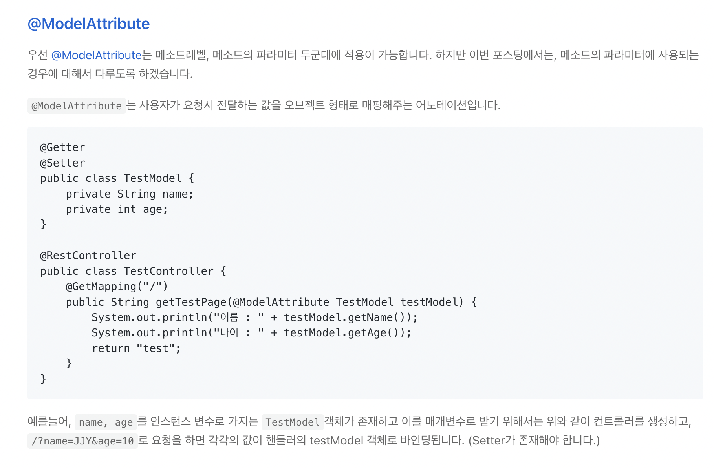
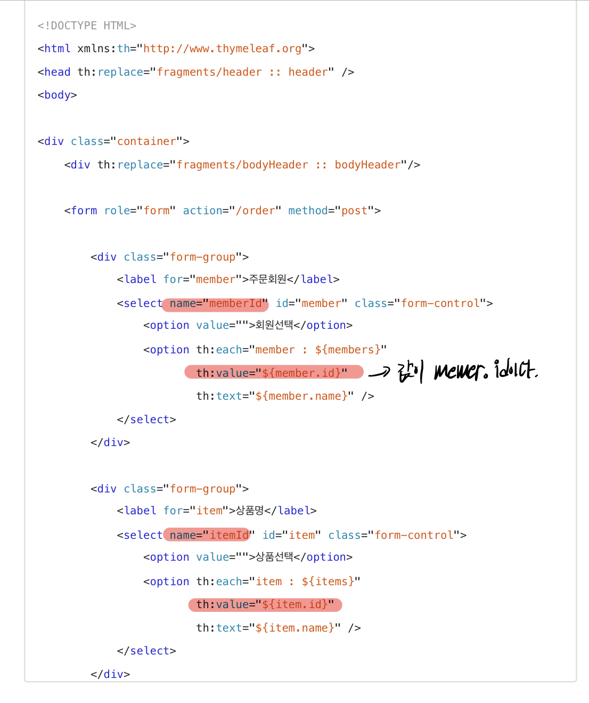

# ♻️ study-Spring

<br/>

### JPA 기본
- 지금 시대는 객체를 관계형 DB에 관리한다
- 객체 -> SQL변환 -> RDB

## Init
  - ### 객체와 관계형 데이터베이스의 차이
    - 상속
      - DB에 저장할 객체에는 상속관계 안쓴다
    - 연관관계
      - 객체는 참조를 사용
      - 테이블은 외래키를 사용 
      - -> 즉 , **서로 연관관계를 바라보는 시선이 다르다**
      - 
    - 데이터 타입
    - 데이터 식별 방법
    - **객체를 자바 컬렉션에 저장하듯이 DB에 저장할 수는 없을까??** <br> -> **JPA**
  
  - ### JPA
    - 자바 진영의 ORM 기술 표준
    - ORM : 객체 관계 매핑, 객체는 객체대로 설계, RDB는 RDB대로 설계 <br> ORM프레임워크가 중간에서 매핑 -> **패러다임의 불일치를 해결**
    - **SQL 중심적인 개발에서 객체 중심으로 개발**

      
      
      
      

    - ```java 
      jpa.persist(member) // 저장
      Member member = jpa.find(memberId)  // 조회 -> 객체 그래프 탐색
      //동일한 트랜잭션에서 조회한 엔티티는 같음을 보장
      member.setName("변경할 이름")   //수정
      jpa.remove(member)  //삭제

      SQL은 JPA가 처리
      ```
    - JPA의 성능 최적화 기능
      - 1차캐시와 동일성 보장(영속성 컨텍스트)
      - 트랜잭션을 지원하는 쓰기 지연(커밋할때까지 INSERT SQL을 모음)
      - 지연로딩과 즉시로딩(객체가 실제사용될때 로딩, 한번에 연관된 객체까지 미리 조회)  

    - JPA는 특정 데이터베이스에 종속적이지 않다
      - 
      - javax : 표준 패키지
      - hibernate : 전용옵션 (hibernate가 아닌 다른 JPA구현체를 사용해도 된다, <br>      내부적으로 JDBC API를 쓴다)
      - jdbc : java 어플리케이션에서 db에 접속할 수 있도록 도와주는 API<br> 현재 javax.  sql패키지에 포함되어 있다

    - JPA 구동 방식
      - 
      - `EntityManagerFactory`는 하나만 생성해서 애플리케이션 전체에서 공유(DB당 하나)
      - `EntityManager`는 쓰레드간에 공유 X
      - JPA의 모든 데이터변경은 트랜잭션 안에서 실행
    
    - JPQL
      - JPA를 사용하면 엔티티 객체를 중심으로 개발
      - **애플리케이션이 필요한 데이터만 DB에서 불러오려면 <br> 결국 검색조건이 포함된 SQL이 필요하다**
      - JPA는 SQL을 추상화한 JPQL이란는 객체지향 쿼리 언어를 제공
      - JPQL은 엔티티 객체를 대상으로 쿼리
      - SQL은 데이터베이스 테이블을 대상으로 쿼리

- ## 영속성 관리
  - **JPA에서 가장 중요한 2가지**
    - 객체와 관계형 DB 매핑
    - 영속성 컨텍스트
  - ### 영속성 컨텍스트
    - 엔티티를 영구저장하는 환경이라는 뜻

      
    - `EntityManger.persist(entity);`

      
    
    - 엔티티의 생명 주기
      - 비영속
        - 영속성 컨텍스트와 전혀 관계가 없는 새로운 상태
        - JPA와 관계없는 상태
      - 영속
        - 영속성 컨텍스트에 관리되는 상태
        - **persist**
      - 준영속(**detached**)
        - 영속성 컨텍스트에 저장되었다가 분리된 상태
      - 삭제
        - 삭제된 상태

    - 영속성 컨텍스트의 이점
      - 1차 캐시
        - 1차 캐시는 한 트랜잭션 내에서만 이점이 있다 (전체적인 성능향상은 X)
        - 1차 캐시에 없으면 DB조회 후 1차캐시에 저장한다
      - 동일성 보장
      - 트랜잭션을 지원하는 쓰기 지연
        - 엔티티 매니저는 데이터 변경시 트랜잭션을 시작해야한다
          ```java
          EntityManager em = emf.createEntityManager();
          EntityTransaction transaction = em.getTransaction();

          //엔티티 매니저는 데이터 변경시 트랜잭션을 시작해야 한다

          transaction.begin();

          ...

          transaction.commit();
          ```
      - 변경 감지
        
      - 지연 로딩

    - 플러시(`flush`)
      - 영속성 컨텍스트의 변경내용을 디비에 반영
      - 발생
        - 변경 감지
        - 수정된 엔티티 쓰기지연 SQL 저장소에 등록
        - 쓰기 지연 SQL 저장소의 쿼리를 데이터베이스에 전송
      - 기준
        - `em.flush : 직접호출` 
        - 트랜잭션 커밋 : 플러시 자동 호출
        - JPQL 쿼리 실행 : 플러시 자동 호출
      - 영속성 컨텍스트를 비우지 않는다
      - 영속성 컨텍스트의 변경내용을 데이터베이스에 동기화

    - 준영속 상태로 만드는 방법
      - `em.detach(entity) : 특정 엔티티만 준영속 상태로 전환`
      - `em.clear() : 영속성 컨텍스트를 완전히 초기화, 1차캐시를 전체 삭제`
      - `em.close() : 영속성 컨텍스트를 완전히 종료` 

- ## 엔티티 매핑
  - ### 객체와 테이블 매핑
    - `@Entity`가 붙은 클래스는 JPA가 관리
    - 기본 생성자 필수
    - `final클래스, enum, interface, inner클래스` 사용 불가
  
  - ### 데이터베이스 스키마 자동 생성
    - DDL : 데이터베이스 스키마를 정의하거나 조작하기 위한 언어
    - DDL을 애플리케이션 실행 시점에 자동 생성
    - 테이블 중심 -> 객체 중심
    - 데이터베이스 방언을 활용해서 데이터베이스에 맞는 적절한 DDL생성
      - Oracle -> `varchar2`, H2 -> `varchar`
    - 속성
      - `hibernate.hdm2ddl.auto.create` : 기존 테이블 삭제후 다시 생성
      - `hibernate.hdm2ddl.auto.create-drop` : create와 같으나 종료시점에 테이블 drop
    - 운영장비에서는 절대 create, create-drop, update 사용하면 안된다
    - 스테이징과 운영서버는 validate 또는 none속성을 사용하자
    - DDL 생성기능
      - 제약조건 추가 : `@Column(nullable=false, length=10)`
      - **DDL생성 기능은 DDL을 자동생성할 때만 사용되고, JPA의 실행로직에는 영향을 주지 않는다**

  - ### 필드와 컬럼 매핑
    - 매핑 어노테이션 정리
      - `@Column` : 컬럼 매핑
      - `@Temporal` : 날짜 타입 매핑
      - `@Enumerated` : enum 타입 매핑 -> **ORDINAL속성 사용 X**
      - `@Lob` : BLOB, CLOB 매핑 -> 큰 데이터를 넣고 싶다면
      - `@Transient` : 매핑 무시 -> 메모리에서만 쓰겠다는 뜻

  - ### 기본 키 매핑
    - `@Id` : 기본키 직접 할당
    - `@GeneratedValue` : 자동 생성
      - `IDENTITY` : 데이터베이스에 위임
        - 기본 키 생성을 데이터베이스에 위임하는 것
        - 주로 MySQL, SQL Server 에서 사용
        - ex) MySQL의 AUTO_INCREMENT
        - JPA는 보통 트랜잭션 커밋 시점에 INSERT SQL 실행
        - AUTO_INCREMENT는 데이터베이스에 INSERT SQL을 실행한 이후에 ID값을 알수 없다
        <br> PK값이 DB에 저장된 후에야 알수 있기 때문에 영속성 컨텍스트에 저장되어야 하므로 `em.persist`시점에 즉시 INSERT SQL 실행하고 DB에서 식별자를 조회한다
        - `@Id @GeneratedValue(strategy = GenerationType.IDENTITY)`

      - `SEQUENCE` : 데이터베이스 시퀀스 오브젝트 사용
        - 데이터베이스 시퀀스는 유일한 값을 순서대로 생성하는 특별한 데이터베이스
       오브젝트
        - 주로 오라클, h2 등에서 사용
            ``` java
            @Entity
            @SequenceGenerator(
                    name = "MEMBER_SEQ_GENERATOR",
                    sequenceName = "MEMBER_SEQ",  //매핑할 데이터베이스 시퀀스 이름
                    initialValue = 1, allocationSize = 1)
            public class Member {
            @Id
            @GeneratedValue(strategy = GenerationType.SEQUENCE, generator = "MEMBER_SEQ_GENERATOR")
            private Long id;
            }
      
            ```
            
            
    
      - `TABLE` : 키 생성용 테이블 사용
        - 키 생성 전용 테이블을 하나 만들어서 데이터베이스 시퀀스를 흉내내는 전략
        - 성능 이슈
      - `AUTO` : 자동지정(기본값)

    - 권장하는 식별자 전략
      - 기본키 제약조건 : null x, 유일, 변하면 안된다
      - 예를 들어 주민등록번호도 기본키로 적절하지 않다
      - **권장 : Long형 + 대체키(UUID, 순차키) + 키 생성전략 사용**


### JPA활용 1(웹 애플리케이션 개발)
- 도메인 분석 설계
- 애플리케이션 구현 준비
- 회원 도메인 개발
- 상품 도메인 개발
- 주문 도메인 개발
- 웹 계층 개발

<br/>

## Init
  - ### 프로젝트 시작(Initializer)
    - Gradle - Groovy -> Build Tool(라이브러리를 땡겨온다)
    - Dependencies : `Spring Web`, `Thymeleaf` <br> spring-boot-starter(공통) : 스프링 부트 + 스프링 코어 + 로깅(log)
      - `Spring Web` : 웹지향 통합기능을 제공(서블릿 리스너, 톰캣, 스프링 웹 MVC 등)
      - `Thymeleaf` : HTML을 만들어주는 템플릿 엔진<br> html태그에 속성을 추가해 페이지에 동적으로 값을 추가하거나 처리할 수 있다.
      - Spring Boot : Spring을 지원하기 위한 프레임워크(내장 Tomcat) Intializer로 Spring Boot 바로 생성
      - `spring-boot-starter-data-jpa`
        - `spring-boot-starter-aop`
        - `spring-boot-starter-jdbc`
          - HikariCP 커넥션 풀
        - `hibernate + JPA` : 하이버네이트 + JPA
        - `spring-data-jpa` : 스프링 데이터 JPA


  - ### JPA와 DB설정
    - main/resources/application.yml 내부에 설정(application.properties에 해도 상관 없다)

      ```java
      spring: //띄어쓰기 없음 
        datasource: //띄어쓰기 2칸
          url: jdbc:h2:tcp://localhost/~/jpashop //4칸 
          username: sa
          password:
          driver-class-name: org.h2.Driver

        jpa: //띄어쓰기 2칸 
          hibernate: //띄어쓰기 4칸
            ddl-auto: create //띄어쓰기 6칸 
          properties: //띄어쓰기 4칸
            hibernate: //띄어쓰기 6칸 
            //show_sql: true #띄어쓰기 8칸
              format_sql: true //띄어쓰기 8칸
      logging.level: //띄어쓰기 없음 
        org.hibernate.SQL: debug //띄어쓰기 2칸
        //org.hibernate.type: trace #띄어쓰기 2칸
      ```

    - 스프링 부트를 활용한 DB설정은 복잡한 설정이 다 자동화 되어있다.
    - 쿼리 파라미터 로그를 남기는 방법도 존재
      - 운영에서는 병목현상이 발생할 수도 있으므로 고민해볼 문제


- ## 도메인 분석 설계 (중요)
  - ### 도메인 모델과 테이블 설계
    
    - 다대다 관계는 `관계형 디비`는 물론이고 `엔티티`에서도 거의 사용하지 않는다
    - 따라서, 그림처럼 주문상품이라는 `엔티티`를 추가해서 다대다 관계를 일대다, 다대일 관계로 풀어내야 한다

    - Entity
       

    - DB
      

    - **외래키가 있는 곳을 연관관계의 주인으로 정하자**
      
  
  - ### 엔티티 클래스 개발
    - 실무에서는 가급적 `Getter`는 열어두고, `Setter`는 꼭 필요한 경우에만 사용하자
    - `Setter`말고 변경지점이 명확하도록 변경을 위한 비즈니스 메서드를 별도로 제공해야 한다
    - `@Id`: 주키
    - `@GeneratedValue`: 자동으로 id값 같은것을 생성
    - `@Embedded`: 내장타입을 포함했다는 애노테이션(ex: Address)
    - `@OneToMany(mappedBy = "member") `: 맵핑된 거울일 뿐이라는 뜻, member의 값을 넣는다해서 fk가 변경되지는 않는다
    - `@ManyToOne(fetch = FetchType.LAZY)`: 양방향 연관관계일때 연관관계주인을 정해주어야 한다 fk를 업데이트 하는 주체가 주인이 된다(보통 Many쪽)
    - `@JoinColumn(name = "memeber_id")`: fk를 어떤 pk를 참조할것인지 설정해주는 것
    - `@OneToMany(mappedBy = "order", cascade = CascadeType.ALL)` : persist해주는 과정에서 하나만 persist해도 연관관계가 형성되어있는 것을 같이 persist해준다

      ```java
      // Order 클래스 내
      @OneToMany(mappedBy = "order", cascade = CascadeType.ALL)
      private List<OrderItem> orderItems = new ArrayList<>(); // persist(order)만 해도 안에 들어있는 모든 item들도 persist된다

      @OneToOne(cascade = CascadeType.ALL, fetch = FetchType.LAZY)
      @JoinColumn(name = "delivery_id")
      private Delivery delivery;  //Order만 persist해도 delivery가 같이 persist된다
      ```

      

    - 연관관계 관련 메서드는 컨트롤하는 쪽(주인)에서 메서드를 정의해주는 것이 좋다
    - `@Entity`

      

    - ..etc(애노테이션)

  - ### 엔티티 설계시 주의점
    - 모든 연관관계는 지연로딩(LAZY)으로 설정해야한다
    - 컬렉션 초기화
      
    - 테이블, 컬럼명 생성전략 참고
      

    
<br/>


- ## 애플리케이션 구현
  - ### 애플리케이션 아키텍처
    
    - 개발순서
      - 도메인
      - 서비스, 리포지토리
      - 테스트케이서 작성 검증
      - 웹 계층 적용(Controller)

  - ### 리포지토리
    - `@PersistenceContext` : 스프링에서 생성한 EntityManager를 넣어준다(DI)
      - 참고
        - SQL : Table 대상 Query
        - JPQL : Entity(객체) 대상 Query  
    - JPA 관련 `findAll`과 같은 메서드는 검색조건에 동적으로 쿼리를 생성해서 주문 엔티티를 조회하는데
      - JPQL쿼리를 문자로 작성
      - JPA Criteria로 처리(JPQL을 자바코드로 작성할 수 있게끔 도와주는 역활)
      - Querydsl(추천)

  - ### 서비스
    - `@Transactional` : 트랜잭션, 영속성 컨텍스트
      - 영속성 컨텍스트 : 엔티티 매니저를 통해 엔티티를 저장하거나 조회하면 엔티티 <br>매니저는 영속성 컨텍스트에 엔티티를 보관하고 관리한다.
      - `em.persist(member);`
      - 엔티티 매니저를 사용해 회원 엔티티를 영속성 컨텍스트에 저장한다는 의미!
      - `readOnly = true` : 데이터의 변경이 없는 읽기 전용 메서드에 사용,<br> 영속성 컨텍스트를 플러시 하지않으므로 약간의 성능 향상(읽기전용에는 다 적용)
      - 비즈니스로직을 보통 여기다 작성하지만 `Entity`이 비즈니스로직을 가지고있는 경우가 더 좋다(응집력이 올라가기 때문에)
        - 주문 서비스의 주문과 주문 취소 메서드를 보면 비즈니스 로직 대부분이 엔티티에 있다. 서비스계층은 단순히 엔티티에 필요한 요청을 **위임**하는 역할을 한다<br>
        이처럼 엔티티가 비즈니스로직을 가지고 객체지향의 특성을 적극 활용하는 것을<br> 도메인 모델 패턴 이라한다<br>반대로 엔티티에는 비즈니스 로직이 거의 없고 서비스 계층에서 대부분의 비즈니스 로직을 처리하는 것을<br> 트랜잭션 스크립트 패턴이라 한다
      - **`Controller`계층 보다는 `Service`계층에서 엔티티를 찾는것이 더 깔끔하다**

  - ### 테스트

      

      - `@RunWith(SpringRunner.class)`: 스프링과 테스트 통합
      - `@SpringBootTest` : 스프링 부트 띄우고 테스트(이게 없다면 Autowired 안됨)
      - `@Transactional` : 반복 가능한 테스트 지원, 각각의 테스트를 실행할 때마다 트랜잭션을 시작하고, 테스트가 끝나면 트랜잭션을 강제로 롤백

    - 테스트 케이스를 위한 설정
      - 테스트는 케이스 격리된 환경에서 실행하고, 끝나면 데이터를 초기화 하는것이 좋다
      - 그런면에서 메모리 DB를 사용하는 것이 가장 이상적이다
      - 스프링부트는 datasource설정이 없으면 기본적으로 메모리 DB를 사용한다
      - `driver-class`도 현재 등록된 라이브러리를 보고 찾아준다
      - 따라서, 데이터 소스나 JPA 관련된 별도의 추가설정(applicaiton.yml)을 하지 않아도 된다
  


  - ### 도메인 보충
      


  - ### 웹 계층(Controller)

    

    - view 리소스로 부트스트랩을 사용
    - 폼 객체를 통해 화면 계층과 서비스 계층을 명확하게 분리한다.

    
      - Error가 있다면 Error Page를 띄우는 것이 아닌 특정 html을 반환한다

    

      - 폼 객체 vs 엔티티 직접 사용

        - 요구사항이 정말 단순 할 때는 폼 객체(`MemeberForm`)없이 엔티티(`Member`)를 직접 <br> 등록과 수정화면에서 사용한다 하지만 화면 요구사항이 복잡해지기 시작하면<br> 엔티티에 화면을 처리하기 위한 기능이 점점 증가한다
        - 결과적으로 엔티티는 점점 화면에 종속적으로 변하고, 이렇게 화면 기능 때문에 지저분해진 엔티티는 결국 유지보수하기 어려워진다
        - 실무에서는 엔티티는 핵심 비즈니스 로직만 가지고 있고, 화면을 위한 로직은 없어야 한다<br> **화면이나 API에 맞는 폼 객체나 DTO를 사용하자** <br> 그래서 화면이나 API요구사항을 이것들로 처리하고, 엔티티는 최대한 순수하게 유지하자.

          ``` java 
          @Getter @Setter
          public class MemberForm {
            @NotEmpty(message = "회원 이름은 필수입니다")
            private String name;

            private String city;
            private String street;
            private String zipcode;
          }

          @Entity
          @Getter @Setter
           public class Member {
            @Id @GeneratedValue
            @Column(name = "member_id")
            private Long id;

            private String name;

            @Embedded
            private Address address;

            @OneToMany(mappedBy = "member")
            private List<Order> orders = new ArrayList<>();
            }

          ``` 
    - 애노테이션 및 변경감지와 병합

      

      

      
    
      ``` java
      @GetMapping(value = "/items/{itemId}/edit")
      public String updateItemForm(@PathVariable("itemId") Long itemId, Model model)  
      // PathVariable => URL경로에 변수를 넣어주는것을 매핑시켜준다 itemId
      // Model 객체는 Controller에서 생성된 데이터를 담아 View로 전달할때 사용하는 객체

      @PostMapping(value = "/items/{itemId}/edit")
      public String updateItem(@ModelAttribute("form") BookForm form)
        Book book = new Book();
        book.setId(form.getId());
        book.setName(form.getName());
        book.setPrice(form.getPrice());
        book.setStockQuantity(form.getStockQuantity());
        book.setAuthor(form.getAuthor());
        book.setIsbn(form.getIsbn());

        itemService.saveItem(book); //준영속성 컨텍스트
        return "redirect:/items";
      
      ```

      ``` html
      <form th:object="${form}" method="post">
      ```

      - **준영속 엔티티?**
        - 영속성 컨텍스트가 더는 관리하지 않는 엔티티를 말한다
        - 여기서는 itemService.saveItem(book)에서 수정을 시도하는 Book객체다(new로 만들었지만 JPA가 관리하지 않는다)
        - Book객체는 이미 DB에 한번 저장되어서 식별자가 존재한다 <br>이렇게 임의로 만들어낸 엔티티도 기존 식별자를 가지고 있으면 준영속 엔티티로 볼 수 있다

      - 준영속 엔티티를 수정하는 방법 2가지
        - 변경 감지 기능 사용
        - 병합 사용
          - 변경 감지기능은 원하는 속성만 선택하여 변경 가능
          - 병합은 모든 속성이 변경 -> 병합시 값이 없다면 `null`로 업데이트
          - 즉, 변경 감지가 더 좋다

      - 변경 감지 기능 사용
        ``` java
        @Transactional
        void update(Item itemParam) { //itemParam: 파라미터로 넘어온 준영속 상태의 엔티티
          Item findItem = em.find(Item.class, itemParam.getId()); //같은 엔티티를 조회한다(영속상태인걸 가지고 온다)
          findItem.setPrice(itemParam.getPrice());  //데이터를 수정한다

        }
        ```
      
      - 병합 사용
        - 준영속 상태의 엔티티를 영속상태로 변경할 때 사용하는 기능
         ``` java
         @Transactional
         void update(Item itemParam){ //itemParam : 파라미터로 넘어온 준영속 상태의 엔티티
          Item mergeItem = em.merge(itemParam);
         }
         ```

      

      

      

      
  
    - 보충 사항

      

      

      

      

      

      

    


