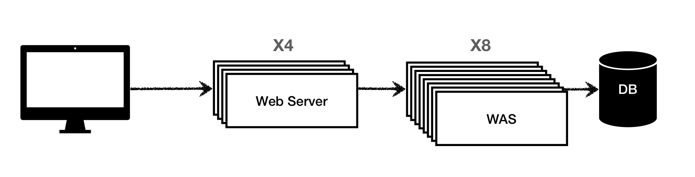
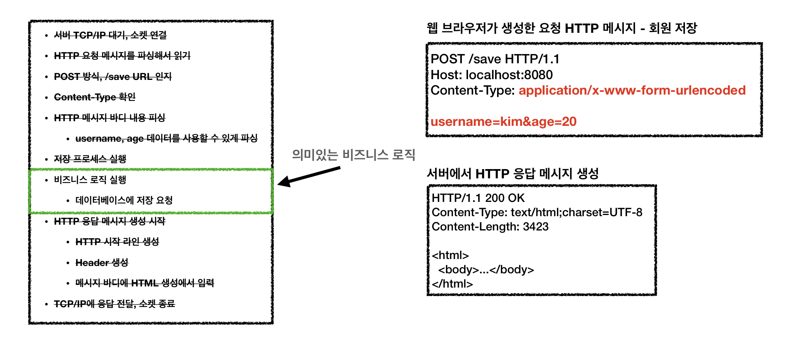
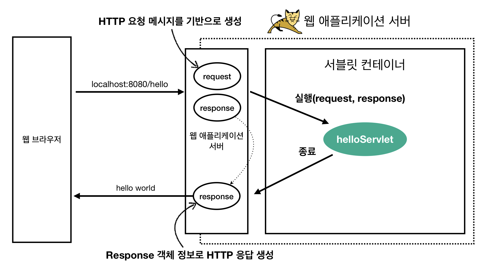
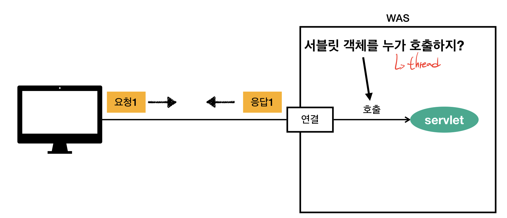
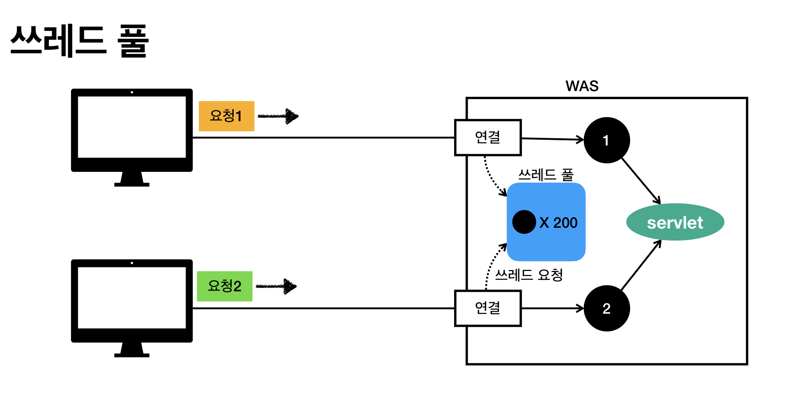
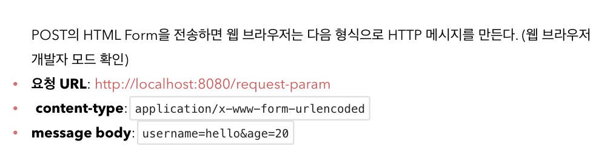
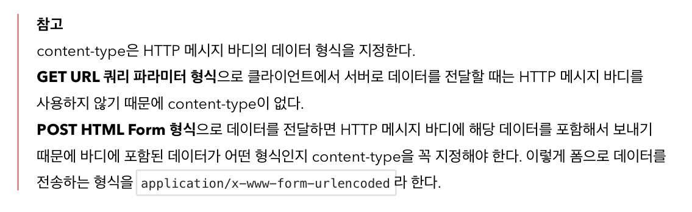

## 스프링 웹 MVC
- ### Init
  - **웹 서버**
    - 웹서버는 HTTP기반으로 동작
    - 정적 리소스 제공, 기타 부가기능
    - 정적(파일) HTML, CSS, JS, 이미지, 영상
    - 예) NGINX, APACHE
    
  - **웹 어플리케이션 서버**(WAS)
    - 웹서버와 동일하게 HTTP기반으로 동작
    - 동적 + 정적 리소스 제공
    - 프로그램 코드를 실행해서 애플리케이션 로직 수행
      - 동적 HTML, HTTP API(JSON)
      - 서블릿, JSP, 스프링 MVC
    - 예) 톰캣 등
  
  - 웹서버 VS 웹 어플리케이션 서버(WAS)
    - 웹서버는 정적 리소스, WAS는 애플리케이션 로직
    - **사실 둘의 경계가 애매**
      - 웹서버도 프로그램을 실행하는 기능을 포함하기도 함
      - WAS도 웹 서버의 기능을 제공

  - **웹 시스템 구성**

    

    - WAS가 너무 많은 역할을 담당하면 서버 과부하가 우려되므로<br> 정적리소스는 웹서버가 처리
    - 위의 그림은 효율적인 리소스를 관리하는 예

  - **서블릿**

    

    - 서블릿을 지원하는 WAS를 사용하는 경우 우리는 의미있는 비즈니스 로직에만 집중하면 된다
    - ```java
      @WebServlet(name = "helloServlet", urlPatterns = "/hello")
      public class HelloServlet extends HttpServlet {
        @Override
        protected void service(HttpServletRequest request, HttpServletResponse response){
          //애플리케이션 로직
        }
      }
      ```

      - `urlPatterns(/hello)`의 URL이 호출되면 서블릿 코드가 실행
      - HTTP요청 정보를 편리하게 사용할 수 있는 HttpServletRequest
      - HTTP요청 정보를 편리하게 사용할 수 있는 HttpServletResponse
      - **개발자는 HTTP스펙을 매우 편리하게 사용할 수 있게 된다**

      

        - HTTP 요청 시
          - WAS는 Request, Response **객체**를 새로 만들어서 서블릿 객체 호출
          - 개발자는 Request객체에서 HTTP요청 정보를 편리하게 꺼내서 사용
          - 개발자는 Response 객체에 HTTP응답 정보를 편리하게 입력
          - WAS는 Response 객체에 담겨있는 내용으로 HTTP응답 정보를 생성


---------------

  - **서블릿 컨테이너**
    - **톰캣**처럼 서블릿을 지원하는 WAS를 서블릿 컨테이너라고 한다
    - 서블릿 객체를 생성, 초기화, 호출, 종료하는 생명주기 관리
    - **서블릿 객체는 싱글톤으로 관리**
      - 고객의 요청이 올 때 마다 **계속 객체를 생성**하는 것은 비효율적이다
      - 최초 로딩 시점에 서블릿 객체를 미리 만들어두고 **재활용**한다
      - 모든 고객 요청은 **동일한 서블릿 객체 인스턴스**에 접근
      - 그러므로, **공유변수** 사용을 주의해야한다
      - 서블릿 컨테이너 종료시 **함께 종료된다**

    - **JSP도 서블릿으로 변환되어 사용된다**
    - **동시요청을 위한 멀티 쓰레드 처리를 지원한다**
      - 쓰레드
        
        - 애플리케이션 코드를 하나하나 순차적으로 실행하는 것은 쓰레드
        - 자바 main메서드를 처음 실행하면 main이라는 이름의 쓰레드가 실행된다
        - 쓰레드가 없다면 자바 애플리케이션 실행이 불가능
        - 쓰레드는 한번에 하나의 코드 라인만 수행
        - **동시처리가 필요하면 쓰레드를 추가로 생성**
        - **요청마다 쓰레드를 생성한다면 여러 단점이 발생한다**
        - 

          - **쓰레드 풀**은 필요한 쓰레드만 보관하고 관리한다
          - 사용하고 반납하는 형식
          - WAS의 주요 튜닝 포인트는 최대쓰레드 수 이다
          - 너무 높게설정한다면 리소스 임계점 초과로 서버다운 가능
          - 너무 낮게설정한다면 응답지연이 발생가능

        - **멀티쓰레드에 대한 부분은 WAS가 처리하므로 신경쓰지 않아도 된다**
        - 멀티쓰레드 환경이므로 싱글톤 객체(서블릿, 스프링 빈)은 주의해서 사용


  - **SSR - 서버 사이드 렌더링**
    - HTML 최종 결과를 **서버**에서 만들어서 웹 브라우저에 전달
    - 서버에서 최종 HTML을 생성해서 클라이언트에 전달
    - **주로 정적인 화면에 사용한다**
    - JSP, Thymeleaf -> 백엔드

  - **CSR - 클라이언트 사이드 렌더링**
    - HTML결과를 자바스크립트를 사용해 웹 브라우저에게 동적으로 생성해 적용
    - **주로 동적인 화면에 사용**
    - 구글 지도, Gmail 등
    - React, Vue.js -> 프론트엔드


  - **자바 백엔드 웹 기술 역사**
    - 과거 기술
      - **서블릿 (1997)**
        - HTML생성이 어려움
      - **JSP (1999)**
        - HTML 생성은 편리하지만 비즈니스 로직까지 너무 많은 역할 담당
      - **서블릿, JSP 조합 MVC 패턴 사용**
        - 모델, 뷰, 컨트롤러로 역할을 나누어 개발
      - **MVC 프레임워크 춘추 전국 시대**
        - MVC 패턴 자동화, 복잡한 웹 기술을 편리하게 사용할 수 있는 다양한 기능 지원
        - 스트럿츠, 웹워크, 스프링MVC(과거 버전)
    - 현재 사용 기술
      - 애노테이션 기반의 스프링 MVC 등장
        - `@Controller`
      - 스프링 부트의 등장
        - **스프링 부트는 서브를 내장**
        - 과거에는 서버에 **WAS**를 직접 설치하고, 소스는 **War**파일을 만들어서 설치한 **WAS**에 배포
        - 스프링 부트는 빌드결과(**Jar**)에 **WAS서버** 포함 -> 빌드 배포 단순화
      - 스프링 웹기술의 분화
        - `Web Servlet` - Spring MVC
        - `Web Reactive` - Spring WebFlux - 아직 쓰는곳이 적음

  - **자바 뷰 템플릿 역사**
    - HTML을 편리하게 생성하는 뷰 기능
      - JSP
      - Freemarker, Velocity
      - Thymeleaf


-------------

- ### 서블릿
  - 스프링 부트는 서블릿을 직접 등록해서 사용할 수 있도록 `@ServletComponentScan`을 지원한다(**main 메서드를 호출하는 메인클래스 애노테이션에 추가**)

  ``` java
  @WebServlet(name = "helloServlet", urlPatterns = "/hello")
  public class HelloServlet extends HttpServlet {
      @Override
      protected void service(HttpServletRequest request, HttpServletResponse response) throws ServletException, IOException {
                ...
              }
  }
  ```

  - `@WebServlet`
    - `name` : 서블릿 이름
    - `urlPatterns` : URL매핑

  - HTTP요청을 통해 매핑된 URL이 호출되면서 서블릿 컨테이너는 다음 메서드를 실행한다<br>
  `protected void service(HttpServletRequest request, HttpServletResponse response)`
    - Was서버들이 위 HttpServlet..표준스펙을 구현한다


-------------


  - **HttpServletRequest**
    - Http 요청 메시지를 개발자가 직접 파싱해서 사용해도 되지만, 매우 불편할 것이다
    - **서블릿**은 개발자가 HTTP요청 메시지를 편리하게 사용할 수 있도록 개발자 대신에 HTTP 요청메시지를 파싱한다
    - 그 파싱결과를 **HttpServletRequest** 객체에 담아서 제공한다<br> `request.getHeaderNames()` 등
    - **임시 저장소 기능**
      - 해당 Http 요청이 시작부터 끝날 때 까지 유지되는 임시 저장소 기능
      - 저장 : `request.setAttribute(naem, value)`
      - 조회 : `request.getAttribute(name)`


  - **HTTP 요청 데이터** <br> HTTP요청 메시지를 통해 클라이언트에서 서버로 데이터를 전달하는 방법 3가지
    - GET - 쿼리 파라미터
      - `/url?username=hello&age=20`
    - POST - HTML Form
      - HTML Form 사용(메시지 바디에 쿼리 파라미터 형식으로 전달)
        ``` html
        <form action = "/request-param" method = "post">
          username : <input type="text" name="username" />
          age : <input type="text" name = "age" />
          <button type="submit"> 전송 </button>
        </form>
        ```

        

      - 형식은 GET에서 살펴본 쿼리 파라미터 형식과 같다<br> 따라서 쿼리 파라미터 조회 메서드를 그대로 사용하면 된다(`request.getParameter()`)
      - 정리하자면, `request.getParameter()`는 GET URL 쿼리 파라미터 형식도 지원하고,<br> POST HTML Form형식도 둘 다 지원한다.<br> (HTML form 데이터도 메시지 바디를 통해 전송되므로 직접 읽을 수 있다 <br>하지만 편리한 파라미터 조회 기능 `request.getParameter(...)`을 이미 제공하기 때문에 파라미터 조회기능을 사용하면 된다)
      
        

    - HTTP message body에 직접 데이터를 담아서 요청하는 경우
      - 단순 텍스트로 온 경우
      - ``` java
          ServletInputStream inputStream = request.getInputStream();
          String messageBody = StreamUtils.copyToString(inputStream, StandardCharsets.UTF_8);
            System.out.println("messageBody = " + messageBody);
            response.getWriter().write("ok");
          ```

      - JSON으로 온 경우
      - 
        ``` java
          private ObjectMapper objectMapper = new ObjectMapper();
          @Override
          protected void service(HttpServletRequest request, HttpServletResponse response) throws ServletException, IOException {
            ServletInputStream inputStream = request.getInputStream();
            String messageBody = StreamUtils.copyToString(inputStream,StandardCharsets.UTF_8);
            System.out.println("messageBody = " + messageBody);
            HelloData helloData = objectMapper.readValue(messageBody,HelloData.class);
            System.out.println("helloData.username = " + helloData.getUsername());
            System.out.println("helloData.age = " + helloData.getAge());
            response.getWriter().write("ok");
          }
        ```

        - JSON결과를 파싱해서 사용 할 수 있는 자바 객체로 변환하려면 `Jackson, Gson`과 같은 JSON변환 라이브러리를 추가해서 사용해야 한다.<br> 스프링 부트로 Spring MVC 를 선택하면 기본으로 `Jackson라이브러리`(ObjectMapper)를 함께 제공한다


-------------
  - **HttpServletResponse**
    - HTTP응답 메시지 생성
      - HTTP응답 코드 지정, 헤더 생성, 바디 생성
    - 편의기능 제공
      - Content-Type, 쿠키, Redirect


  - **HTTP 응답 데이터**
    - 단순 텍스트 응답
    - HTML 응답
      - ``` java
          //Content-Type: text/html;charset=utf-8
          response.setContentType("text/html");
          response.setCharacterEncoding("utf-8");
          PrintWriter writer = response.getWriter(); 
          writer.println("<html>");
          writer.println("<body>");
          writer.println(" <div>안녕?</div>");
          writer.println("</body>");
          writer.println("</html>");
        ```
    - HTTP API - MessageBody Json 응답
      - ``` java
          //Content-Type: application/json
          response.setHeader("content-type", "application/json");
          response.setCharacterEncoding("utf-8");
          HelloData data = new HelloData();
          data.setUsername("kim");
          data.setAge(20);
          //{"username":"kim","age":20}
          String result = objectMapper.writeValueAsString(data);
          response.getWriter().write(result);
        ```


