## 스프링 웹 MVC
- ### Init
  - **웹 서버**
    - 웹서버는 HTTP기반으로 동작
    - 정적 리소스 제공, 기타 부가기능
    - 정적(파일) HTML, CSS, JS, 이미지, 영상
    - 예) NGINX, APACHE
    
  - **웹 어플리케이션 서버**(WAS)
    - 웹서버와 동일하게 HTTP기반으로 동작
    - 동적 + 정적 리소스 제공
    - 프로그램 코드를 실행해서 애플리케이션 로직 수행
      - 동적 HTML, HTTP API(JSON)
      - 서블릿, JSP, 스프링 MVC
    - 예) 톰캣 등
  
  - 웹서버 VS 웹 어플리케이션 서버(WAS)
    - 웹서버는 정적 리소스, WAS는 애플리케이션 로직
    - **사실 둘의 경계가 애매**
      - 웹서버도 프로그램을 실행하는 기능을 포함하기도 함
      - WAS도 웹 서버의 기능을 제공

  - **웹 시스템 구성**

    

    - WAS가 너무 많은 역할을 담당하면 서버 과부하가 우려되므로<br> 정적리소스는 웹서버가 처리
    - 위의 그림은 효율적인 리소스를 관리하는 예

  - **서블릿**

    

    - 서블릿을 지원하는 WAS를 사용하는 경우 우리는 의미있는 비즈니스 로직에만 집중하면 된다
    - ```java
      @WebServlet(name = "helloServlet", urlPatterns = "/hello")
      public class HelloServlet extends HttpServlet {
        @Override
        protected void service(HttpServletRequest request, HttpServletResponse response){
          //애플리케이션 로직
        }
      }
      ```

      - `urlPatterns(/hello)`의 URL이 호출되면 서블릿 코드가 실행
      - HTTP요청 정보를 편리하게 사용할 수 있는 HttpServletRequest
      - HTTP요청 정보를 편리하게 사용할 수 있는 HttpServletResponse
      - **개발자는 HTTP스펙을 매우 편리하게 사용할 수 있게 된다**

      

        - HTTP 요청 시
          - WAS는 Request, Response **객체**를 새로 만들어서 서블릿 객체 호출
          - 개발자는 Request객체에서 HTTP요청 정보를 편리하게 꺼내서 사용
          - 개발자는 Response 객체에 HTTP응답 정보를 편리하게 입력
          - WAS는 Response 객체에 담겨있는 내용으로 HTTP응답 정보를 생성


---------------

  - **서블릿 컨테이너**
    - **톰캣**처럼 서블릿을 지원하는 WAS를 서블릿 컨테이너라고 한다
    - 서블릿 객체를 생성, 초기화, 호출, 종료하는 생명주기 관리
    - **서블릿 객체는 싱글톤으로 관리**
      - 고객의 요청이 올 때 마다 **계속 객체를 생성**하는 것은 비효율적이다
      - 최초 로딩 시점에 서블릿 객체를 미리 만들어두고 **재활용**한다
      - 모든 고객 요청은 **동일한 서블릿 객체 인스턴스**에 접근
      - 그러므로, **공유변수** 사용을 주의해야한다
      - 서블릿 컨테이너 종료시 **함께 종료된다**

    - **JSP도 서블릿으로 변환되어 사용된다**
    - **동시요청을 위한 멀티 쓰레드 처리를 지원한다**
      - 쓰레드
        
        - 애플리케이션 코드를 하나하나 순차적으로 실행하는 것은 쓰레드
        - 자바 main메서드를 처음 실행하면 main이라는 이름의 쓰레드가 실행된다
        - 쓰레드가 없다면 자바 애플리케이션 실행이 불가능
        - 쓰레드는 한번에 하나의 코드 라인만 수행
        - **동시처리가 필요하면 쓰레드를 추가로 생성**
        - **요청마다 쓰레드를 생성한다면 여러 단점이 발생한다**
        - 

          - **쓰레드 풀**은 필요한 쓰레드만 보관하고 관리한다
          - 사용하고 반납하는 형식
          - WAS의 주요 튜닝 포인트는 최대쓰레드 수 이다
          - 너무 높게설정한다면 리소스 임계점 초과로 서버다운 가능
          - 너무 낮게설정한다면 응답지연이 발생가능

        - **멀티쓰레드에 대한 부분은 WAS가 처리하므로 신경쓰지 않아도 된다**
        - 멀티쓰레드 환경이므로 싱글톤 객체(서블릿, 스프링 빈)은 주의해서 사용


  - **SSR - 서버 사이드 렌더링**
    - HTML 최종 결과를 **서버**에서 만들어서 웹 브라우저에 전달
    - 서버에서 최종 HTML을 생성해서 클라이언트에 전달
    - **주로 정적인 화면에 사용한다**
    - JSP, Thymeleaf -> 백엔드

  - **CSR - 클라이언트 사이드 렌더링**
    - HTML결과를 자바스크립트를 사용해 웹 브라우저에게 동적으로 생성해 적용
    - **주로 동적인 화면에 사용**
    - 구글 지도, Gmail 등
    - React, Vue.js -> 프론트엔드


  - **자바 백엔드 웹 기술 역사**
    - 과거 기술
      - **서블릿 (1997)**
        - HTML생성이 어려움
      - **JSP (1999)**
        - HTML 생성은 편리하지만 비즈니스 로직까지 너무 많은 역할 담당
      - **서블릿, JSP 조합 MVC 패턴 사용**
        - 모델, 뷰, 컨트롤러로 역할을 나누어 개발
      - **MVC 프레임워크 춘추 전국 시대**
        - MVC 패턴 자동화, 복잡한 웹 기술을 편리하게 사용할 수 있는 다양한 기능 지원
        - 스트럿츠, 웹워크, 스프링MVC(과거 버전)
    - 현재 사용 기술
      - 애노테이션 기반의 스프링 MVC 등장
        - `@Controller`
      - 스프링 부트의 등장
        - **스프링 부트는 서브를 내장**
        - 과거에는 서버에 **WAS**를 직접 설치하고, 소스는 **War**파일을 만들어서 설치한 **WAS**에 배포
        - 스프링 부트는 빌드결과(**Jar**)에 **WAS서버** 포함 -> 빌드 배포 단순화
      - 스프링 웹기술의 분화
        - `Web Servlet` - Spring MVC
        - `Web Reactive` - Spring WebFlux - 아직 쓰는곳이 적음

  - **자바 뷰 템플릿 역사**
    - HTML을 편리하게 생성하는 뷰 기능
      - JSP
      - Freemarker, Velocity
      - Thymeleaf


-------------

- ### 서블릿
  - 스프링 부트는 서블릿을 직접 등록해서 사용할 수 있도록 `@ServletComponentScan`을 지원한다(**main 메서드를 호출하는 메인클래스 애노테이션에 추가**)

  ``` java
  @WebServlet(name = "helloServlet", urlPatterns = "/hello")
  public class HelloServlet extends HttpServlet {
      @Override
      protected void service(HttpServletRequest request, HttpServletResponse response) throws ServletException, IOException {
                ...
              }
  }
  ```

  - `@WebServlet`
    - `name` : 서블릿 이름
    - `urlPatterns` : URL매핑

  - HTTP요청을 통해 매핑된 URL이 호출되면서 서블릿 컨테이너는 다음 메서드를 실행한다<br>
  `protected void service(HttpServletRequest request, HttpServletResponse response)`
    - Was서버들이 위 HttpServlet..표준스펙을 구현한다


-------------


  - **HttpServletRequest**
    - Http 요청 메시지를 개발자가 직접 파싱해서 사용해도 되지만, 매우 불편할 것이다
    - **서블릿**은 개발자가 HTTP요청 메시지를 편리하게 사용할 수 있도록 개발자 대신에 HTTP 요청메시지를 파싱한다
    - 그 파싱결과를 **HttpServletRequest** 객체에 담아서 제공한다<br> `request.getHeaderNames()` 등
    - **임시 저장소 기능**
      - 해당 Http 요청이 시작부터 끝날 때 까지 유지되는 임시 저장소 기능
      - 저장 : `request.setAttribute(naem, value)`
      - 조회 : `request.getAttribute(name)`


  - **HTTP 요청 데이터** <br> HTTP요청 메시지를 통해 클라이언트에서 서버로 데이터를 전달하는 방법 3가지
    - GET - 쿼리 파라미터
      - `/url?username=hello&age=20`
    - POST - HTML Form
      - HTML Form 사용(메시지 바디에 쿼리 파라미터 형식으로 전달)
        ``` html
        <form action = "/request-param" method = "post">
          username : <input type="text" name="username" />
          age : <input type="text" name = "age" />
          <button type="submit"> 전송 </button>
        </form>
        ```

        

      - 형식은 GET에서 살펴본 쿼리 파라미터 형식과 같다<br> 따라서 쿼리 파라미터 조회 메서드를 그대로 사용하면 된다(`request.getParameter()`)
      - 정리하자면, `request.getParameter()`는 GET URL 쿼리 파라미터 형식도 지원하고,<br> POST HTML Form형식도 둘 다 지원한다.<br> (HTML form 데이터도 메시지 바디를 통해 전송되므로 직접 읽을 수 있다 <br>하지만 편리한 파라미터 조회 기능 `request.getParameter(...)`을 이미 제공하기 때문에 파라미터 조회기능을 사용하면 된다)
      
        

    - HTTP message body에 직접 데이터를 담아서 요청하는 경우
      - 단순 텍스트로 온 경우
      - ``` java
          ServletInputStream inputStream = request.getInputStream();
          String messageBody = StreamUtils.copyToString(inputStream, StandardCharsets.UTF_8);
            System.out.println("messageBody = " + messageBody);
            response.getWriter().write("ok");
          ```

      - JSON으로 온 경우
      - 
        ``` java
          private ObjectMapper objectMapper = new ObjectMapper();
          @Override
          protected void service(HttpServletRequest request, HttpServletResponse response) throws ServletException, IOException {
            ServletInputStream inputStream = request.getInputStream();
            String messageBody = StreamUtils.copyToString(inputStream,StandardCharsets.UTF_8);
            System.out.println("messageBody = " + messageBody);
            HelloData helloData = objectMapper.readValue(messageBody,HelloData.class);
            System.out.println("helloData.username = " + helloData.getUsername());
            System.out.println("helloData.age = " + helloData.getAge());
            response.getWriter().write("ok");
          }
        ```

        - JSON결과를 파싱해서 사용 할 수 있는 자바 객체로 변환하려면 `Jackson, Gson`과 같은 JSON변환 라이브러리를 추가해서 사용해야 한다.<br> 스프링 부트로 Spring MVC 를 선택하면 기본으로 `Jackson라이브러리`(ObjectMapper)를 함께 제공한다


-------------
  - **HttpServletResponse**
    - HTTP응답 메시지 생성
      - HTTP응답 코드 지정, 헤더 생성, 바디 생성
    - 편의기능 제공
      - Content-Type, 쿠키, Redirect


  - **HTTP 응답 데이터**
    - 단순 텍스트 응답
    - HTML 응답
      - ``` java
          //Content-Type: text/html;charset=utf-8
          response.setContentType("text/html");
          response.setCharacterEncoding("utf-8");
          PrintWriter writer = response.getWriter(); 
          writer.println("<html>");
          writer.println("<body>");
          writer.println(" <div>안녕?</div>");
          writer.println("</body>");
          writer.println("</html>");
        ```
    - HTTP API - MessageBody Json 응답
      - ``` java
          //Content-Type: application/json
          response.setHeader("content-type", "application/json");
          response.setCharacterEncoding("utf-8");
          HelloData data = new HelloData();
          data.setUsername("kim");
          data.setAge(20);
          //{"username":"kim","age":20}
          String result = objectMapper.writeValueAsString(data);
          response.getWriter().write(result);
        ```

-----------------


- ### 서블릿으로 회원 관리 웹 애플리케이션 만들기
  - 서블릿으로 회원 등록 폼 HTML 폼 제공
    ``` java 
    response.setContentType("text/html");
    response.setCharacterEncoding("utf-8");

    PrintWriter w = response.getWriter();
    w.write("<!DOCTYPE html>\n" +
    "<html>\n" +
    "<head>\n" +
    "    <meta charset=\"UTF-8\">\n" +
    "    <title>Title</title>\n" +
    "</head>\n" +
    "<body>\n" +
    "<form action=\"/servlet/members/save\" method=\"post\">\n" +
    "    username: <input type=\"text\" name=\"username\" />\n" +
    "    age:      <input type=\"text\" name=\"age\" />\n" +
    " <button type=\"submit\">전송</button>\n" + "</form>\n" +
    "</body>\n" +
    "</html>\n");
    ```
    - 자바 코드로 HTML을 제공해야하는 힘든 작업

  - **템플릿 엔진 사용**
    - 자바 코드로 HTML을 만들어 내는 것 보다 차라리 HTML문서에 동적으로 변경해야 하는 부분만 <br> 자바 코드를 넣을 수 있다면 더 편리할 것이다
    - JSP, Thymeleaf, Freemarker, Velocity 등
    - **JSP**
      - JSP 관련 라이브러리 추가
      - `<% ~~~ %>` -> 이 부분에는 자바 코드를 **입력** 할 수 있다
      - `<%= ~~~ %>` -> 이 부분에는 자바 코드를 **출력** 할 수 있다
      - `${}` 문법을 사용하면 `request`의 `attribute`에 담긴 데이터를 편리하게 조회할 수 있다

    - **MVC패턴의 등장**
      - 하나의 서블릿이나 JSP만으로 비즈니스 로직과 뷰 렌더링까지 모두 처리하게 되면, <br> 너무 많은 역할을 하게되고 결과적으로 유지보수가 어려워 진다
        - 변경의 라이프 사이클이 다르다(변경되는 라이프 사이클이 다르다)
        - 비지니스 로직 분리
    

  - **MVC 패턴 적용**
    - `dispatcher.forward()`: 다른 서블릿이나 JSP로 이동할 수 있는 기능
    - `redirect vs forward`
      - `redirect`는 실제 클라이언트에 응답이 나갔다가, 클라이언트가 `redirect`경로로 다시 요청
        - URL경로가 실제로 바뀐다
      - `forward`는 서버 내부에서 일어나는 호출이기 대문에 클라이언트가 전혀 인지하지 못한다

    - **MVC 패턴 한계**
      - 공통처리가 어렵다
        - 기능이 복잡해질 수 록 컨트롤러에서 공통으로 처리해야 하는 부분이 점점 더 많이 증가한다<br> -> **수문장역할을 하는 기능 (프론트 컨트롤러를 도입)**

------------------------

- ### MVC 프레임워크 만들기

  - 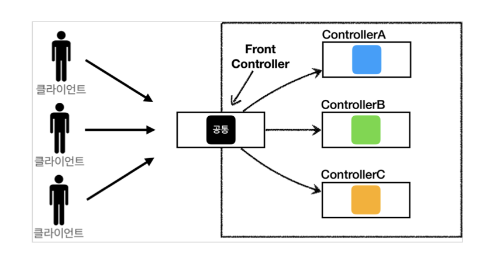

  - **프론트 컨트롤러** 서블릿 하나로 클라이언트의 요청을 받는다
  - **프론트 컨트롤러**가 요청에 맞는 컨트롤러를 찾아서 호출해준다
  - **프론트 컨트롤러**를 제외한 나머지 컨트롤러는 서블릿을 사용하지 않아도 된다
  - 스프링 웹 MVC의 `DispatcherServlet`이 **FrontController** 패턴으로 구현되어 있다


  - 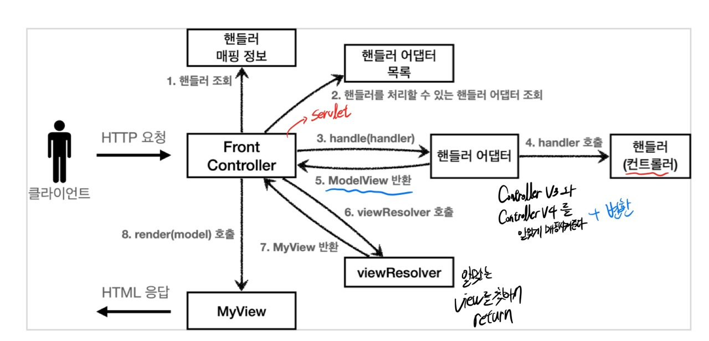


------------------------

- ### MVC 구조 이해
  - 직접만든 프레임워크와 스프링 MVC 비교
    - FrontController -> `DispatcherServlet`
    - handlerMappingMap -> `HandlerMapping`
    - MyHandlerAdapter -> `HandlerAdapter`
    - ModelView -> `ModelAndView`
    - viewResolver -> `ViewResolver`
    - MyView -> `View`

  - `DispatcherServlet` 서블릿 등록
    - `DispatcherServlet`도 부모 클래스에서 `HttpServlet`을 상속 받아서 사용하고, 서블릿으로 동작한다
      - `DispatcherServlet` -> `FrameworkServlet` -> `HttpServletBean` -> `HttpServlet`
    - 스프링 부트는 `DispatcherServlet`을 서블릿으로 자동으로 등록하면서 모든 경로(`urlPatterns="/"`)에 대해서 매핑한다
      - 더 자세한 경로가 우선순위가 높고, **기존에 등록한 서블릿**도 함께 동작한다
    - 서블릿이 호출되면 `HttpServlet`이 제공하는 `service()`가 호출된다
    - 스프링 MVC는 `DispatcherServlet`의 부모인 `FrameworkServlet`에서 `service()`를 오버라이드해두었다
    - `FrameworkServlet.service()`를 시작으로 여러 메서드가 호출되면서 `DispatcherServlet.doDispatch()`가 호출된다
    - ``` java
      protected void doDispatch(HttpServletRequest request, HttpServletResponse response) throws Exception {
      HttpServletRequest processedRequest = request;
      HandlerExecutionChain mappedHandler = null;
      ModelAndView mv = null;
      // 1. 핸들러 조회
      mappedHandler = getHandler(processedRequest);
      if (mappedHandler == null) {
        noHandlerFound(processedRequest, response);
        return; }
      //2.핸들러 어댑터 조회-핸들러를 처리할 수 있는 어댑터
      HandlerAdapter ha = getHandlerAdapter(mappedHandler.getHandler());
      // 3. 핸들러 어댑터 실행 -> 4. 핸들러 어댑터를 통해 핸들러 실행 -> 5. ModelAndView 반환
      mv = ha.handle(processedRequest, response, mappedHandler.getHandler());
      processDispatchResult(processedRequest, response, mappedHandler, mv, dispatchException);
      }


      private void processDispatchResult(HttpServletRequest request, HttpServletResponse response, HandlerExecutionChain mappedHandler, ModelAndView mv, Exception exception) throws Exception {
         
      // 뷰 렌더링 호출
      render(mv, request, response);
      }
      protected void render(ModelAndView mv, HttpServletRequest request, HttpServletResponse response) throws Exception {
      View view;
      String viewName = mv.getViewName(); 
      //6. 뷰 리졸버를 통해서 뷰 찾기,7.View 반환
      view = resolveViewName(viewName, mv.getModelInternal(), locale, request);
      // 8. 뷰 렌더링
      view.render(mv.getModelInternal(), request, response);
      }
      ```
  - Spring MVC 구조
    - 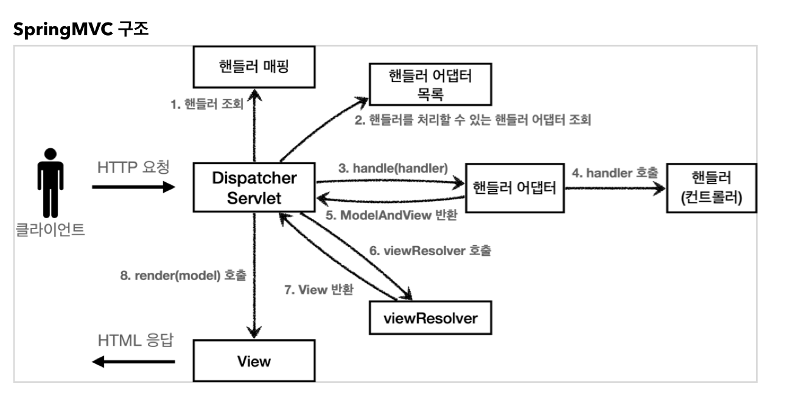

    - 동작순서
      - **핸들러 조회** : 핸들러 매핑을 통해 요청 URL에 매핑된 핸들러(컨트롤러)를 조회한다
      - **핸들러 어댑터 조회** : 핸들러를 실행할 수 있는 핸들러 어댑터를 조회한다
      - **핸들러 어댑터 실행** : 핸들러 어댑터를 실행한다
      - **핸들러 실행** : 핸들러 어댑터가 실제 핸들러를 실행한다
      - **ModelAndView 반환** : 핸들러 어댑터는 핸들러가 반환하는 정보를 ModelAndView로 변환해서 반환한다
      - **viewResolver 호출** : 뷰 리졸버를 찾고 실행한다
      - **View 반환** : 뷰 리졸버는 뷰의 논리 이름을 물리 이름으로 바꾸고, 렌더링 역할을 담당하는 뷰 객체를 반환한다
        - JSP의 경우 `InternalResourceView(JstlView)`를 반환하는데, 내부에 `forward()`로직이 있다
      - **뷰 렌더링** : 뷰를 통해서 뷰를 렌더링 한다

    - 인터페이스 살펴보기
      - 가장 큰 장점은 `DispatcherServlet` 코드의 변경 없이, 원하는 기능을 변경하거나 확장할 수 있다는 점
      - 확장 가능할 수 있게 인터페이스로 제공한다
      - 인터페이스들만 구현해서 `DispatcherServlet`에 등록하면 여러분만의 컨트롤러를 만들 수도 있다.

    - **핸들러 매핑과 핸들러 어댑터**
      - `Controller`인터페이스
        - ``` java
          public interface Controller {
            ModelAndView handleRequest(HttpServletRequest request, HttpServletResponse response) throws Exception;
          }
          ```
        - **`Controller`인터페이스는 `@Controller`애노테이션과는 전혀 다르다**
        - ``` java
          @Component("/springmvc/old-controller")
          public class OldController implements Controller {
            @Override
            public ModelAndView handleRequest(HttpServletRequest request, HttpServletResponse response) throws Exception
            {
              System.out.println("OldController.handleRequest");
              return null;
            }
          }
          ```
          - `@Component`: 이컨트롤러는 `/springmvc/old-controller`라는 이름의 스프링 빈으로 등록되었다
          - 빈의 이름으로 URL을 매핑할 것 이다
        - 위 컨트롤러가 호출되려면
          - 1. 핸들러 매핑
            - 핸들러 매핑에서 이 컨트롤러를 찾을 수 있어야한다
            - 예) 스프링 빈의 이름으로 핸들러를 찾을 수 있는 핸들러 매핑이 필요
          - 2. 핸들러 어댑터
            - (1.핸들러 매핑)을 통해서 찾은 핸들러를 실행할 수 있는 핸들러 어댑터가 필요하다
            - 예) `Controller`인터페이스를 실행할 수 있는 핸들러 어댑터를 찾고 실행해야 한다
          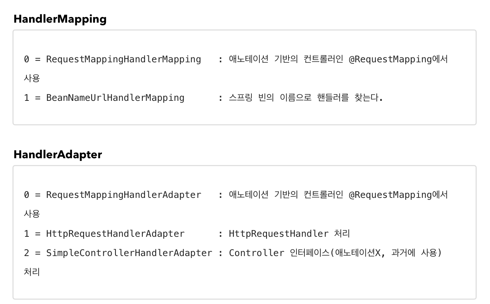
            - (1) 핸들러 매핑으로 핸들러 조회
              - `HandlerMapping`을 순서대로 실행해서, 핸들러를 찾는다
              - 이 경우 빈 이름으로 핸들러를 찾아야 하기 때문에 이름 그대로 빈이름으로 핸들러를 찾아주는 <br>
              `BeanNameUrlHandlerMapping`가 실행에 성공하고 핸들러인 `OldController`를 반환한다.
            - (2) 핸들러 어댑터 조회
              - `HandlerAdapter`의 `supports()`를 순서대로 호출한다
              - `SimpleControllerHandlerAdapter`가 `Controller`인터페이스를 지원하므로 대상이 된다
            - (3) 핸들러 어댑터 실행
              - 디스패처 서블릿이 조회한 `SimpleControllerHandlerAdapter`를 실행하면서 핸들러 정보도 함께 넘겨준다
              - `SimpleControllerHandlerAdapter`는 핸들러인 `OldController`를 내부에서 실행하고, 그결과를 반환한다

          - `@RequestMapping`
            - 가장 우선순위가 높은 핸들러 매핑과 핸들러 어댑터는 `RequestMappingHandlerMapping`, `RequestMappingHandlerAdapter`이다
            - 이것이 바로 스프링에서 주로 사용하는 **애노테이션 기반의 컨트롤러**를 지원하는 매핑과 어댑터이다

    - **뷰 리졸버**
      - 스프링 부트는 `InternalResourceViewResolver`라는 뷰 리졸버를 자동으로 등록하는데, <br> 이때 `application.properties`에 등록한 `spring.mvc.view.prefix`, `spring.mvc.view.suffix` 설정 정보를 사용해서 등록한다
      - 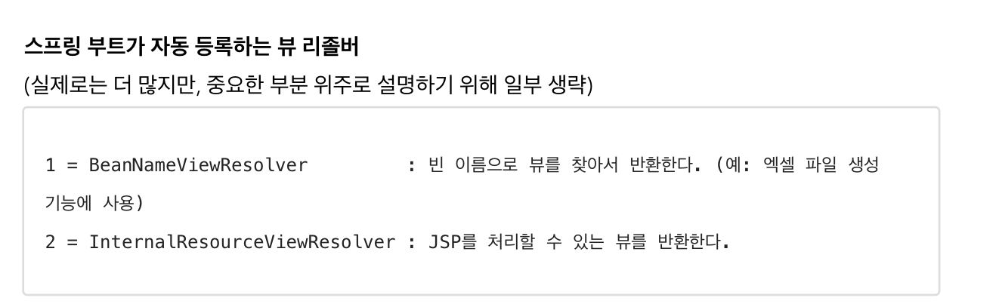
        - (1) 핸들러 어댑터 호출
          - 핸들러 어댑터를 통해 `new-form` 이라는 논리 뷰 이름을 흭득한다

        - (2) ViewResolver 호출
          - `new-form`이라는 뷰 이름으로 `viewResolver`를 순서대로 호출한다
          - `BeanNameViewResolver`는 `new-form`이라는 이름의 `스프링 빈`으로 등록된 뷰를 찾아야 하는데 없다면
          - `InternalResourceViewResolver`가 호출된다

        - (3) `InternalResourceViewResolver`
          - 이 뷰 리졸버는 `InternalResourceView`를 반환한다

        - (3) `InternalResourceView`
          - `InternalResourceView`는 JSP처럼 포워드`forward()`를 호출해서 처리할 수 있는 경우에 사용한다

        - (4) view.render()
          - `view.render()`가 호출되고 `InternalResourceView`는 `forward()`를 사용해서 JSP를 실행한다
          
        - 다른 뷰는 실제 뷰를 렌더링하지만, JSP의 경우 `forward()`통해서 해당 JSP로 이동해야 렌더링이 된다
        - JSP를 제외한 나머지 뷰 템플릿들은 `forward()`과정 없이 바로 렌더링 된다.
        - Thymeleaf 뷰 템플릿을 사용하면 `ThymeleafViewResolver`를 등록해야 한다
          - 최근에는 라이브러리만 추가하면 스프링 부트가 이런 작업도 모두 자동화 해준다

    - **스프링 MVC 시작하기**
      - `@Controller`
        - 스프링이 자동으로 스프링 빈으로 등록한다(내부에 `@Component`애노테이션이 있어서 컴포넌트 스캔의 대상이 된다)
        - 스프링 MVC에서 애노테이션 기반 컨트롤러로 인식한다

      - `@RequestMapping`
        - 요청정보를 매핑한다
        - 해당 URL이 호출되면 이 메서드가 호출

      - `@ModelAndView`
        - 모델과 뷰 정보를 담아서 반환하면 된다

      - `RequestMappingHandlerMapping`은 스프링 빈 중에서 `@RequestMapping` 또는 `@Controller`가 클래스 레벨에 붙어있는 경우에 매핑정보로 인식한다.<br> (스프링3.0 이상에서는 `@RequestMapping`은 이제 인식하지 않고, `@Controller`만 인식한다)
    
      - `@RestController`
        - `@Controller`는 반환 값이 `String`이면 뷰 이름으로 인식된다 그래서 뷰를 찾고 뷰가 렌더링된다
        - `@RestController`는 반환 값으로 뷰를 찾는것이 아니라, HTTP메시지 바디에 바로 입력한다
          - 따라서, 실행결과로 ok메시지를 받을 수 있다

----------------------

- ### 스프링 MVC 기본기능
  - **로깅**
    - 운영시스템에서는 `System.out.println()`같은 시스템 콘솔을 사용해서 필요한 정보를 출력하지 않고, <br> 별도의 로깅 라이브러리를 사용해서 로그를 출력한다
    - 스프링 부트 라이브러리를 사용하면 스프링 부트 로깅 라이브러리(`spring-boot-starter-logging`)가 포함된다
    - 로그 라이브러리는 Logback, Log4J, Log4J2 등 수많은 라이브러리가 있다
      - 그것을 통합해서 인터페이스로 제공하는 것이 바로 `SLF4J` 라이브러리이다
    - `SLF4J`는 인터페이스이고, 그 구현체로 Logback같은 로그 라이브러리를 사용하면 된다
    - **보통, Logback을 대부분 사용한다**

    - 로그 레벨 설정을 변경해서 출력결과를 변경할 수 있다
      - `logging.level.root = info`
    - 올바른 로그 사용법
      - `log.debug("data={}", data)

  - **HTTP요청 - 기본, 헤더조회**
    - ``` java
      @Slf4j
      @RestController
      public class RequestHeaderController {
        @RequestMapping("/headers")
        public String headers(
          HttpServletRequest request,
          HttpServletResponse response,
          HttpMethod httpMethod,
          Locale locale,
          @RequestHeader MultiValueMap<String, String> headerMap,
          @RequestHeader("host") String host,
          @CookieValue(value = "myCookie", required = false) String cookie)
          {
            log.info("request={}", request);
            log.info("response={}", response);
            log.info("httpMethod={}", httpMethod);
            log.info("locale={}", locale);
            log.info("headerMap={}", headerMap);
            log.info("header host={}", host);
            log.info("myCookie={}", cookie);
            return "ok";
          }
        }
      ```
      - `HttpMethod` : HTTP 메서드를 조회한다
      - `Locale` : Locale 정보를 조회한다
      - `@RequestHeader MultiValueMap<String, String> headerMap`
        - 모든 HTTP헤더를 `MultiValueMap`형식으로 조회한다 -> `keyA=value1&keyA=value2` 같은 경우를 받는 형식
      - `@RequestHeader("host") String host` : 특정 Http헤더를 조회한다
      - `@CookieValue(value = "myCookie", required = false) String cookie`
        - 특정 쿠키를 조회한다

  - **HTTP 요청 파라미터 - 쿼리 파라미터, HTML Form**
    - 클라이언트에서 서버로 요청 데이터를 전달할 때
      - GET - 쿼리 파라미터
      - POST - HTML Form
      - HTTP messageBody에 데이터를 직접 담아서 요청
    - `Jar`를 사용하면 `webapp`경로를 사용할 수 없다
  
    - 쿼리 파라미터, HTML Form
      - (1) `@RequstParam`
        - 쿼리 파라미터 매핑
      - (2) `@ModelAttribute`
        - 요청 파라미터를 받아서 필요한 객체를 만든다

    - HTTP messagebody
      - (1) HTTP 메시지 바디의 데이터를 `InputStream`을 사용해서 직접 읽을 수 있다
      - (2) `HttpEntity` : HTTP header, body 정보를 편리하게 조회
        - `HttpEntity`를 상속받은 `RequestEntity`, `ResponseEntity` 객체들도 같은 기능을 제공
      - (3) `@RequestBody`, `@ResponseBody`
        - 이렇게 메시지 바디를 직접 조회하는 기능은 요청 파라미터를 조회하는 `@RequestParam`, `@ModelAttribute`와는 전혀 관계가 없다
        - `@RequestBody`를 사용하면 HTTP 메시지 바디 정보를 편리하게 조회 가능
        - `@ResponseBody`를 사용하면 응답결과를 HTTP메시지 바디에 직접 담아서 전달할 수 있다
          - `@RequestBody` 를 사용해서 HTTP 메시지에서 데이터를 꺼내고 messageBody에 저장한다.<br> 문자로 된 JSON 데이터인 messageBody 를 `objectMapper` 를 통해서 자바 객체로 변환한다.
          - 문자로 변환하고 다시 json으로 변환하는 과정이 불편하다. <br> @ModelAttribute처럼 한번에 객체로 변환할 수는 없을까?
      - 
        ``` java
        @ResponseBody
        @PostMapping("/request-body-json-v3")
        public String requestBodyJsonV3(@RequestBody HelloData data) {
          log.info("username={}, age={}", data.getUsername(), data.getAge());
        return "ok";
        } 
        ```
        - `HttpEntity`, `@RequestBody`를 사용하면 **HTTP 메시지 컨버터**가 HTTP 메시지 바디의 내용을 **우리가 원하는 문자나 객체 등으로 변환해준다**
        - `@RequestBody`요청
          - JSON 요청 -> **HTTP 메시지 컨버터** -> 객체
        - `@ResponseBody` 응답
          - 객체 -> **HTTP 메시지 컨버터** -> JSON 응답


  - **HTTP 응답 - 정적 리소스, 뷰 템플릿**
    - 정적 리소스
      - 웹 브라우저에 정적인 HTML, css, js를 제공할때는, 정적리소스를 사용
      - 해당 파일을 변경 없이 그대로 서비스 하는것
    - 뷰 템플릿 사용
      - 웹 브라우저에 동적인 HTML을 제공할 때는 뷰 템플릿을 사용한다
    - HTTP 메시지 사용
    

  - HTTP 메시지 컨버터
    - 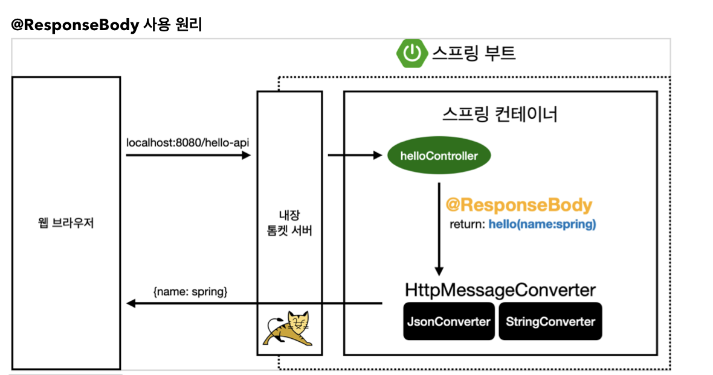

    - `@ResponseBody`
      - HTTP의 Body에 문자내용을 직접 반환
      - `viewResolver`대신에 `HttpMessageConverter`가 동작
      - 기본문자처리 : `StringHttpMessageConverter`
      - 기본객체처리 : `MappingJackson2HttpMessageConverter`
      - byte 처리 등등 기타 여러 HttpMessageConverter가 기본으로 등록되어 있음
    
    - 스프링 MVC는 다음의 경우에 HTTP메시지 컨버터를 적용한다
      - HTTP 요청 : `@RequestBody`, `HttpEntity(RequestEntity)`
      - HTTP 응답 : `@ResponseBody`, `HttpEntity(ResponseEntity)`

    - 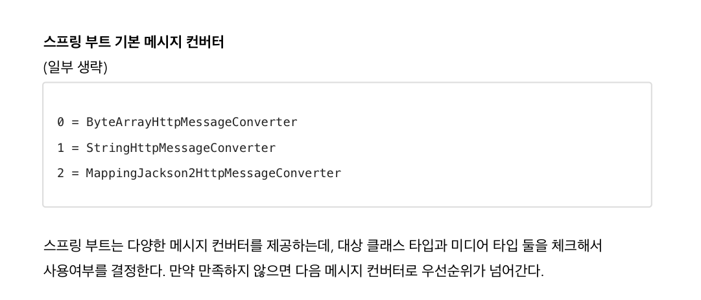

    - `ByteArrayHttpMessageConverter`: byte[] 데이터를 처리한다
      - 클래스 타입: byte[], 미디어 타입: */*
    - `StringHttpMessageConverter` : String 문자로 데이터를 처리한다
      - 클래스 타입 : String, 미디어 타입: */*
    - `MappingJackson2HttpMessageConverter` : application/json
      - 클래스 타입 : 객체 또는 `HashMap`, 미디어 타입: application/json 관련

    - HTTP요청 데이터 읽기
      - HTTP요청이 오고 컨트롤러에서 `@RequestBody`, `HttpEntity`파라미터를 사용한다
      - 메시지 컨버터가 메시지를 읽을 수 있는지 확인하기 위해 `canRead()`를 호출한다
        - 대상 클래스 타입을 지원하는가
          - 예) `@RequestBody`의 대상 클래스(`byte[], String, HelloData`)
        - HTTP요청의 Content-Type 미디어 타입을 지원하는가.
          - 예) `text/plain`, `application/json`, `*/*`
      - `canRead()`조건을 만족하면 `read()`를 호출해서 객체 생성하고 반환한다

    - HTTP응답 데이터 생성
      - 컨트롤러에서 `@ResponseBdoy`, `HttpEntity`로 값이 반환된다
      - 메시지 컨버터가 메시지를 쓸 수 있는지 확인하기 위해 `canWrite()`를 호출한다
        - 대상 클래스 타입을 지원하는가
          - 예) return의 대상 클래스(`byte[], String, HelloData`)
        - HTTP요청의 Accept미디어 타입을 지원하는가(더 정확히는 `@RequestMapping`의 `produces`)
          - 예) `text/plain`, `application/json`, `*/*`

      - `canWrite()`조건을 만족하면 `write()`를 호출해서 HTTP응답 메시지 바디에 데이터를 생성한다

  - 요청 매핑 핸들러 어댑터 구조
    - 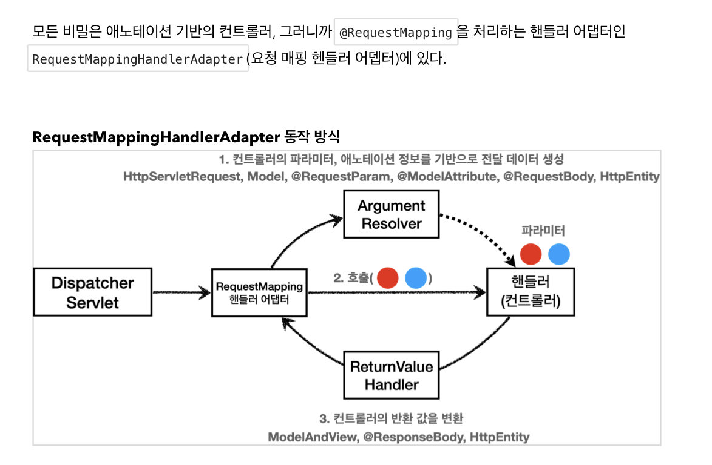

    - 애노테이션 기반 컨트롤러를 처리하는 `RequestMappingHandlerAdapter`는 바로 <br>
    이 `ArgumentResolver`(매우 다양한 파라미터 사용 가능)를 <br>호출해서 컨트롤러(핸들러)가 필요로 하는 다양한 파라미터의 값(객체)을 생성한다
    - 파라미터의 값이 모두 준비되면 컨트롤러를 호출하면서 값을 넘겨준다
      - `ReturnValueHandler`(`ArgumentResolver`와 비슷하지만 이것은 응답값을 변환하고 처리한다)
        - 컨트롤러에서 String으로 뷰 이름을 반환해도, 동작하는 이유가 바로 `ReturnValueHandler` 덕분이다.
        - 예) `ModelAndView`, `@ResponseBody`, `HttpEntity`, `String`
    
    - 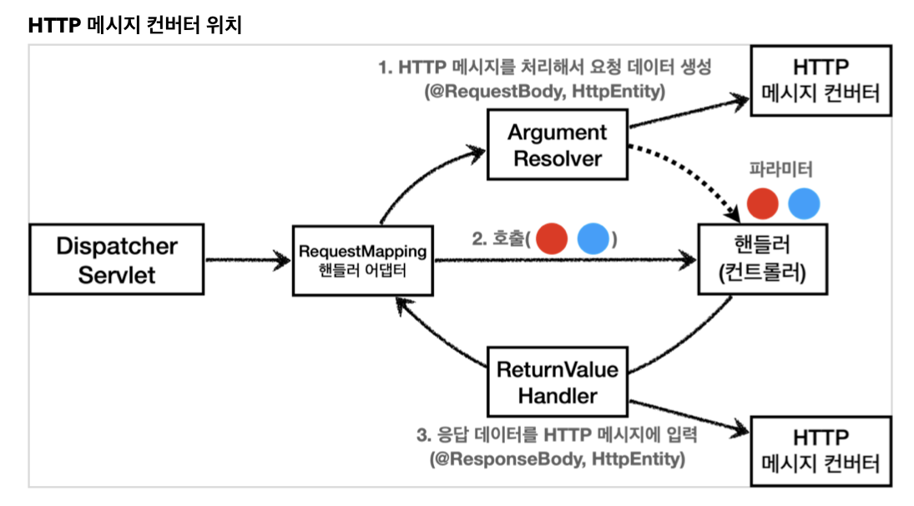

    - **요청의 경우**
       - `@RequestBody`를 처리하는 `ArgumentResolver`가 있고, `HttpEntity`를 처리하는 `ArgumentResolver`가 있다
       - 이 `ArgumentResolver`들이 HTTP메시지 컨버터를 사용해서 필요한 객체를 생성하는 것이다
    - **응답의 경우**
      - `@ResponseBody`와 `HttpEntity`를 처리하는 `ReturnValueHandler`가 있다
      - 여기에서 HTTP메시지 컨버터를 호출해서 응답결과를 만든다

------------------------

  

- ### Thymeleaf
  - 타임리프 사용 선언
    - `<html xmlns:th="http://www.thymeleaf.org">`
  - 속성변경
    - 대부분의 HTML 속성을 `th:xxx`로 변경할 수 있다
    - 핵심은 `th:xxx`가 붙은 부분은 서버사이드에서 렌더링 되고, 기존 것을 대체한다
    - `th:xxx`이 없으면 기존 html의 `xxx`속성이 그대로 사용된다
    - **HTML을 파일 보기를 유지하면서 템플릿 기능도 할 수 있다**(JSP는 깨진다)

  - 리터럴 대체 -> |...|
  - URL링크 표현식
    - `@{...}`
  - 변수 표현식 -> ${...}


  - ### PRG
    - 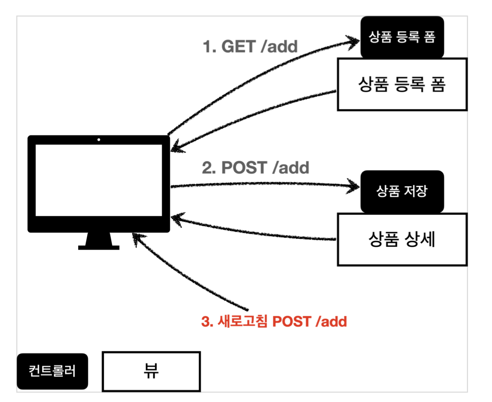
    
    - 웹 브라우저의 새로고침은 마지막에 서버에 전송한 데이터를 다시 전송한다
    
    - 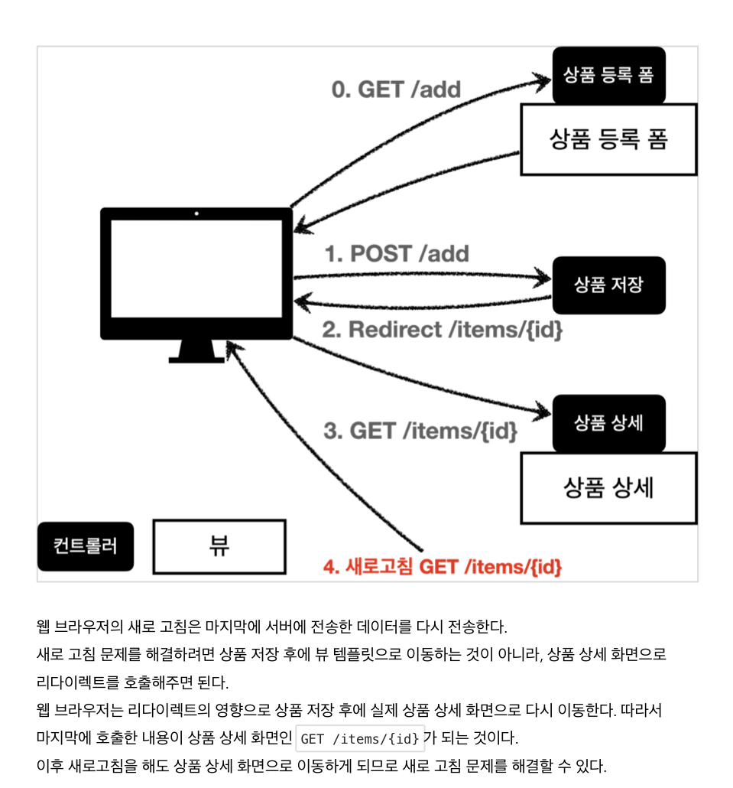

    - `"redirect:/basic/items/" + item.getId()`redirect에서 `+item.getId()`처럼 URL에 변수를 더해서 사용하는 것은<br> URL인코딩이 안되기 때문에 위험하다
    - `RedirectAttributes`를 사용하자
      ``` java
        @PostMapping("/add")
        public String addItemV6(Item item, RedirectAttributes redirectAttributes) {
          Item savedItem = itemRepository.save(item);
          redirectAttributes.addAttribute("itemId", savedItem.getId());
          redirectAttributes.addAttribute("status", true);
          return "redirect:/basic/items/{itemId}";
        }

      ```
        - `pathVariable` 바인딩 : `{itemId}`
        - 나머지는 쿼리 파라미터로 처리 : `?status=true`

