# Mybatis

## 목차
  - [**초기 순서**](#💡-초기-순서)
  - [**설계 순서도**](#🧩-설계-순서도)
  
----------


### 💡 초기 순서
  - `maven`프로젝트 설치(`Spring.initialize`)
  - `mysql DB (local or server)`설치 및 사용자 세팅
  - `pom.xml`파일에 `mysql + sql매핑(Mybatis)`라이브러리 추가
    - 라이브러리 추가 방법 
      - 1. `MavenRepository` 검색 후 거기서 디펜던시 코드 추가
      - 2. `Spring.initialize` 에서 추가후 코드 추가
  - `application.properties`에 스프링 `DataSource` 관련 데이터 추가 (접속할 디비 설정)
  - 마이바티스는 `Sql Mapping`기술을 이용한며 자바의 메서드와 `Sql`을 매핑시켜준다 그래서 `Mapper`라는것을 만들어야 한다
  - `JSP`를 웹상에 띄울려면 읽기위한 도구가 필요하며, `tomcat jasper`를 의존성 추가해야 한다.
  - `WEB-INF`파일은 클라이언트가 볼 수 없는 것들이다 그래서 그안에 `html` 파일을 넣으면 당연히 사용자에게는 보여지지 않는다 따라서 `jsp`파일을 넣자

    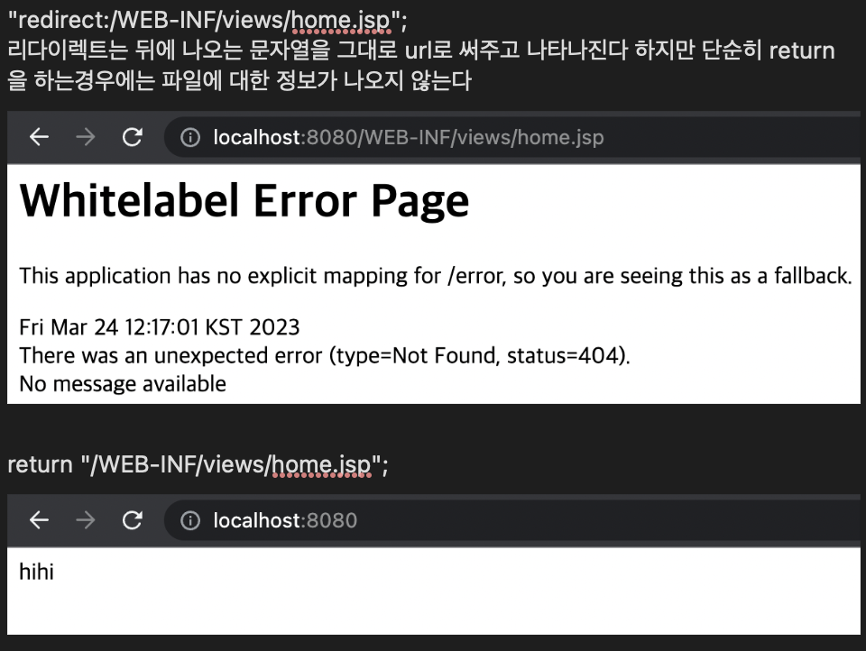

  - `DTO` 대신 `VO`를 사용한다 
    - 간단하게 jpa - DTO, mybatis - VO
    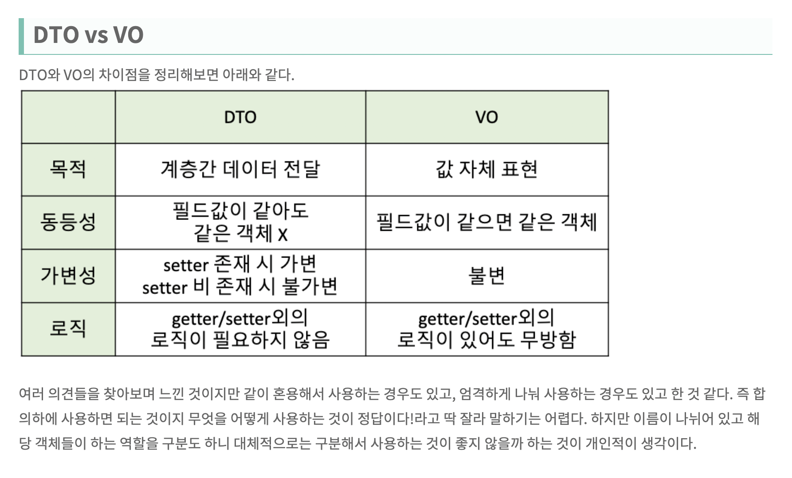


### 🧩 설계 순서도
  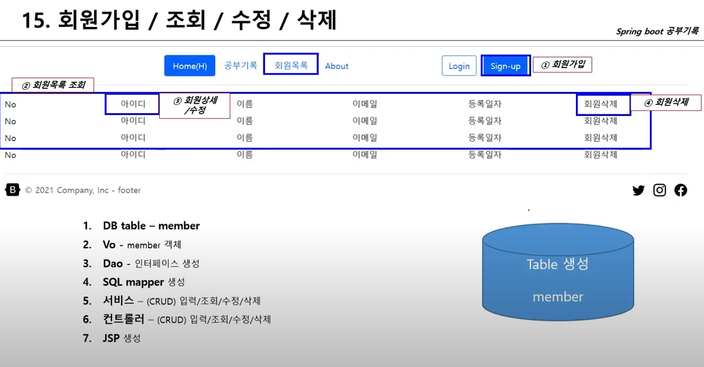


  - `application.properties`(= `application.yml`)
    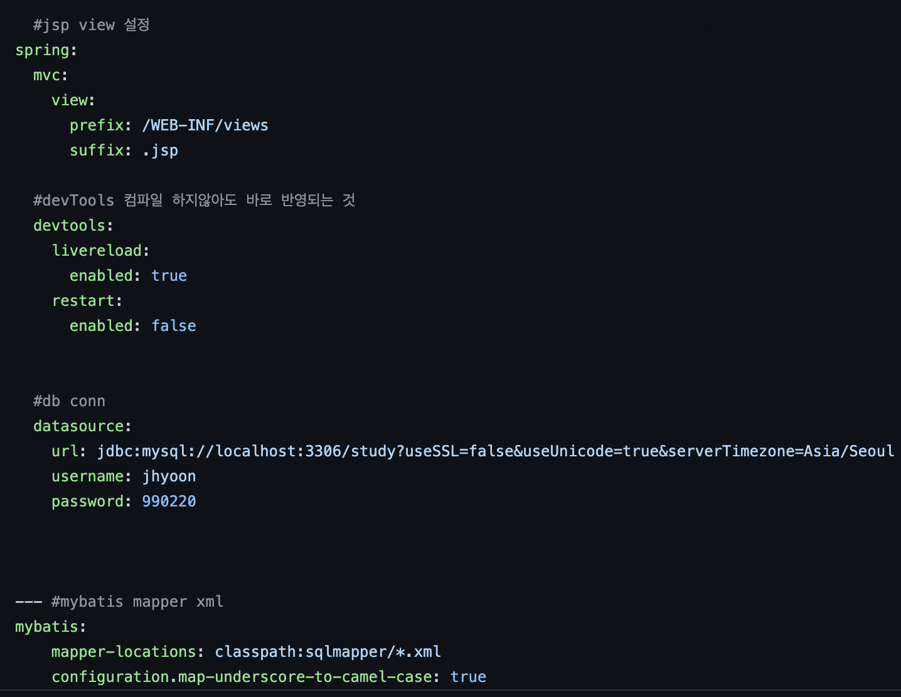

  - `build.gradle`
    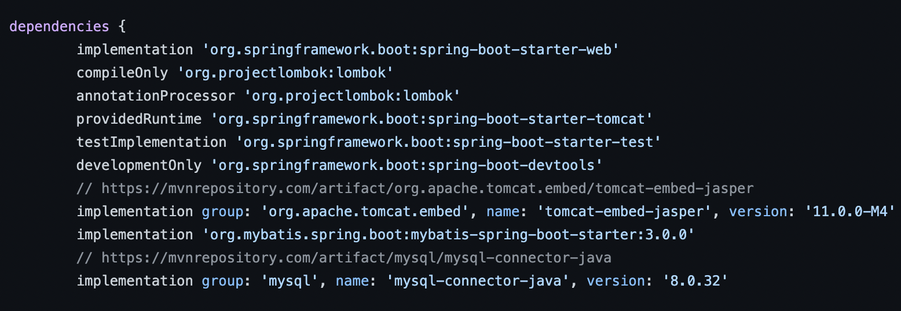


  - `DB Table`
    - 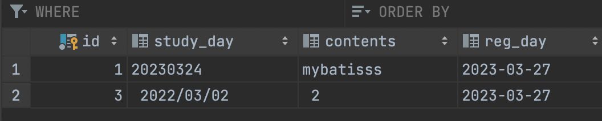
    - DB 테이블은 `Data grip`으로 생성 용이

  - `VO`와 프로젝트 구조
    - 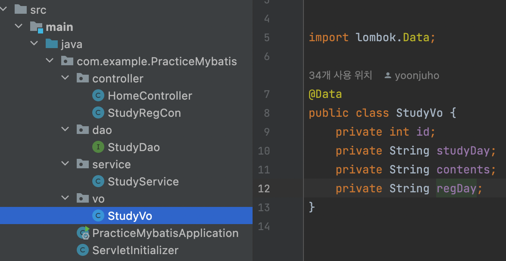

  - `Dao`
    - 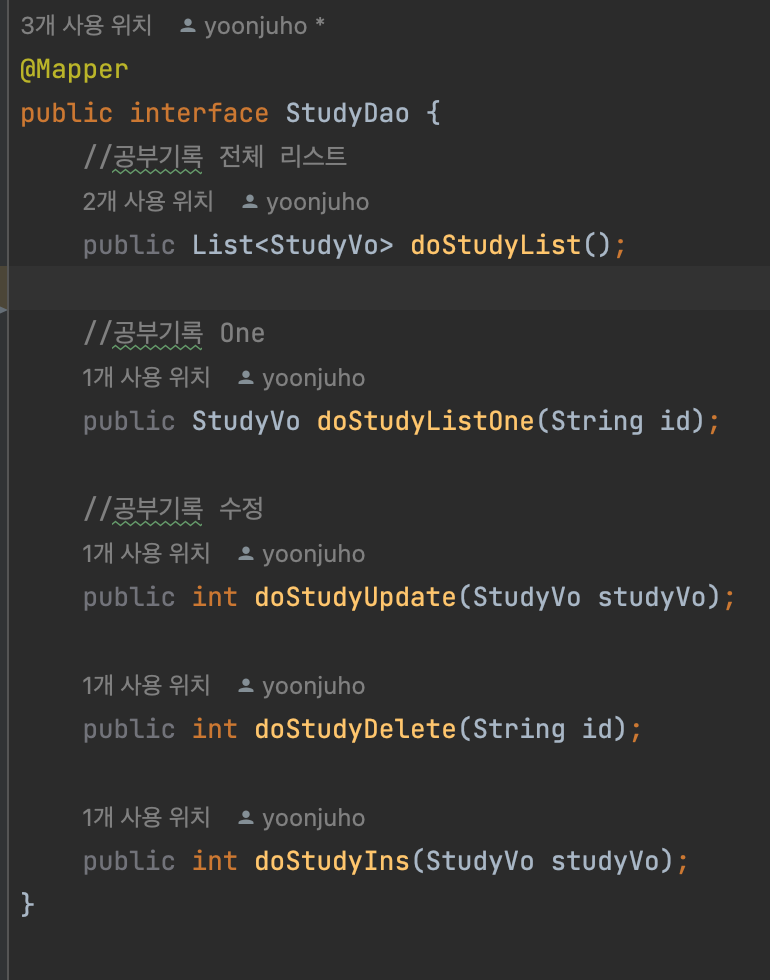
    - dao 패키지를 만들고 dao인터페이스를 `mapper`로 설정한다 이 과정에서 자동으로 디비에서 값을 꺼내온다
    - 디비에서 값을 꺼내올때 캐스팅 주의해야한다(`List<Map<String, String>>`형식이면 그렇지만 `VO`를 사용하면 괜찮다)


  - `Sql mapper`(`src/main/resources/sqlmapper/study_sql.xml`)
    ``` xml
    <?xml version="1.0" encoding="UTF-8"?>
    <!DOCTYPE mapper PUBLIC "//mybatis.org/DTD Mapper 3.0//EN" "http://mybatis.org/dtd/mybatis-3-mapper.dtd" >

    <mapper namespace="com.example.PracticeMybatis.dao.StudyDao">
        <!-- 매핑시켜주는 것 -->
        <resultMap id="map_vo_study" type="com.example.PracticeMybatis.vo.StudyVo">
                <result column="id" property="id"></result>
                <result column="study_day" property="studyDay"></result>
                <result column="contents" property="contents"></result>
                <result column="reg_day" property="regDay"></result>
        </resultMap> 

        <select id="doStudyList" resultMap="map_vo_study">
                select * from study_record
        </select>

        <select id="doStudyListOne" resultMap="map_vo_study">
                select * from study_record  where id = #{id}
        </select>

        <!-- 비교할때 #{value} 써야한다 -->
        <!-- parameterType을 써주지 않아도 mapper가 알아서 매핑한다 -->
        <update id="doStudyUpdate" parameterType="com.example.PracticeMybatis.vo.StudyVo">
                UPDATE study_record
                set study_day = #{studyDay} , contents= #{contents}, reg_day = NOW()
                where id = #{id}
        </update>

        <delete id="doStudyDelete">
                delete from study_record where id = #{id}
        </delete>

        <insert id="doStudyIns">
                INSERT into study_record(study_day, contents, reg_day)
                values (#{studyDay}, #{contents}, NOW())
        </insert>
    </mapper>

    ```


  - **Service**
    - 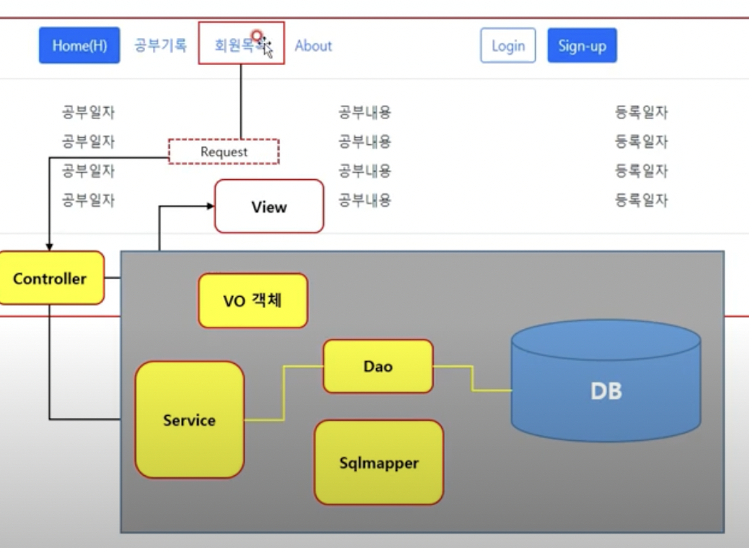
    ``` java
    @Service
    @RequiredArgsConstructor
    public class StudyService {
    private final StudyDao studyDao;

    public List<StudyVo> doStudyList(){
        List<StudyVo> list =  studyDao.doStudyList();
        list = studyDao.doStudyList();
        return list;
    }

    public StudyVo doStudyListOne(String id){
        StudyVo studyVo = new StudyVo();
        studyVo = studyDao.doStudyListOne(id);
        return studyVo;
    }

    public int doStudyUpdate(StudyVo studyVo){
        return studyDao.doStudyUpdate(studyVo);
    }

    public int doStudyDel(String strkeyId) {
        return studyDao.doStudyDelete(strkeyId);
    }

    public int doStudyIns(StudyVo studyVo) {
        return studyDao.doStudyIns(studyVo);
    }
    }
    ```

  - **Controller**
      ```java
      @Controller
      @RequestMapping("/study_reg")
      @RequiredArgsConstructor
      @Slf4j
      public class StudyRegCon {

      private final StudyService studyService;


      //수정
      @GetMapping("/modify")
      public String doMod(HttpServletRequest request, Model model){
        String strKeyId = request.getParameter("id");
        System.out.println(strKeyId);
        StudyVo studyVo = new StudyVo();
        studyVo = studyService.doStudyListOne(strKeyId);
        model.addAttribute("vo_study", studyVo);
        return "/study/study_mod";
      } // request로 파라미터로 넘어온값을 바인딩하고 model로 add해 view에 뿌려주는것도 가능하다

      @PostMapping("/modify_exe")
      public String doModExe(@ModelAttribute StudyVo studyVo){
        int intI = studyService.doStudyUpdate(studyVo);
        return "redirect:/study_reg"; //jsp가 아닌 controller상 매핑되어있는 url로 뿌려주게 된다
        
      }


      //삭제
      @GetMapping("/delete")
      public String doDel(@RequestParam(value = "id", defaultValue = "--")String strkeyId){
        int intI = studyService.doStudyDel(strkeyId);
        log.info("intI" + intI);
        return "redirect:/study_reg";
      }
      //입력
      @GetMapping("/insert")
      public String doIns(){
        return "/study/study_ins";
      }

      @PostMapping("/ins_exe")
      public String doInsExe(@ModelAttribute StudyVo studyVo){
        int intI = studyService.doStudyIns(studyVo);
        return "redirect:/study_reg";
      }
      }
      ```
      - `Model`
        - Model 객체는 Controller에서 생성된 데이터를 담아 **View로 전달할 때** 사용하는 객체
          - Servlet의 request.setAttribute와 비슷한 역할을 함
        - addAttribute("key", "value")메서드를 이용해 view에 전달할 데이터를 key, value형식으로 전달 가능
        - 즉, 파라미터값을 가져오는 기능은 없고 단순히 view에 데이터를 전달하는 객체일 뿐이다
  
          ``` java
          @Controller
          public class TestController {
 
            @Autowired
            private TestService service;

            @GetMapping("/test")
            public String test(@ModelAttribute("test") Test test, Model model) {
            model.addAttribute("result", service.getResult(test));
            return "test";
            } //이런식으로 사용하는것이 바람직 하다
            }
          ```
      - `HttpServletRequest`
        - `HttpServletRequest`의 `getParameter()`메서드를 이용하여 파라미터 값을 가져올 수 있다
      - `RequestParam`
        - 위 `doDel()` 참고
      - `RequestBody`
        - 반드시 `Post`형식으로 응답받는 구조여야하고, `Json`이나 `Xml`같은 데이터를 읽을 때 사용한다
      - `ModelAttribute`
        - `RequestParam`과 비슷한데 1:1로 파라미터를 받을 경우에는 `@RequestParam`, 도메인이나 오브젝트로 파라미터를 받을 경우는 `ModelAttribute`


  - **JSP**
    - jsp를 활용하려면 우선 기본적인 패키지구조의 변경이 있어야한다
    - `main/webapp/WEB-INF`폴더 안에 jsp파일을 넣고 사용해야 한다
    - 웬만하면 메인만 변경하고 `footer`, `header`를 캡슐화하여 개발을 진행한다
    - `html` 파일을 완벽호환하므로 `footer`와 `header`는 단순하게 생각
    - `<%@include file="../comm/header.jsp"%>` 이럴경우 자바 문법으로 인식할 수 있다

    - 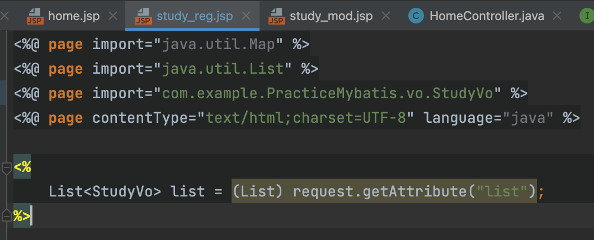

    - 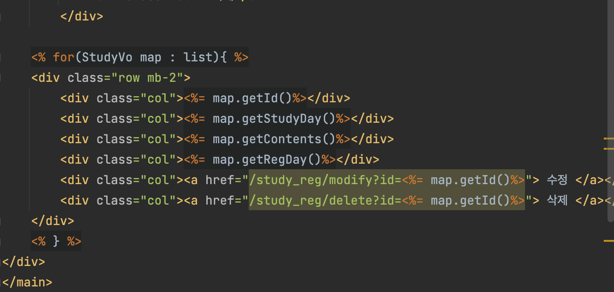