# ♻️ study-Spring

<br/>

### Introduction(중요 부분 발췌)
- JDBC
- JDBC Template
- JPA
- Spring Data JPA
- AOP

<br/>

## 정리(스프링 입문)
  - 프로젝트 시작(Initializer)
    - Gradle - Groovy -> Build Tool(라이브러리를 땡겨온다)
    - Dependencies : `Spring Web`, `Thymeleaf` <br> spring-boot-starter(공통) : 스프링 부트 + 스프링 코어 + 로깅(log)
      - `Spring Web` : 웹지향 통합기능을 제공(서블릿 리스너, 톰캣, 스프링 웹 MVC 등)
      - `Thymeleaf` : HTML을 만들어주는 템플릿 엔진<br> html태그에 속성을 추가해 페이지에 동적으로 값을 추가하거나 처리할 수 있다.
      - Spring Boot : Spring을 지원하기 위한 프레임워크(내장 Tomcat) Intializer로 Spring Boot 바로 생성


  - 스프링 웹 개발 기초
    - 정적 컨텐츠
    - MVC와 템플릿 엔진 -> Web
    - API -> `Android` or `React` or `Server`
      - `@ResponseBody` 를 사용하면 `viewResolver`를 사용하지 않음
      - 대신에 HTTP의 BODY에 문자 내용을 직접 반환
      - `viewResolver`대신에 `HttpMessageConverter`가 동작
        - 기본 문자 처리: `StringHttpMessageConverter`
        - 기본 객체 처리: `MappingJackson2HttpMessageConverter`

  - 스프링 빈과 의존관계
    - (1) 컴포넌트 스캔
      - `@Component`애노테이션이 있으면 스프링 빈으로 자동 등록된다.
      - 생성자에 `@Autowired`가 있으면 스프링이 연관된 객체를 스프링 컨테이너에서 찾아서 넣어준다
    <br> 이렇게 객체 의존관계를 외부에서 넣어주는 것을 DI(의존성 주입)이라 한다.
        - 스프링 빈은 싱글톤으로 설정하는게 일반적이다
      - 의존성주입 : 필드 주입, setter 주입, 생성자 주입 (생성자 주입이 가장 많이 쓰인다)
      ``` java
      @Autowired
      public MemberController(MemberService memberservice){
        this.memberservice = memberservice
      }
      ```

    - (2) 자바코드로 직접 스프링 빈 등록
      - `@Configuration`, `@Bean`

  - Test부분
    ```java
    @SpringBootTest //스프링 컨테이너와 테스트를 함께 실행
    @Transactional //테스트 시작전에 트랜잭션을 시작하고, 테스트 완료 후에 항상 롤백한다
    class MemberServiceIntegrationTest {
      @Autowired MemberService memberService;
      @Autowired MemberRepository memberRepository;   // Test에서는 Injection하고 끝이므로 필드 DI가 유용
    }
    ```


  - 스프링 DB 접근 기술
    - 순수 JDBC (`DataSource` 사용)
    - JDBC Template (`JdbcTemplate` 사용)
    - JPA(`EntityManager` 사용)
      - Table 대상으로 Query를 날리는 것이 아닌 객체를 대상으로 Query를 날린다(JPQL)
      - `@Entity, @Id, @GeneratedValue(strategy = GenerationType.IDENTITY), 서비스계층(@Transactional)`
    - Spring Data JPA
      - 기본 CRUD기능을 제공한다
      - `JPARepository`를 상속받는 인터페이스만으로 구현 가능
        - 스프링 데이터 JPA가 위 상속받는 인터페이스를 스프링 빈으로 자동 등록해준다
      - 복잡한 동적 쿼리는 Querydsl이라는 라이브러리를 이용하면 된다


  - AOP
    - 공통관심사항 vs 핵심관심사항을 분리  

      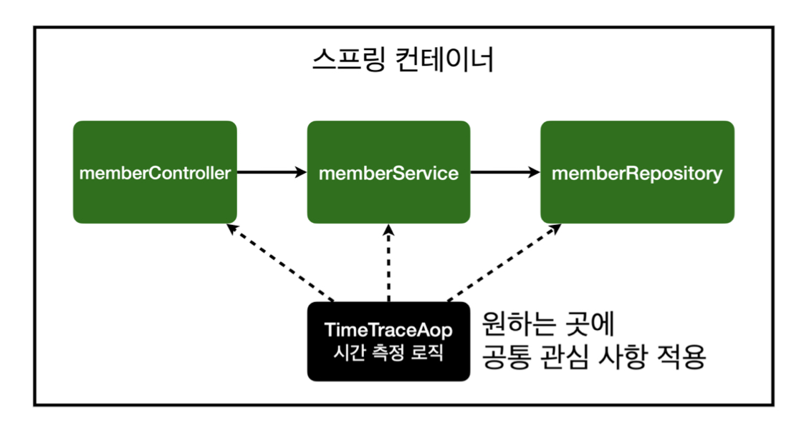

    - `@Aspect, @Around("execution(* com.example.introduction..*(..))")`  

      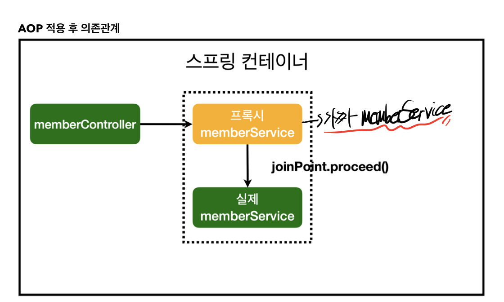  

      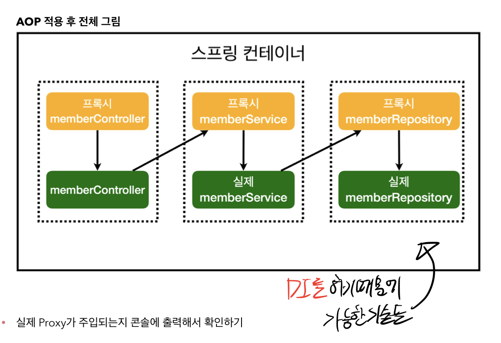


<br/>

### 정리(스프링 핵심 원리 - 기본편)
  - Introduction(중요 부분 발췌)
    - 객체지향 특성
      - 추상화
      - 캡슐화
        - 객체의 필드(속성), 메소드를 하나로 묶는다
        - `실제 구현내용을 외부에 감춘다`
      - 상속
      - 다형성(하나의 타입에 여러 객체를 대입할 수 있는 성질)
        - 오버로딩, 오버라이딩, 함수형 인터페이스
        - `Parent pc = new Child();`
      - 역할(`Interface`)과 구현(`class`)으로 분리
      - **SOLID**
        - **SRP** : 단일책임원칙 -> 한클래스는 하나의 책임만 가져야 한다
        - **OCP** : 개방-폐쇄 원칙 -> 확장에는 열려 있으나 변경에는 닫혀 있어야 한다
        - **LSP** : 리스코프 치환 원칙 -> 객체는 하위 타입의 인스턴스로 바꿀수 있어야 한다
        - **ISP** : 인터페이스 분리 원칙 -> 특정 클라이언트를 위한 인터페이스 여러 개가 범용 인터페이스 하나보다 낫다
        - **DIP** : 의존관계 역전 원칙 -> 추상화에 의존하며, 구체화에 의존하면 안된다 (**DI**)

  - ### 1) 예제 만들기
    - 항상 DIP(**추상화에 의존**), OCP(**확장에 열려있고 변경에 닫혀있다**)를 지키고 있는지  경계하자  
  


  - ### 2) 객체 지향 원리 적용
    - 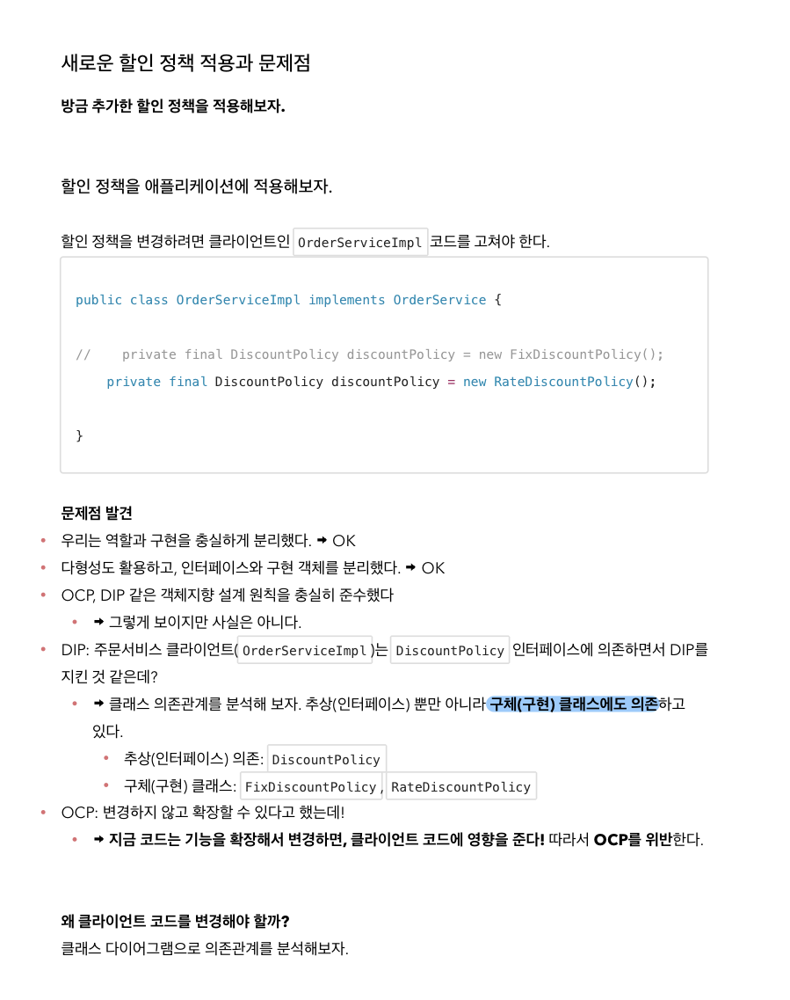
    - `FixDiscountPolicy`를 `RateDiscountPolicy`로 변경하는 순간 `OrderServiceImpl`의 소스코드도 함께 변경해야 한다 -> **OCP 위반**
    - 따라서, `private final DiscountPolicy discountPolicy;`로 수정하자
      - 이러면 Null pointer exception이 발생
      - 관심사를 분리하여 연결을 따로 해주는 설정 클래스를 만들자
      - 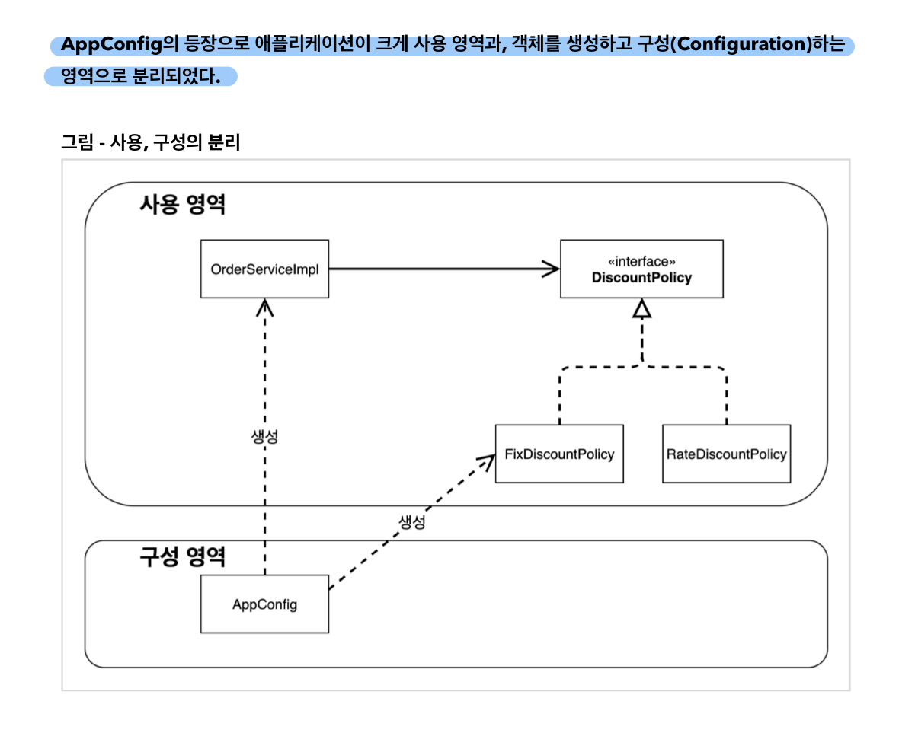
      - `AppConfig`가 의존관계를 `FixDiscountPolicy` -> `RateDiscountPolicy`로 변경해서<br>클라이언트코드에 주입하므로 클라이언트코드는 변경하지 않아도 된다
      - **소프트웨어 요소를 새롭게 확장해도 사용 영역의 변경은 닫혀있다** -> OCP 준수

    - 제어의 역전(IoC)
      - 프로그램에 대한 제어 흐름에 대한 권한은 모두 AppConfig가 가지고 있다
        - 프로그램의 제어 흐름을 직접 제어(구현 객체)하는 것이 아니라 외부(AppConfig)에서 관리하는 것을 제어의 역전(IoC)라고 한다
        - `OrderServiceImpl`(구현 객체)은 필요한 인터페이스들을 호출하지만 어떤 구현 객체들이 실행될지는 모른다

    - 의존관계 주입(DI)
      - 의존관계는 **정적인 클래스 의존 관계**와 **실행 시점에 결정되는 동적인 객체의존관계** 둘을 분리해서 생각해야 한다.
      - 정적인 클래스 의존 관계
        - `import` 코드만 보고 의존관계를 쉽게 파악할 수 있다
      - 동적인 객체 의존 관계
        - 실행 시점에 실제 생성된 객체 인스턴스의 참조가 연결된 의존관계이다
      - **의존관계 주입을 사용하면 정적인 클래스 의존관계를 변경하지 않고, 동적인 객체 인스턴스 의존관계를 쉽게 변경할 수 있다**

    - ### AppConfig처럼 객체를 생성하고 관리하면서 의존관계를 연결해주는 것을 IoC컨테이너 혹은 DI컨테이너라고 한다
    - ### 스프링으로 전환!
      - AppConfig에 설정을 구성한다는 뜻의 `@Configuration`을 붙인다
      - 각 메서드에 `@Bean`을 붙여준다 -> 스프링 컨테이너에 스프링 빈으로 등록된다
      - main 메서드 내에서 `ApplicationContext ac = new AnnotationConfigApplicationContext(AppConfig.class);` -> 컨테이너에 등록한다
      - `MemberService memberService = ac.getBean("memberService", MemberService.class);` -> 컨테이너에서 memberService라는 이름의 빈을 꺼낸다
      - `ApplicationContext`를 스프링 컨테이너라고 한다.

  
  - ### 3) 스프링 컨테이너와 스프링 빈
    - `ApplicationContext`를 스프링 컨테이너라고 하며, 인터페이스이다
    - 스프링 컨테이너는 XML을 기반으로 만들 수 있고, 애노테이션 기반(`ApplicationContext ac = new AnnotationConfigApplicationContext(AppConfig.class);`)의 자바 설정 클래스로 만들 수 있다.

    - 스프링 컨테이너 생성 과정
      - 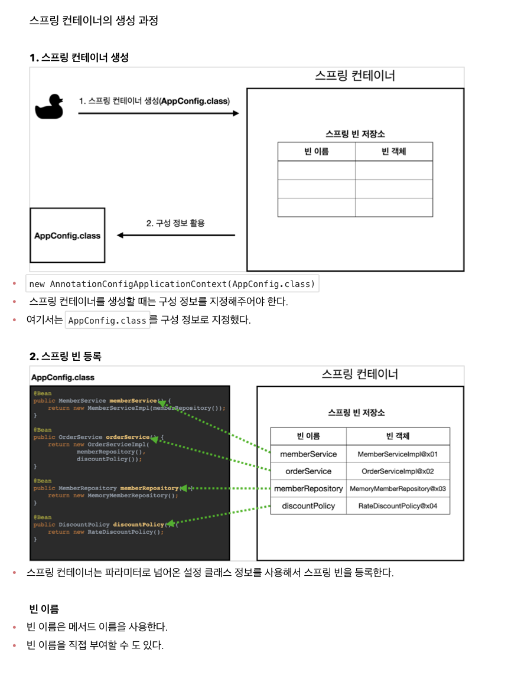
      - 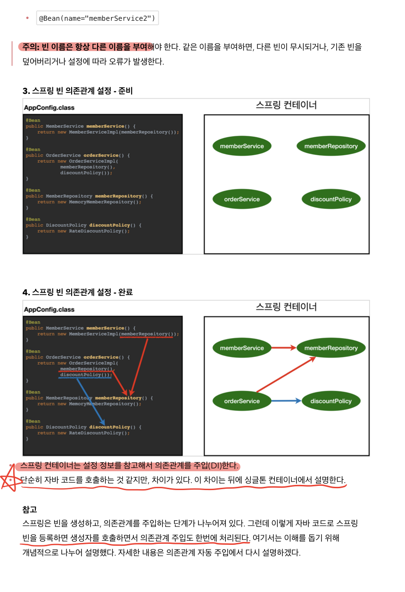

    - 모든 빈 출력하기
      - `ac.getBeanDefinitionNames()`: 스프링에 등록된 모든 빈 이름을 조회한다
      - `ac.getBean(빈이름, 타입)` : 빈 이름으로 빈 객체를 조회한다
      - `ac.getBean(타입 ex)MemberServiceImpl.class)` : 빈 타입으로 빈 객체를 조회한다
        - 타입으로 조회시 같은 타입의 스프링 빈이 둘 이상이면 오류가 발생한다  

    - 스프링 빈 조회 - 상속관계
      - 부모타입으로 조회하면, 자식 타입도 함께 조회된다
        - `ac.getBean(DiscountPolicy.class)` 이면 `DiscountPolicy`를 구현한 `rateDiscountPolicy` 와 `fixDiscountPolicy`의 빈들이 조회되는데 중복이므로 이름까지 지정해서 호출해주면 된다<b r> `ac.getBean("rateDiscountPolicy", DiscountPolicy.class)`
    
    - BeanFactory 와 ApplicationContext
      - 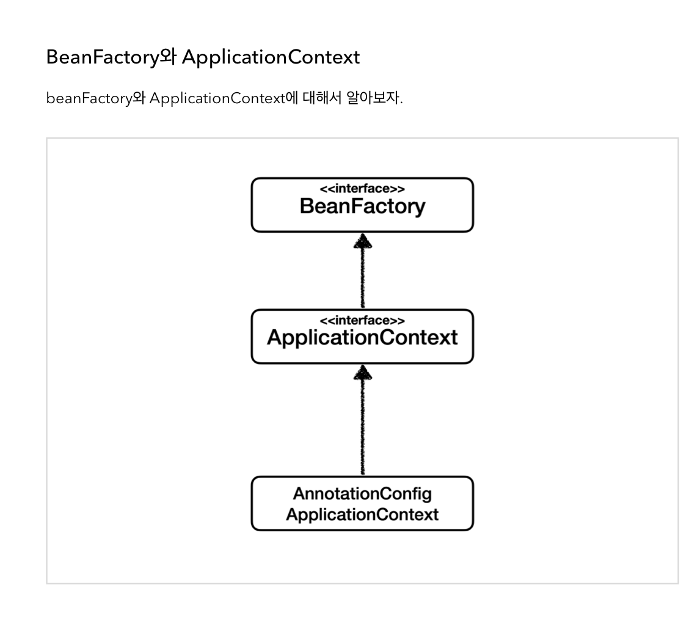
      - `BeanFactory`는 스프링 빈을 관리하고 조회하는 역할을 한다
      - 거의 대부분의 기능을 `BeanFactory`가 제공한다
      
      - 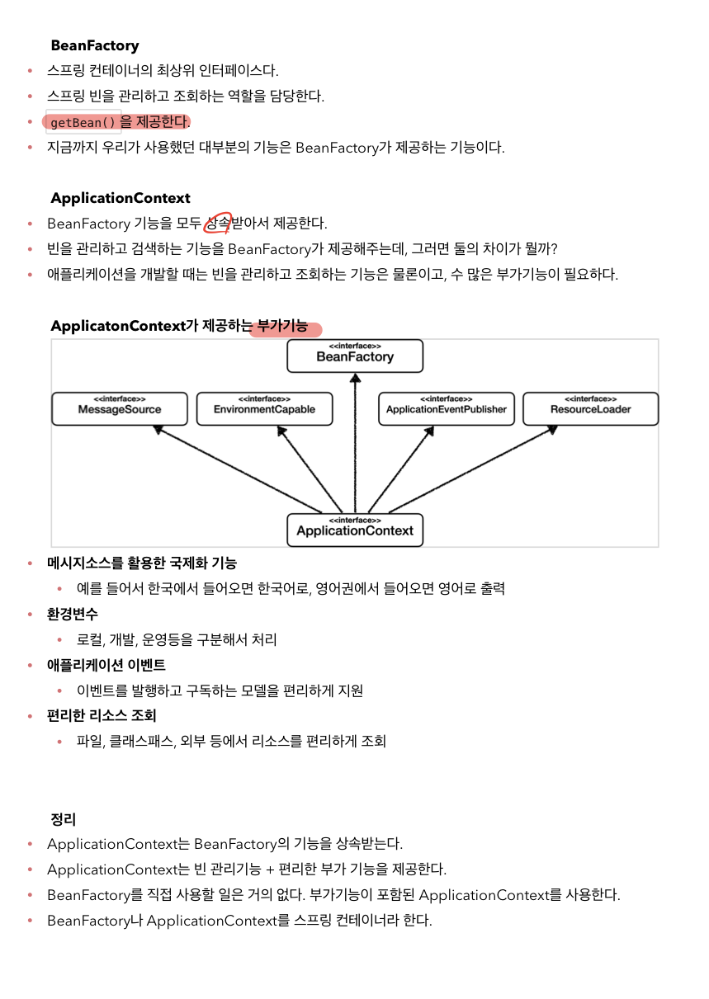
      - 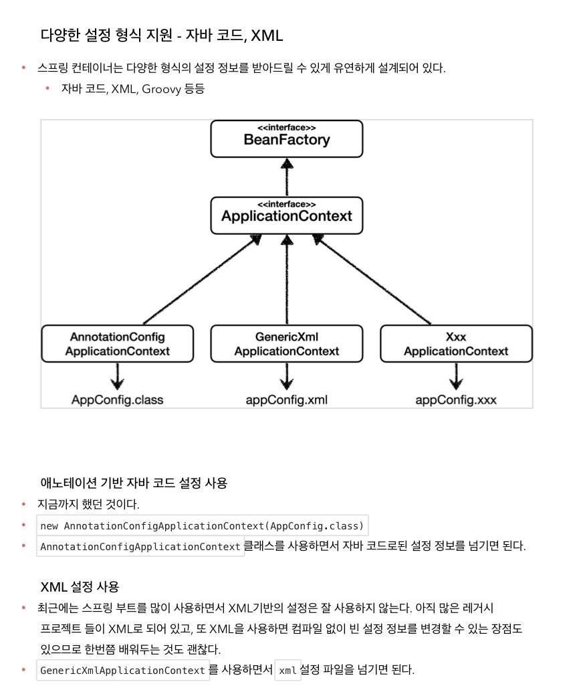
    
    - 스프링 빈 설정 메타 정보 - BeanDefinition
      - 스프링이 이렇게 다양한 설정 형식을 지원할 수 있는 이유
        - -> BeanDefinition(빈 설정 메타 정보)라는 추상화 덕분에<br>(**스프링 컨테이너는 이 메타정보를 기반으로 스프링 빈을 생성한다**)
        - XML을 읽어서 BeanDefinition을 만든다
        - 자바코드를 읽어서 BeanDefinition을 만든다
        - 즉, 스프링 컨테이너는 자바코드인지, XML인지 몰라도 되며 오직 BeanDefinition만 알면 된다
        - **역할**과 **구현**의 분리
      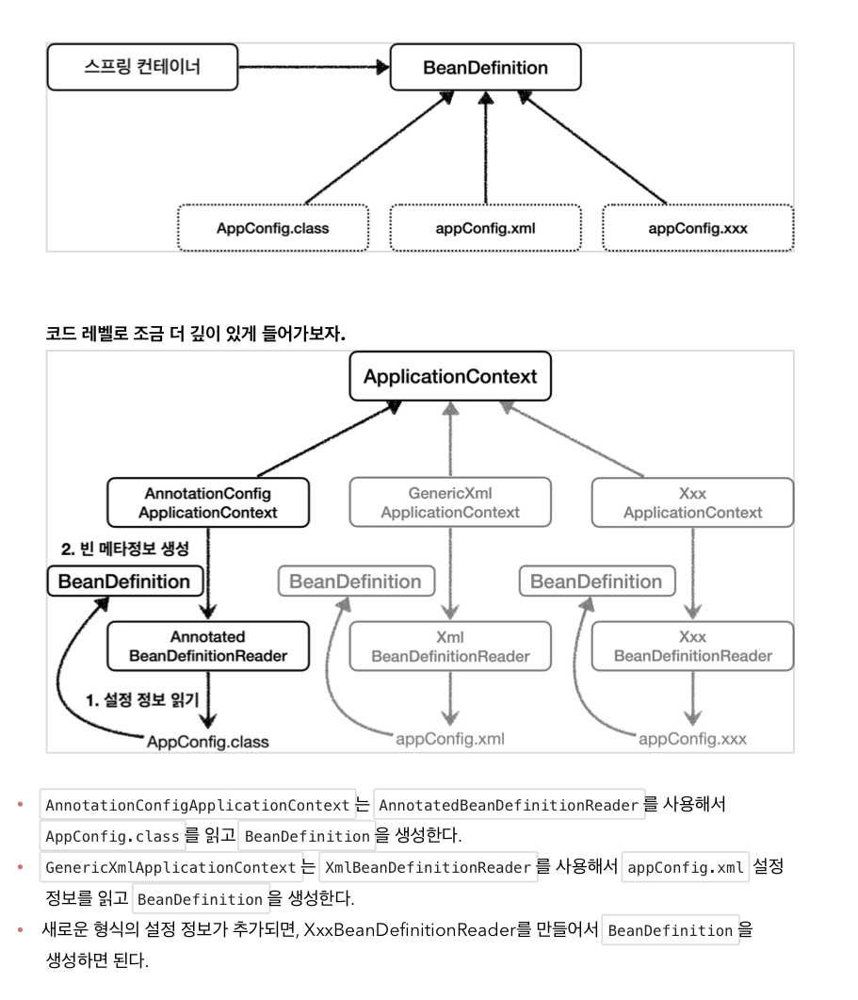
       ```java
        public class BeanDefinitionTest {
            AnnotationConfigApplicationContext ac = new
                          AnnotationConfigApplicationContext(AppConfig.class);
            //    GenericXmlApplicationContext ac = new GenericXmlApplicationContext("appConfig.xml");
            @Test
            @DisplayName("빈 설정 메타정보 확인")
            void findApplicationBean() {
              String[] beanDefinitionNames = ac.getBeanDefinitionNames();
              for (String beanDefinitionName : beanDefinitionNames) {
                BeanDefinition beanDefinition = ac.getBeanDefinition(beanDefinitionName);
                if (beanDefinition.getRole() == BeanDefinition.ROLE_APPLICATION) {
                    System.out.println("beanDefinitionName" + beanDefinitionName + " beanDefinition = " + beanDefinition);
                  }
                }
              }
            }
        ```


  - ### 4) 싱글톤 컨테이너
    - 싱글톤 패턴 : 클래스의 인스턴스가 딱 1개만 생성되는 것을 보장하는 디자인 패턴
      - 문제점
        - 의존관계상 클라이언트가 구체 클래스에 의존한다 -> DIP를 위반
        - 클라이언트가 구체 클래스에 의존해서 OCP원칙을 위반할 가능성이 높다
        - 테스트하기 어렵다
      - -> 싱글톤 컨테이너 : 스프링 컨테이너는 싱글톤 패턴의 문제점을 해결하면서, 객체 인스턴스를 싱글톤으로 관리한다
      - 이렇게 싱글톤 객체를 생성하고 관리하는 기능을 **싱글톤 레지스트리**라고 한다
      - 스프링의 기본 빈 등록방식은 싱글톤이지만, 싱글톤 방식만 지원하는 것은 아니다<br> 요청할 때 마다 새로운 객체를 생성해서 반환하는 기능도 제공한다 -> 빈스코프
    
    - 싱글톤 방식의 주의점
      - 싱글톤 객체는 상태를 유지하게 설계하면 안된다 -> 같은 객체 인스턴스를 공유하기 때문에
      - 무상태로 설계해야 한다 -> 특정 클라이언트에 의존적인 필드가 있으면 안된다  

    - `@Configuration`과 바이트코드 조작의 마법
      - `@Configuration`을 적용한 `AppConfig.class` 또한 스프링 빈으로 등록이되는데,<br> 스프링이 CGLIB라는 바이트코드 조작 라이브러리를 사용해서 `AppConfig클래스`를 상속받은 임의의 다른 클래스를 만들고 그 다른 클래스를 스프링 빈으로 등록한다.
      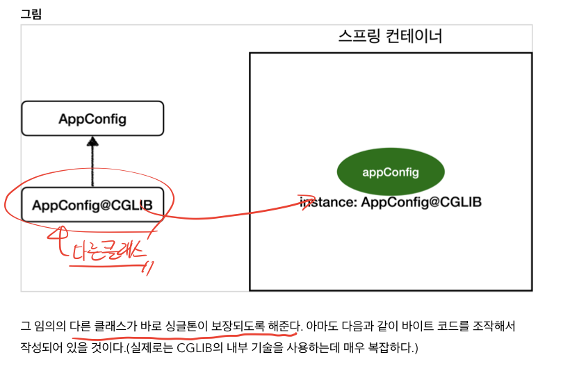
      - `AppConfig@CGLIB`는 `AppConfig`의 자식타입이므로, `AppConfig` 타입으로 조회 할 수 있다
      - `@Configuration`를 제거하면 싱글톤을 보장하지 않는다 <br>즉, 같은 인스턴스를 공유하지 않는다 
        - 빈으로 등록은 되지만, 각각 다른 인스턴스를 가지고 있다
        - 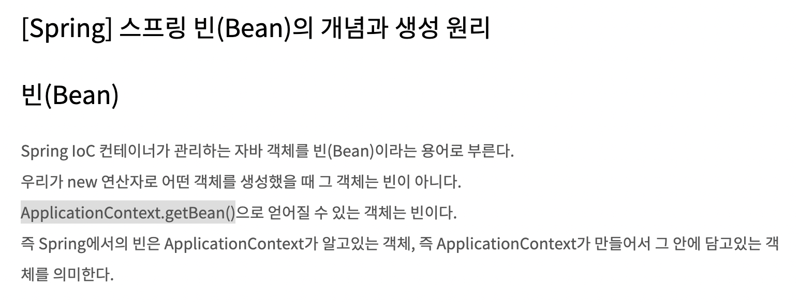
        - 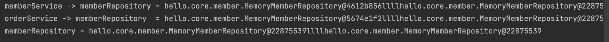
        - 스프링 컨테이너가 관리하는 자바 객체(빈)는 하나인걸 알 수 있다 하지만, <br> `new연산자`를 통해 어떤 객체를 2번 더 생성하는데 그 객체는 빈이 아니다(각기 다른 인스턴스)
        - 저장되는 인스턴스들은 다르고 빈의 등록되는 객체는 하나! -> `memberRepository`의 인스턴스와 빈의 등록되는 인스턴스가 같은 것을 보고 알 수 있다 <br> `memberService`와 `orderService`가 호출하는 `new MemberRepository`는 빈을 활용하는 것이 아니다 (새로운 인스턴스를 생성)


  - ### 5) 컴포넌트 스캔
    - 자동을 스프링 빈을 등록하는 컴포넌트 스캔이라는 기능을 사용
    - 의존관게 자동 주입 `@Autowired`
    ```java
    @Configuration
    @ComponentScan(excludeFilters = @Filter(type = FilterType.ANNOTATION, classes = Configuration.class))
    public class AutoAppConfig{

    }
    ```
    - 컴포넌트 스캔을 사용하려면 `@ComponentScan`을 설정 정보에 붙여준다
    - 기존의 AppConfig와는 다르게 @Bean으로 등록한 클래스가 하나도 없다
    - 앞서 만들어두었던 설정정보는 컴포넌트 스캔 대상에서 제외했다 -> AutoAppConfig는 등록된다  

    - 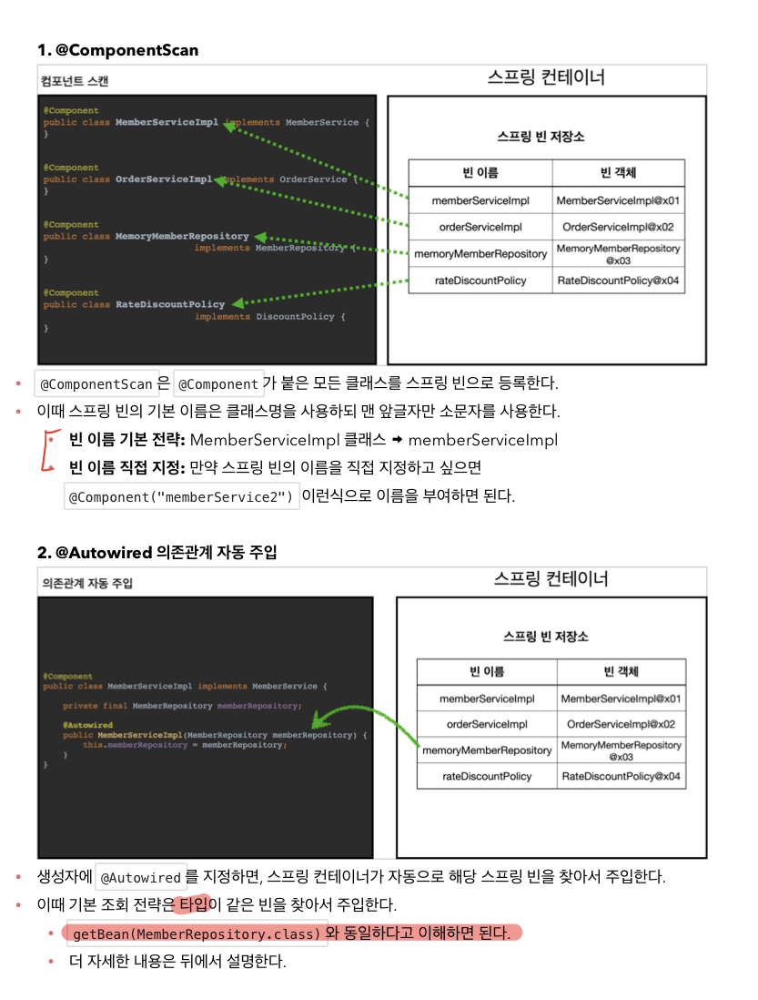
    - 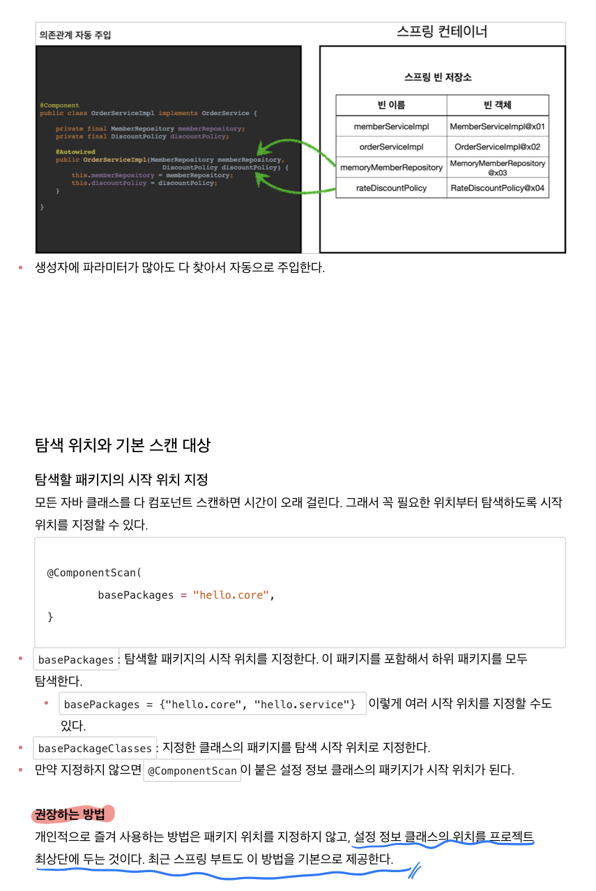
    - 스프링 부트를 사용하면 스프링 부트의 대표 시작 정보인 `@SpringBootApplication`를 이 프로젝트<br>시작 루트 위치에 두는 것이 관례다(안에 `@ComponentScan`이 들어있으므로 `@ComponentScan`를 써주지 않아도 된다.


  - 컴포넌트 기본 대상
    - `@Component` : 컴포넌트 스캔에 사용
    - `@Controller` : 스프링 MVC컨트롤러에서 사용, 스프링 MVC컨트롤러로 인식
    - `@Service` : 스프링 비즈니스 로직에서 사용, 특별한 처리 x 단지, 핵심 비즈니스로직이 여기에 있겠구나 유추 가능
    - `@Repository` : 스프링 데이터 접근계층에서 사용, 스프링 데이터 접근 계층으로 인식하고, 데이터 계층의 예외를 스프링 예외로 변환해준다.
    - `@Configuration` : 스프링 설정 정보에서 사용, 앞서 보았듯이 스프링 설정 정보로 인식하고, 스프링 빈이 싱글톤을 유지하도록 추가처리를 한다.


  - 필터(잘 사용 x)
    - `includeFilters` : 컴포넌트 스캔 대상을 추가로 지정한다
    - `excludeFilters` : 컴포넌트 스캔에서 제외할 대상을 지정한다
    ``` java
    @Target(ElementType.TYPE)
    @Retention(RetentionPolicy.RUNTIME)
    @Documented
    public @interface MyIncludeComponent{

    }

    @MyIncludeComponent
    public class BeanA{

    }

    @Configuration
    @ComponentScan(
        includeFilters = @Filter(type = FilterType.ANNOTATION, classes = MyIncludeComponent.class)
    )
    static class ComponentFilterAppConfig{

    }
    ```

  - FilterType 옵션 5가지 존재


  - 중복등록과 충돌
    - 자동 빈 등록 vs 자동 빈 등록
    - 수동 빈 등록 vs 자동 빈 등록
    - **둘 다 에러 발생**


  - ### 6) 의존관계 자동 주입
    - 생성자 주입 (**불변과 누락에 강해 추천**)
    - setter 주입
    - 필드 주입
    - 일반 메서드 주입


      - 생성자 주입
        ```java
        @Autowired
        public MemberServiceImpl(MemberRepository memberRepository) {
          this.memberRepository = memberRepository;
        }
        ```

      - setter 주입
        ``` java
        @Autowired
        public void setMemberRepository(MemberRepository memberRepository) {
            this.memberRepository = memberRepository;
        }
        ```

      - 필드 주입
        ``` java
        @Component
        public class OrderServiceImpl implements OrderService {
        @Autowired
        private MemberRepository memberRepository;
        @Autowired
        private DiscountPolicy discountPolicy;
        }
        ```
        - 가급적이면 사용하지 말고, 테스트 딴에서는 가끔 사용하기도 한다

      - 일반 메서드 주입
        ``` java
          @Autowired
          public void init(MemberRepository memberRepository, DiscountPolicy
          discountPolicy) {
            this.memberRepository = memberRepository;
            this.discountPolicy = discountPolicy;
          }
        ```

    - 옵션 처리
      - 주입할 스프링 빈이 없어도 동작해야 할 때가 있다
      - `@Autowired(required = false)`
      - @Nullable
        ``` java
          @Autowired
          public void setNoBean2(@Nullabe Member member) {
            System.out.println("setNoBean2 : " + member);
          }
        ```
      - Optional<>
        ``` java
        @Autowired(required = false)
        public void setNoBean3(Optional<Member> member) {
            System.out.println("setNoBean3 : " + member);
        }
        ```

    - final 키워드
      - 생성자 주입을 사용하면 필드에 `final` 키워드를 사용할 수 있다
    
    - 롬복과 최신 트렌드
      - 롬복 라이브러리를 이용하여 `@RequiredArgsConstructor`기능을 사용하면<br> final이 붙은 피드를 모아서 생성자를 자동으로 만들어 준다
      ```java
      @Component
      @RequiredArgsConstructor
      public class OrderServiceImpl implements OrderService{
        private final MemberRepository memberRepository;
        private final DiscountPolicy discountPolicy;
      }
      ```

    - 조회 빈이 2개 이상인 경우
      - `@Autowired` 필드 명 매칭
        - 필드 명 매칭은 먼저 타입 매칭을 시도 하고 그 결과에 여러 빈이 있을 때 추가로 동작한다
          ``` java
          @Autowired
          private DiscountPolicy rateDiscountPolicy
          ```
      - `@Qualifier`
        - 추가 구분자를 붙여주는 방법, 빈 이름을 변경하는 것은 아니다.
        - 1. @Qualifier끼리 매칭, 2. 빈 이름 매칭, 3. 에러 발생
          ``` java
          @Component
          @Qualifier("mainDiscountPolicy")
          public class RateDiscountPolicy implements DiscountPolicy {}


          @Autowired
          public OrderServiceImpl(MemberRepository memberRepository,
                          @Qualifier("mainDiscountPolicy") DiscountPolicy discountPolicy) {
          this.memberRepository = memberRepository;
          this.discountPolicy = discountPolicy;
          } 
          ```
      - `@Primary`
        - 우선순위를 정한다
          ``` java
          @Component
          @Primary
          public class RateDiscountPolicy implements DiscountPolicy {}

          @Component
          public class FixDiscountPolicy implements DiscountPolicy {}
          ```

      - `@Primary` : 기본값 처럼 동작  | `@Qualifier` : 상세하게 동작 
      - 스프링은 자동보다는 수동, 넓은범위보다 좁은 범위의 선택권이 우선순위가 높다. <br> 따라서 `@Qualifier`가 우선순위가 더 높다.
      - 이렇게 애노테이션을 만들어서 사용할 수 있다
        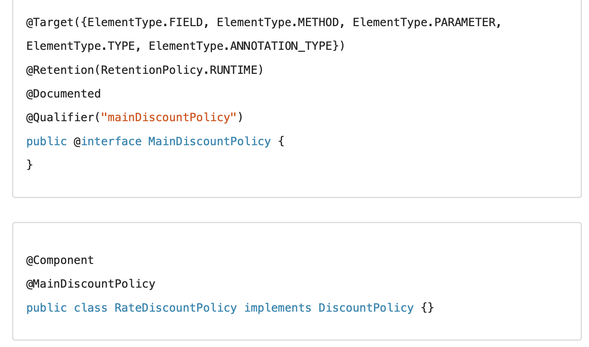

    - 조회한 빈이 모두 필요할 때, **List Map**
      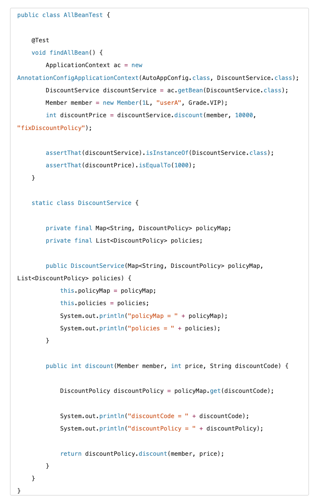
    
    - ### 자동, 수동의 올바른 실무운영 기준(자주 읽자)
      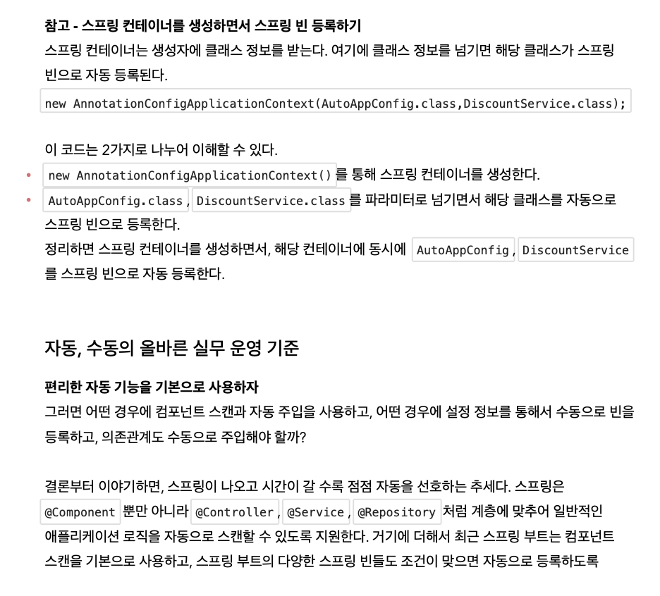
      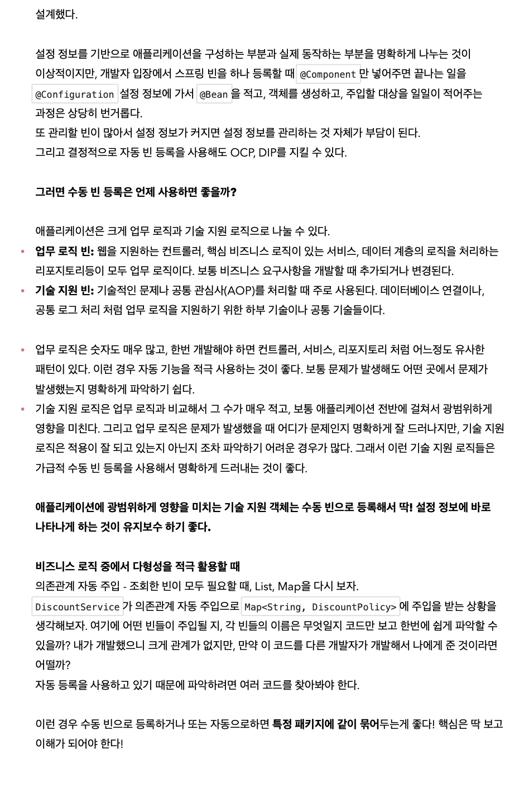
      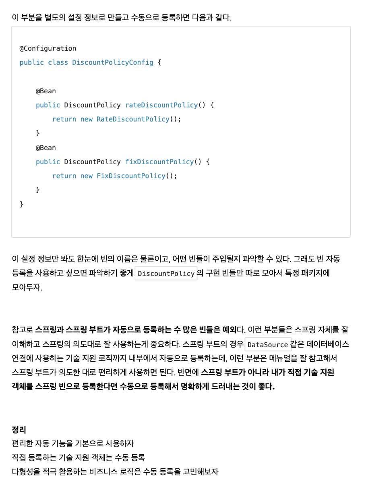


  - ### 7) 빈 생명주기 콜백
    - 스프링 빈은 **객체생성** -> **의존관계 주입** 과 같은 라이프 사이클을 가진다(간단한 버전)
      - 생성자 주입의 경우에는 위의 과정이 동시에 일어난다
    - 스프링 빈은 객체를 생성하고, 의존관계 주입이 다 끝난 다음에야 <br>필요한 데이터를 사용할 수 있는 준비가 완료된다  
      - 따라서, 초기화(필요한 데이터)작업은 의존관계 주입이 모두 완료되고 난 다음에 호출해야 한다.  

    - **스프링은 의존관계 주입이 완료되면 스프링 빈에게 콜백 메서드를 통해 초기화 시점을 알려주고,<br> 스프링 컨테이너가 종료되기 직전 소멸 콜백을 준다**
    - 즉, 스프링 빈의 이벤트 라이프 사이클은 <br>스프링 컨테이너 생성 -> 스프링 빈 생성 -> 의존관계 주입 -> 초기화 콜백<br> -> 사용 -> 소멸전 콜백 -> 스프링 종료
      - 초기화 콜백 : 빈이 생성되고, 빈의 의존관계 주입이 완료된 후 호출
      - 소멸전 콜백 : 빈이 소멸되기 직전에 호출  

    - ### 객체의 생성과 초기화를 분리하자!
      - 생성자안에서 무거운 초기화 작업을 진행하지말고 객체를 생성하는 부분과<br> 초기화 하는 부분을 명확하게 나누는 것이 유지보수 관점에서 좋다

    - 싱글톤 빈들은 스프링 컨테이너가 종료될때 싱글톤 빈들도 함께 종료되기 때문에 <br>스프링 컨테이너가 종료되기 직전에 소멸전 콜백이 일어난다 (생명주기가 짧은 빈들도 존재 - Scope)

    - 스프링이 지원하는 빈 생명주기 콜백 3가지 방법
      - 인터페이스(`InitializingBean`, `DisposableBean`)
      - 설정 정보에 초기화 메서드, 종료 메서드 지정
        - `@Bean(initMethod = "init", destroyMethod = "close")`
        - 외부라이브러리를 초기화, 종료할때 사용
      - `@PostConstruct`, `@PreDestroy` 애노테이션 지원(권장)
        ```java
        @PostConstruct
        public void init(){
          System.out.println("NetworkClient.init");
          connect();
          call("초기화 연결 메시지");
        }

        @PreDestroy
        public void close(){
          System.out.println("NetworkClient.close");
          disconnect();
        }
        ```

  - ### 8) 빈 스코프
    - 스프링 빈은 기본적으로 싱글톤 스코프로 생성되어, <br> 스프링 컨테이너의 시작과 함께 생성되어서 스프링 컨테이너가 종료될때까지 유지된다
    - 다양한 스코프
      - 싱글톤 : 기본, 가장 넓은 범위
      - 프로토 타입 : 스프링 컨테이너는 프로토타입의 빈의 생성과 의존관계 주입까지만 관여하고,<br> 더는 관리하지 않는 매우 짧은 범위
        - 스프링 빈 생성 -> 의존관계 주입 -> 초기화 (여기까지만 관리)
      - 웹 관련 스코프
        - request : 웹 **요청**이 들어오고 나갈때까지 유지되는 스코프
        - session : 웹 **세션**이 생성되고 종료될때까지 유지되는 스코프
        - application : 웹의 서블릿 컨텍스트와 같은 범위로 유지되는 스코프
      - 예시
        ```java
        @Scope("prototype")
        @Component
        public class HelloBean{}

        @Scope("prototype")
        @Bean
        ProtypeBean HelloBean() {
          return new HelloBean();
        }
        ```
      - 프로토 타입 스코프 빈
        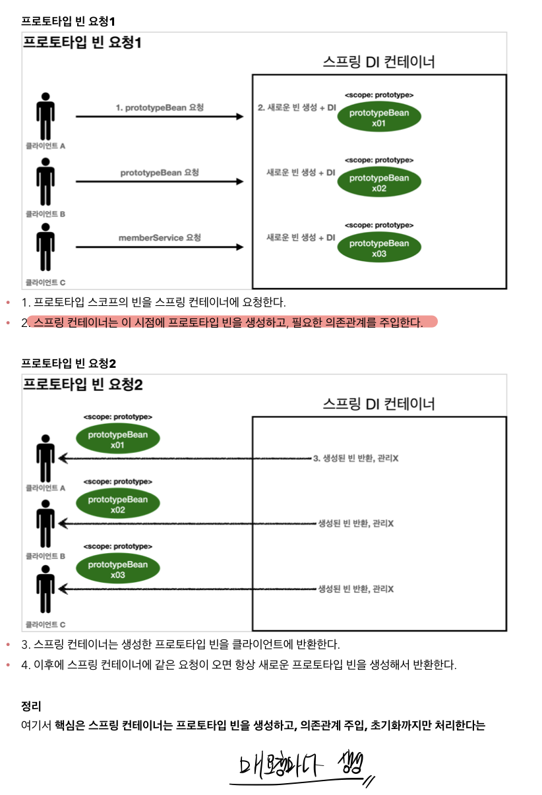
        - 클라이언트에 빈을 반환하고, 이후 스프링 컨테이너는 생성된 프로토 타입 빈을 관리하지 않는다
        - `@PreDestroy`같은 종료 메서드가 호출되지 않는다
    
    - 프로토타입 스코프와 싱글톤 스코프를 함께 사용할 경우 발생하는 문제점
      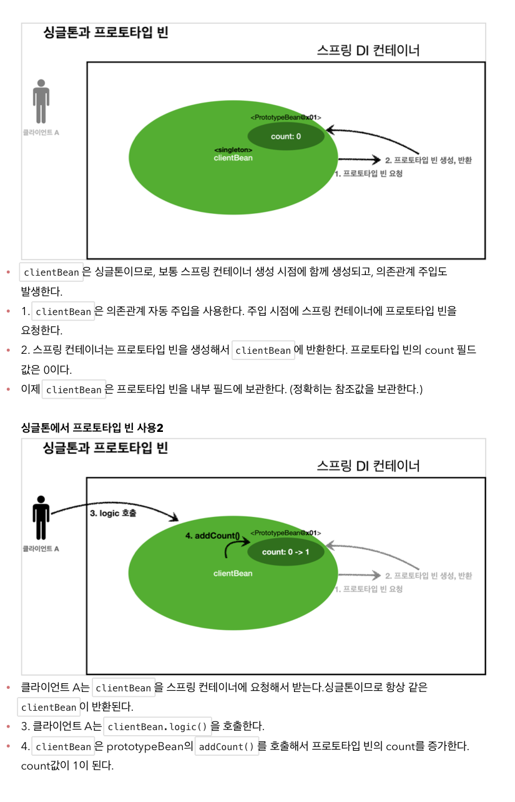
      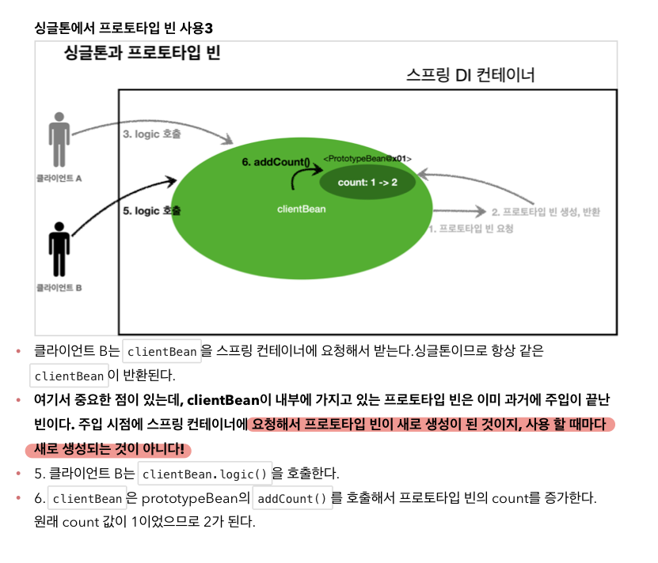
      ```java
      static class ClientBean{
        private final PrototypeBean prototypeBean;

        @Autowired
        public ClientBean(PrototypeBean prototypeBean) {
          this.prototypeBean = prototypeBean;
        }
        ...
      }
      ```

      - 항상 새로운 프로토 타입 빈을 생성할려면?
        - 가장 간단한 방법
          ``` java
          static class ClientBean{

          @Autowired
          private ApplictionContext ac;

          public int logic(){
            PrototypeBean prototypeBean = ac.getBean(PrototypeBean.class);
            prototypeBean.addCount();
            int count = prototypeBean.getCount();
            return count;
          }
          ...
          }
          ```
          - 의존관계를 외부에서 주입(DI)받는게 아니라 이렇게 직접 필요한 의존관계를 <br>
          찾는것을 **Dependency Lookup(DL)** 의존관계 조회라고 한다
          - 이렇게 스프링의 애플리케이션 컨텍스트 전체를 주입받게 되면, 스프링 컨테이너에 종속적인<br> 코드가 되고, 단위테스트 또한 어려워진다.
        - 스프링이 제공하는 `ObjectFactory`, `ObjectProvider` 사용
          ```java
          @Autowired
          private ObjectProvider<PrototypeBean> prototypeBeanProvider;

          public int logic(){
            PrototypeBean prototypeBean = prototypeBeanProvider.getObject();
            prototypeBean.addCount();
            int count = prototypeBean.getCount();
            return count;
          }
          ```
          - `ObjectProvider`의 `getObject()`를 호출하면 내부에서는 스프링 컨테이너를 통해<br> 해당 빈을 찾아서 반환한다(DL) -> 대리자정도
          - `ObjectProvider`는 지금 딱 필요한 DL정도의 기능만 제공한다

        - 스프링에 의존적이지 않은 JSR-330 Provider
          ```java
          @Autowired
          private Provider<PrototypeBean> provider;

          public int logic(){
            PrototypeBean prototypeBean = provider.get();
            prototypeBean.addCount();
            int count = prototypeBean.getCount();
            return count;
          }
          ```
          - `Provider`의 `get()`를 호출하면 내부에서는 스프링 컨테이너를 통해<br> 해당 빈을 찾아서 반환한다(DL) -> 대리자정도
          - `Provider`는 지금 딱 필요한 DL정도의 기능만 제공한다
          - `ObjectProvider`와의 차이점은 별도의 라이브러리가 필요하고,<br> 자바 표준으로 스프링이 아닌 다른 컨테이너에서도 사용 가능하다는 점이다
          - **웬만하면 스프링이 제공하는 기능을 이용하자**

    - 웹 스코프
      - 웹스코프는 웹 환경에서만 동작한다
      - 프로토타입과 다르게 스프링이 해당 스코프의 종료시점까지 관리(따라서, 종료메서드가 호출된다)
      - 종류(범위만 다르고 동작 방식은 모두 유사하다)
        - request : HTTP요청 하나가 들어오고 나갈때 까지 유지되는 스코프<br> 각각의 HTTP요청마다 별도의 빈 인스턴스가 생성되고, 관리된다
        - session : HTTP Session과 동일한 생명주기를 가지는 스코프
        - applicaiton : 서블릿 컨텍스트(**ServletContext**)와 동일한 생명주기를 가지는 스코프
        - websocket : 웹 소켓과 동일한 생명주기를 가지는 스코프
      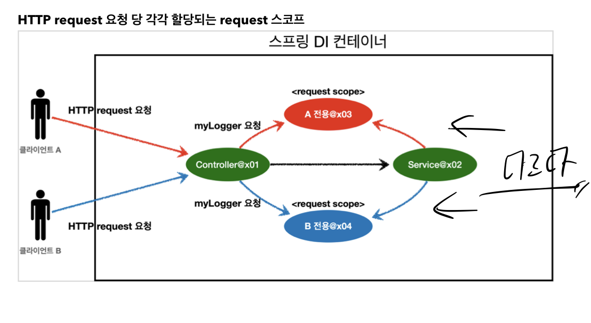


      - request 웹 스코프
        - 스프링 부트는 웹 라이브러리가 없으면 지금까지 학습한 `AnnotationConfigApplicationContext`를 기반으로 애플리케이션을 구동한다<br> 웹 라이브러리가 추가되면 웹과 관련된 추가 설정과 환경들이 필요하므로<br> `AnnotationConfigServletWebServerApplicationContext`를 기반으로 애플리케이션을 구동한다

        - 동시에 여러 HTTP요청이 오면 정확히 어떤 요청이 남긴 로그인지 구분하기 어렵다<br> 이때 유용하다
        ```java
        @Component
        @Scope(value = "request")
        public class MyLogger {
          private String uuid;
          private String requestURL;
          
          public void setRequestURL(String requestURL) {
            this.requestURL = requestURL;
          }

          public void log(String message) {
            System.out.println("[" + uuid + "]" + "[" + requestURL + "] " + message); 
          }

          @PostConstruct
          public void init() {
            uuid = UUID.randomUUID().toString();
            System.out.println("[" + uuid + "] request scope bean create:" + this);
          }
          @PreDestroy
          public void close() {
            System.out.println("[" + uuid + "] request scope bean close:" + this);
            }
        }
        ```
        - `@Scope(value = "request")`를 사용해서 이제 이 빈은 HTTP요청당 하나씩 생성되고, HTTP요청이 끝나는 시점에 소멸된다

        ``` java
        @Controller
        @RequiredArgsConstructor
        public class LogDemoController {
          private final LogDemoService logDemoService;
          private final ObjectProvider<MyLogger> myLoggerProvider;

          @RequestMapping("log-demo")
          @ResponseBody
          public String logDemo(HttpServletRequest request) {
            String requestURL = request.getRequestURL().toString();
            MyLogger myLogger = myLoggerProvider.getObject();
            myLogger.setRequestURL(requestURL);
            myLogger.log("controller test");
            logDemoService.logic("testId");
            return "OK";
          } 
        }
        //ObjectProvider덕분에 ObjectProvider.getObject()를 호출하는 시점까지 request scope
        //빈의 생성을 지연할 수 있었다
        @Service
        @RequiredArgsConstructor
        public class LogDemoService {
          private final ObjectProvider<MyLogger> myLoggerProvider;

          public void logic(String id) {
            MyLogger myLogger = myLoggerProvider.getObject();
            myLogger.log("service id = " + id);
          } 
        }

        ```
        - 참고
          - requestURL을 MyLogger에 저장하는 부분은 컨트롤러 보다는 <br> 공통 처리가 가능한 스프링 인터셉터나 서블릿 필터 같은 곳을 활용하는 것이 좋다.
          
          - 여기서 중요한점이 있다. request scope를 사용하지 않고 파라미터로 이 모든 정보를 서비스 계층에 넘긴다면, 파라미터가 많아서 지저분해진다. <br>더 문제는 requestURL 같은 웹과 관련된 정보가 웹과 관련없는 서비스 계층까지 넘어가게 된다. <br>웹과 관련된 부분은 컨트롤러까지만 사용해야 한다. <br>서비스 계층은 웹 기술에 종속되지 않고, 가급적 순수하게 유지하는 것이 유지보수 관점에서 좋다.  


      - `ObjectProvider`가 아닌 프록시를 쓰는 방법
        ``` java
        @Component
        @Scope(value = "request", proxyMode = ScopedProxyMode.TARGET_CLASS)
        public class MyLogger {
        }
        ```
        - `proxyMode = ScopedProxyMode.TARGET_CLASS`를 추가
          - 클래스면 `TARGET_CLASS`
          - 인터페이스 이면 `INTERFACES` 선택

        - MyLogger의 가짜 프록시 클래스를 만들어두고 HTTP request와 상관없이 <br>가짜 프록시 클래스를 다른 빈에 미리 주입해 둘 수 있다 -> `ObjectProvider`를 사용하지 않아도 된다

        - `CGLIB`라는 라이브러리로 내 클래스를 상속받은 **가짜 프록시 객체**를 만들어서 주입한다

        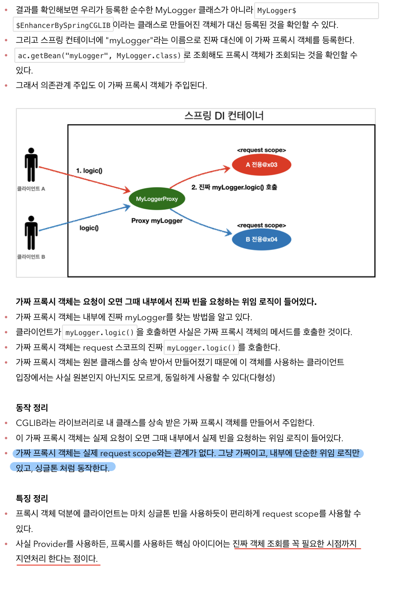

        - 애노테이션의 변경만으로 원본객체를 프록시 객체로 대체할 수 있다 <br> **다형성과 DI컨테이너가 가진 장점**(프록시는 웹 스코프가 아니더라도 사용 가능)
        - scope는 무분별한 사용을 지양하자
        

## Servlet

- ### Servlet(자바로 구현된 CGI)
  - 클라이언트가 어떠한 요청을 하면 그에 대한 결과를 다시 전송해주어야 하는데, <br> 이러한 역할을 하는 자바 프로그램
  - 자바에서 웹 애플리케이션을 만드는 기술(서블릿은 여러개)
  - 자바에서 동적인 웹페이지를 구현하기 위한 표준
  - 클라이언트의 요청을 처리하고, 그 결과를 반환하는 Servlet클래스의 구현 규칙을 지킨 자바 웹 프로그래밍 기술이다

    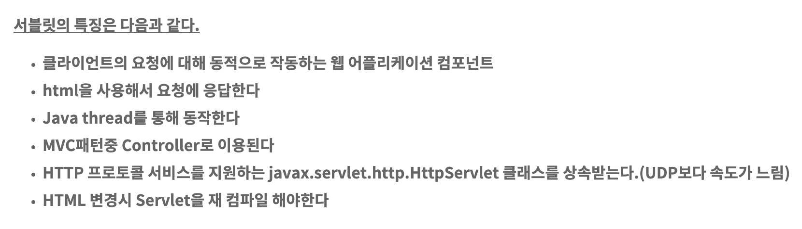

- ### CGI
  - 웹서버와 애플리케이션 사이에 데이터를 주고받는 규약
  - 프로그램 종류로는 컴파일방식(C, C++, java)과 인터프리터 방식(php, python)방식이 존재한다
  - 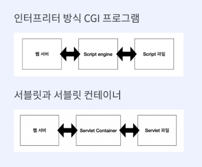
  - 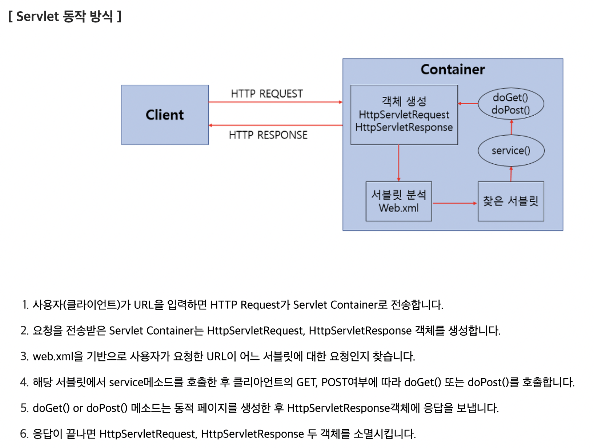

**우리는 cgi규칙을 몰라도 된다**  

**웹서버와 cgi규칙으로 데이터를 주고받는 스크립트 엔진, 서블릿 컨테이너**

## Servlet Container(서블릿 컨테이너)
  - 서블릿의 생성부터 소멸까지의 라이프 사이클을 관리하는 역할
  - 서블릿 컨테이너는 웹 서버와 소켓을 만들고 통신하는 과정을 대신 처리해준다
  - **개발자는 비즈니스 로직에만 집중하면 된다**
  - 서블릿 객체를 싱글톤으로 관리(인스턴스 하나만 생성하여 공유하는 방식)
  - 상태를 유지하게 설계하면 안됨
  - 쓰레드 safety(어떤 공유자원에 여러 쓰레드가 동시에 접근해도 프로그램 실행에 문제가 없는 상태를 의미한다)하지 않다 <br> -> **쓰레드끼리 서로 경쟁한다**

    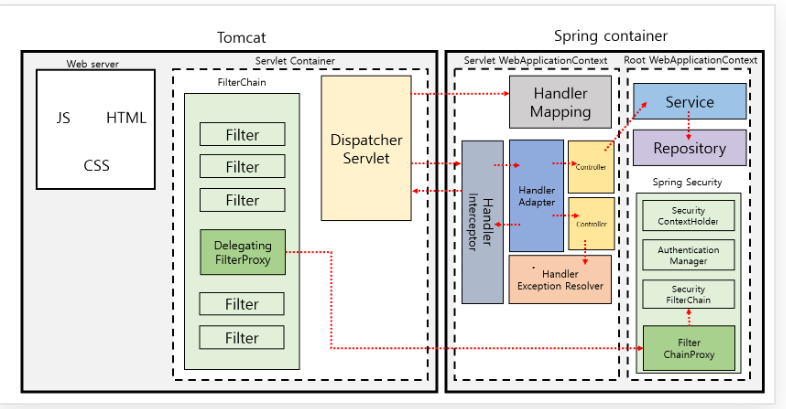

    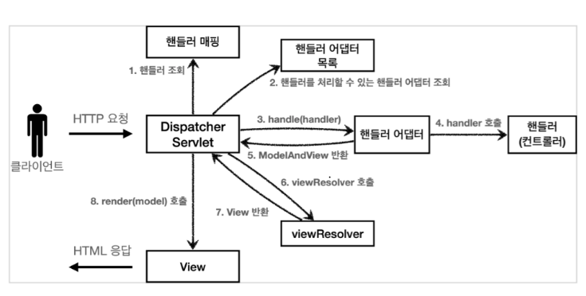

    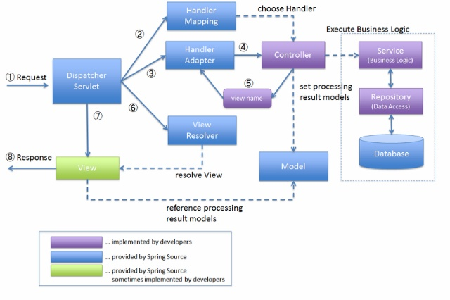

    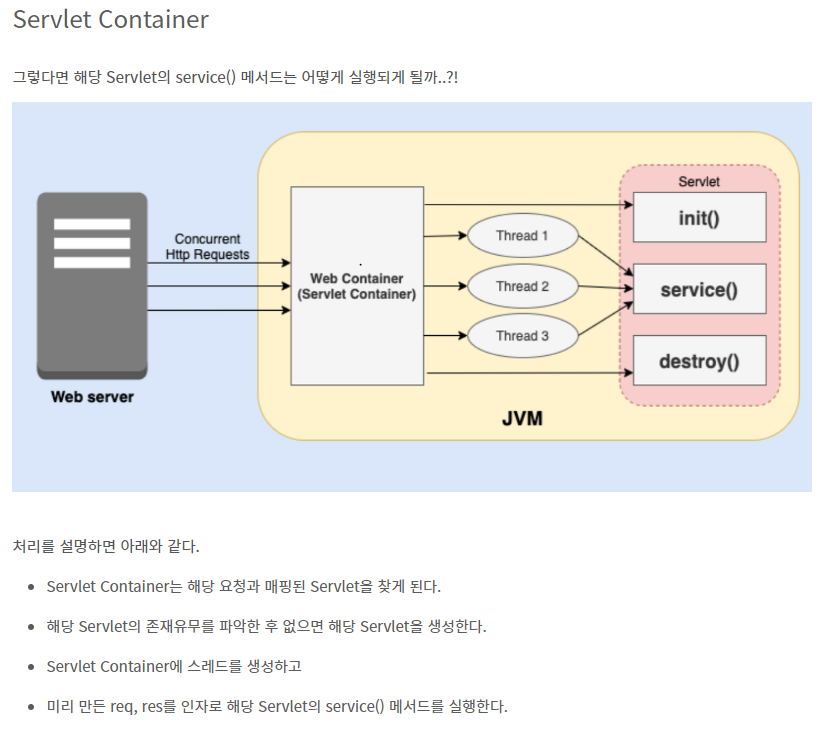

  - Spring MVC
    - Spring MVC는 spring에서 제공하는 웹 모듈로 Model, View, Controller 세가지 구성요소를 사용해 <br> 사용자의 다양한 HTTP Request를 처리하고 단순한 텍스트 형식의 응답부터 REST형식의 응답은 물론 <br> View를 표시하는 html을 return하는 응답까지 다양한 응답을 할 수 있도록 하는 프레임 워크

    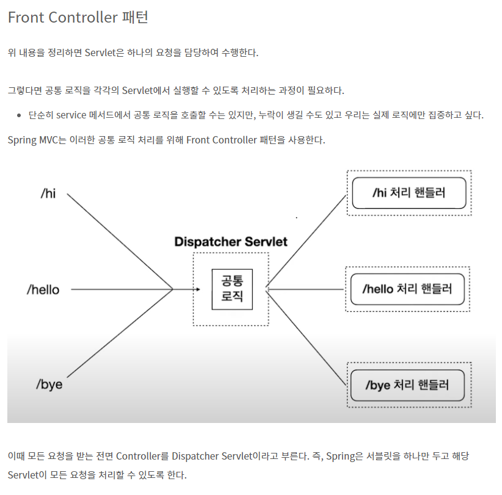

    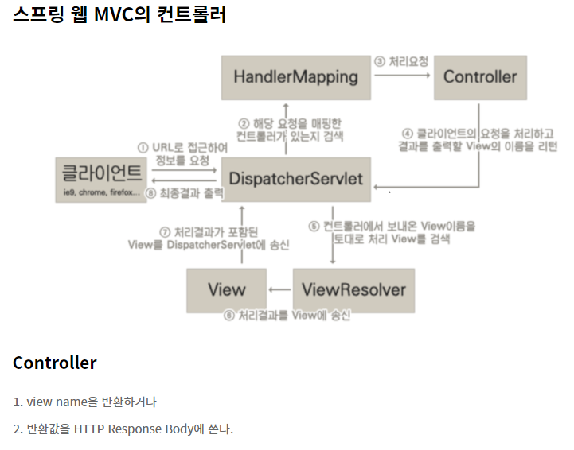

    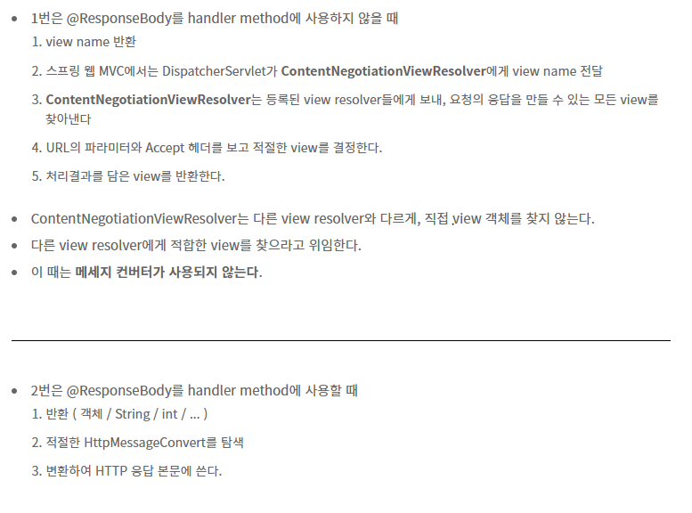

    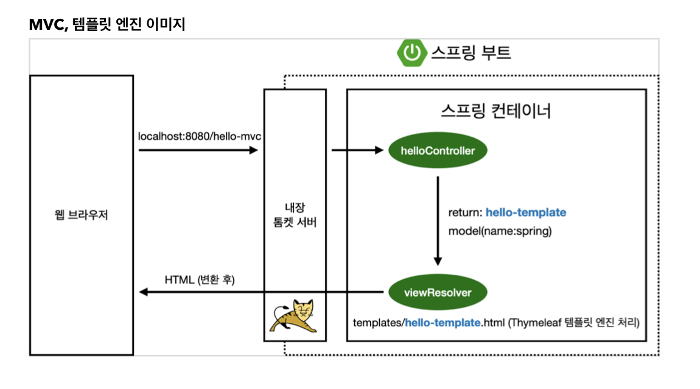

    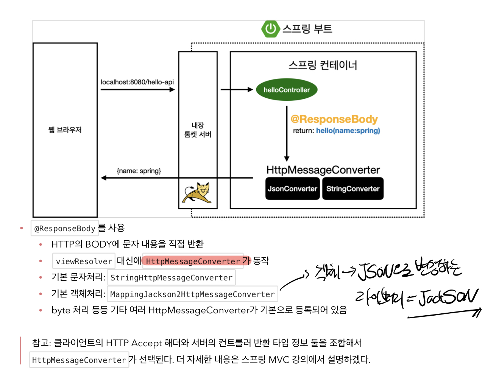


### JSP
  - HTML내에 자바 코드를 삽입하여 웹 서버에서 동적으로 웹페이지를 생성하여 웹브라우저를 돌려주는 언어
  - JSP(Java Server Pages)는 서블릿 기술을 활용하여 동작하는 웹 프로그래밍 기술입니다.
  - JSP는 서블릿 코드를 자동으로 생성하고, 이를 서블릿 컨테이너에서 실행시킵니다.<br> 따라서 JSP는 사실상 서블릿으로 변환되어 실행되는 것이 맞습니다.
  - 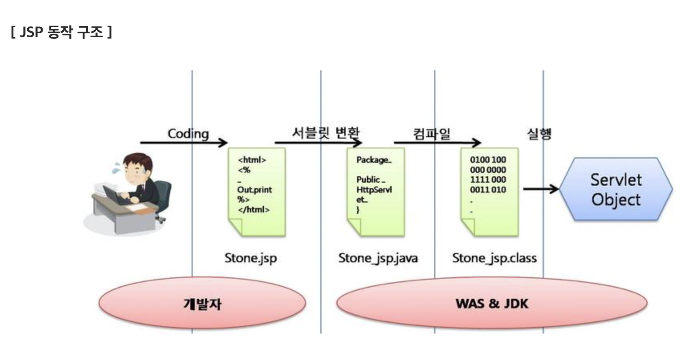


### Was vs Servlet Container
  - **Was는 서블릿 컨테이너를 포함하는 개념**
  - Was는 매 요청마다 스레드 풀에서 기존스레드를 사용한다
  - Was의 주요 튜닝 포인트는 max thread수
  - 대표적인 Was는 톰캣이 있다
  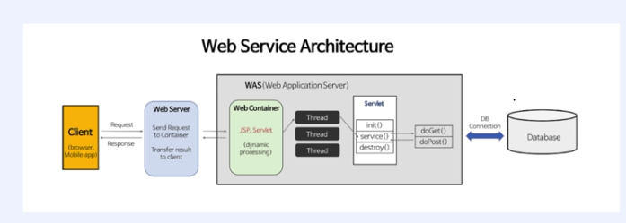


### JDBC
  - **DBCP** : 미리 일정량의 DB커넥션을 생성해서 풀에 저장해 두고있다가 HTTP 요청에 따라 필요할 때 **풀에서 커넥션을 가져다 사용하는 기법**
  - 참고로 스프링 부트 2.0부터는 디폴트 커넥션 풀로 **HikariC**P사용
    - 커넥션 풀 사용시 유의사항 : 커넥션의 사용 주체는 WAS 스레드이므로 커넥션 개수는 WAS 스레드 수와 함께 고려해야 한다
    - 커넥션 수를 크게 설정하면 메모리 소모가 큰 대신 동시 접속자 수가 많아지더라도 사용자 대기시간이 상대적으로 줄어들게 되고, <br>반대로 커넥션 개수를 작게 설정하면 메모리 소모는 적은 대신 그만큼 대기시간이 길어질 수 있다 따라서 **적정량의 커넥션 객체를 생성해 두어야 한다**
  - **DataSource** : 커넥션 흭득하기 위한 표준 인터페이스
  - **HikariCP의 DataSource 사용한다**

    


