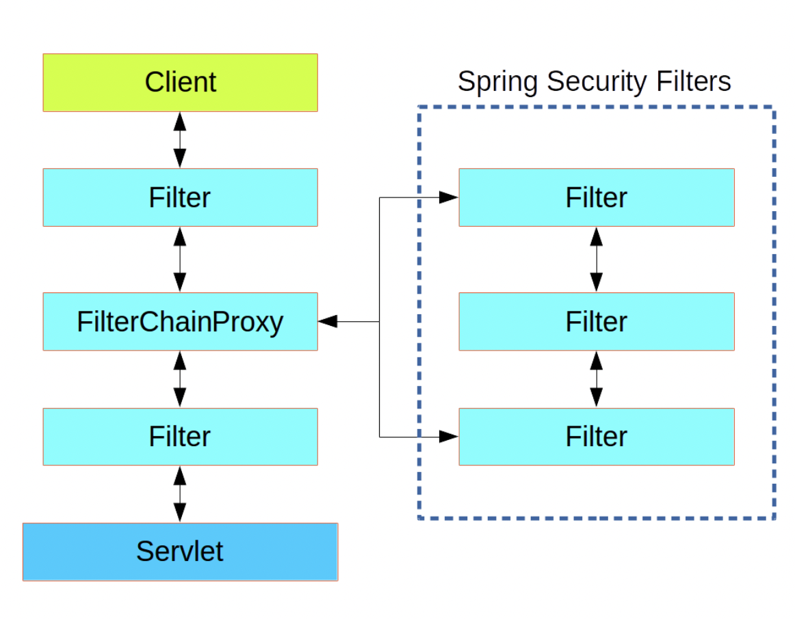
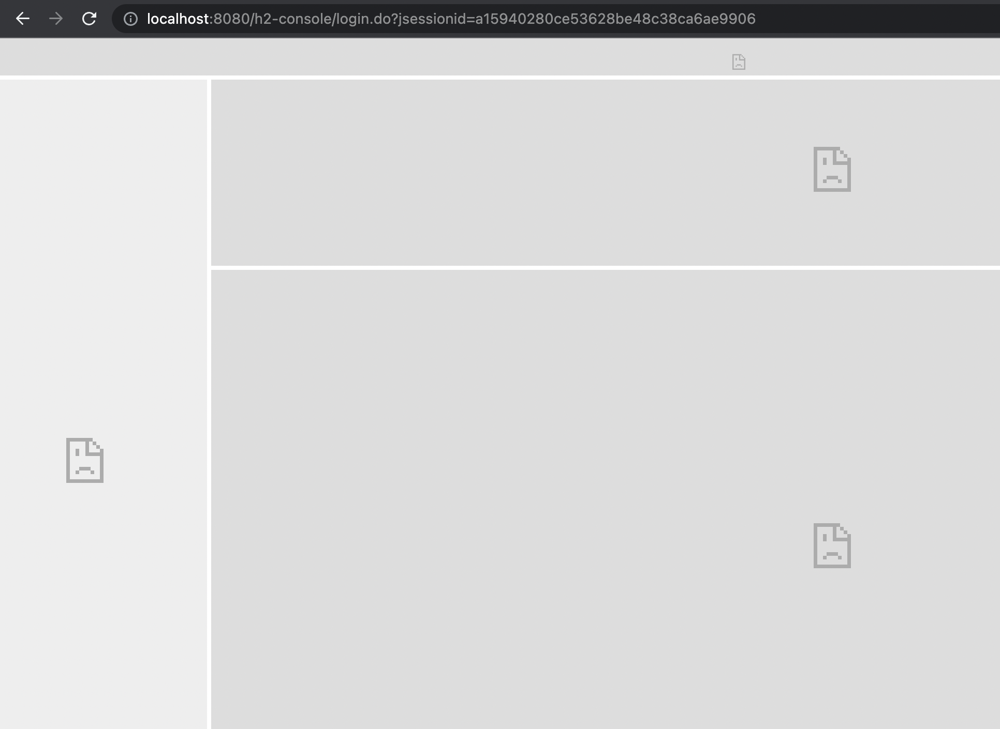

## Spring Security
  - **JWT**

- ### Spring Security
  - 스프링 시큐리티는 스프링 기반 애플리케이션의 **인증**과 **권한**을 담당하는 스프링의 하위 프레임워크이다.
  - **인증(Authenticate)**은 로그인을 의미한다.
  - **권한(Authorize)**은 인증된 사용자가 어떤 것을 할 수 있는지를 의미한다.
  - **FilterChainProxy**라는 이름으로 내부에 여러 `Filter`들이 동작하고 있다
  - Spring Security는 `Filter`를 이용해서 기본적인 기능을 간단하게 구현할 수 있다
  - 설정은 `WebSecurityConfigurerAdapter` 클래스를 상속받아 오버라이딩하는 방식으로 진행가능하다<br> 하지만, `Deprecated`되어 `SecurityFilterChain`을 리턴하는 메서드 이용

    

  - 클라이언트가 서버에 데이터를 요청하면 `DispatcherServlet`에 전달되기 이전에 여러 `ServletFilter`를 거친다
  - 이때, Spring Security에 등록했었던 `Filter`를 이용해 사용자 보안 관련된 처리를 진행하는데<br> 연결된 여러개의 Filter들로 구성 되어 있어서 `FilterChain`이라고 부른다
    - `@Configuration` : 해당 클래스를 Configuration으로 등록한다
    - `@EnableWebSecurity` : Spring Security를 활성화 시킨다
    - `@EnableGlobalMethodSecurity(prePostEnabled = true)` : Controller에서 특정 페이지에 특정 권한이 있는 유저만 접근을 허용할 경우 <br> `@PreAuthorize` 어노테이션을 사용하는데, 해당 어노테이션에 대한 설정을 활성화시키는 어노테이션
      - 이것또한 `Deprecated`되어 `@EnableMethodSecurity` 추가, `@PreAuthorize` 어노테이션을 메서드 단위로 추가하기 위해서 사용


- ### JWT
  - JSON객체를 사용해서 토큰 자체에 정보들을 저장하고 있는 `Web Token`이라고 정의
  - 장점
    - 중앙의 인증서버, 데이터 스토어에 대한 의존성 없다, 시스템 수평 확장에 유리
    - **Base64 URL Safe Encoding을 사용하기 때문에 -> URL, Cookie, Header 어디에서든 모두 사용 가능**
  - 단점
    - Payload의 정보가 많아지면 네트워크 사용량 증가, 데이터 설계 고려 필요
    - 토큰이 서버에 저장되지 않고, 각 클라이언트에 저장되기 때문에 서버에서는 각 클라이언트에 저장된 토큰 정보를 조작할 수 없다

  - **Init**
    - 아무런 설정을 하지않고 `Get`을 한다면
    - `401 unauthorized`가 발생하고 이를 해결하기 위해 Security를 설정해야 한다
      - 그 후, `Datasource`, `JPA`설정
      - `Entity`를 생성한다
    - `EnableWebSecurity` 어노테이션은 기본적인 `Web`보안을 활성화 하겠다는 의미
      - 스프링 시큐리티 필터가 스프링 필터체인에 등록이 된다
      - 추가적인 설정을 위해서 `WebSecurityConfigure`를 `implements`하거나 `WebSecurityConfigureAdapter`를 `extends`하는 방법이 있다
      - `WebSecurityConfigureAdapter`가 `deprecated`되어 쓸 수 없게 되어
        ``` java
        @EnableWebSecurity
        // @EnableWebSecurity는 모든 요청 URL이 스프링 시큐리티의 제어를 받도록 만드는 애너테이션이다.
        // @EnableWebSecurity 애너테이션을 사용하면 내부적으로 SpringSecurityFilterChain이 동작하여 URL 필터가 적용된다.
        @Configuration
        public class SecurityConfig{

          //HttpSecurity Configure
          @Bean
          public SecurityFilterChain filterChain(HttpSecurity http) throws Exception {
          // 스프링 시큐리티의 세부 설정은 SecurityFilterChain 빈을 생성하여 설정할 수 있다. 
          http
                .authorizeHttpRequests()    //HttpServletRequest를 사용하는 요청들에 대한 접근제한을 설정하겠다는 의미
                .requestMatchers("/api/hello").permitAll()  // api/hello에 대한 요청은 인증없이 접근을 허용하겠다는 뜻
                .anyRequest().authenticated();  //나머지 요청들은 모두 인증을 받아야 한다


          return http.build();

        }

          //WebSecurity Configure
          @Bean
          public WebSecurityCustomizer webSecurityCustomizer() {
            return (web) -> web.ignoring().requestMatchers( "/h2-console/**","/favicon.ico");
            // h2-console 하위 모든 요청과 파비콘은 모두 무시하는 것으로 설정 해준다.
            // Spring Security를 적용하면 H2 콘솔 로그인시 403 Forbidden 오류가 발생한다
            }
        }
        ```
  - `WebSecurity vs HttpSecurity`
    - `SpringBuilder`는 웹 보안을 구성하는 빌더 클래스로서 웹 보안을 구성하는 빈 객체와 설정 클래스들을 생성하는 역할을 한다.
    - 이 빌더의 종류로는 **HttpSecurity**와 **WebSecurity**가 있다.
    - `WebSecurity`는 `HttpSecurity`의 상위에 있다. `WebSecurity`의 ignoring에 endpoint를 만들면, Security Filter Chain이 적용되지 않는다.
    - 이 경우 `Cross-Site Scripting`, `XSS 공격`, `content-sniffing`에 취약해진다. 
    - `HttpSecurity`의 `permitAll`에 endpoint를 지정하면 인증처리의 결과를 무시하지만 <br>`Security Filter Chain`이 적용되어 `Cross-Site Scripting`, `XSS 공격`, `content-sniffing`에 대한 검사를 할 수 있다.
    - 위의 예제의 경우 WebSecurity에 ignoring에 설정된 `/h2-console/**` 엔드포인트에 대하여 `HttpSecurity` 부분은 동작하지 않는다.
    - 실무에서 `HttpSecurity`의 `permitAll`이 설정된 endpoint에 잘못된 BearerToken 값이 들어오면 `Security Filter Chain`를 거치면서 에러를 반환하지만,<br> `WebSecurity`는 ignoring이 설정된 잘못된 BearerToken 값이 들어와도 통과된다.
    - **그래서 WebSecurity는 보안과 전혀 상관없는 로그인 페이지, 공개 페이지(어플리캐이션 소개 페이지 등),<br> 어플리캐이션의 health 체크를 하기위한 API에 사용하고, 그 이외에는 HttpSecurity를 사용하는 것이 좋다.**

  - **H2 403 Error**
    - 스프링 시큐리티를 적용하면 **CSRF**기능이 작동한다
      - **CSRF(cross site request forgery)** 는 웹 사이트 취약점 공격을 방지를 위해 사용하는 기술이다.
      - 스프링 시큐리티가 **CSRF** 토큰 값을 세션을 통해 발행하고 웹 페이지에서는 폼 전송시에 <br>해당 토큰을 함께 전송하여 실제 웹 페이지에서 작성된 데이터가 전달되는지를 검증하는 기술이다.
      - `<input type="hidden" name="_csrf" value="0d609fbc-b102-4b3f-aa97-0ab30c8fcfd4"/>`
      - 스프링 시큐리티에 의해 위와 같은 CSRF 토큰이 자동으로 생성된다. 
      - 즉, 스프링 시큐리티는 이렇게 발행한 **CSRF** 토큰의 값이 정확한지 검증하는 과정을 거친다. 
      - **(만약 CSRF 값이 없거나 해커가 임의의 CSRF 값을 강제로 만들어 전송하는 악의적인 URL 요청은 스프링 시큐리티에 의해 블록킹 될 것이다.)**

      - 그런데 H2 콘솔은 이와 같은 **CSRF** 토큰을 발행하는 기능이 없기 때문에 위와 같은 **403 오류**가 발생하는 것이다.

      - H2 콘솔은 스프링과 상관없는 일반 애플리케이션이다.
      - 스프링 시큐리티가 **CSRF** 처리시 H2 콘솔은 예외로 처리할 수 있도록 다음과 같이 설정 파일을 수정하자.

      ``` java 
      @EnableWebSecurity
      @Configuration
      public class SecurityConfig{

        //HttpSecurity Configure
        @Bean
        public SecurityFilterChain filterChain(HttpSecurity http) throws Exception {
          http
                .authorizeHttpRequests()    //HttpServletRequest를 사용하는 요청들에 대한 접근제한을 설정하겠다는 의미
                .requestMatchers(toH2Console(), new AntPathRequestMatcher("/api/hello"))
                .permitAll() // api/hello, H2 Console에 대한 요청은 인증없이 접근을 허용하겠다는 뜻
                .anyRequest().authenticated()   //나머지 요청들은 모두 인증을 받아야 한다
                .and()  //http 객체의 설정을 이어서 할 수 있게 하는 메서드이다.
                .csrf().ignoringRequestMatchers(toH2Console());
                // /h2-console/로 시작하는 URL은 CSRF 검증을 하지 않는다는 설정이다.
        return http.build();

        }

      // WebSecurity를 사용하지 않아도 가능
      //WebSecurity Configure
      //    @Bean
      //    public WebSecurityCustomizer webSecurityCustomizer() {
      //        return (web) -> web.ignoring().requestMatchers( "/h2-console/**","/favicon.ico");
      //        // h2-console 하위 모든 요청과 파비콘은 모두 무시하는 것으로 설정 해준다.
      //    }
      } 

      ```
    - 로그인은 됐지만, 화면이 깨져보이는 상황 
      
      - 이 오류가 발생하는 원인은 H2 콘솔의 화면이 `frame` 구조로 작성되었기 때문이다. 
      - 스프링 시큐리티는 사이트의 콘텐츠가 다른 사이트에 포함되지 않도록 하기 위해 `X-Frame-Options` 헤더값을 사용하여 이를 방지한다. <br>(clickjacking 공격을 막기위해 사용함)
      ``` java
      .and()
        .headers()
          .addHeaderWriter(new XFrameOptionsHeaderWriter(
                        XFrameOptionsHeaderWriter.XFrameOptionsMode.SAMEORIGIN));
      ```
      - 위 처럼 URL 요청시 `X-Frame-Options` 헤더값을 `sameorigin`으로 설정하여 오류가 발생하지 않도록 했다. 
      - `X-Frame-Options` 헤더의 값으로 `sameorigin`을 설정하면 `frame`에 포함된 페이지가 페이지를 제공하는 사이트와 동일한 경우에는 계속 사용할 수 있다.

  - **JWT 관련 코드 개발**
    - `application.yml`파일 JWT 
      - 이 튜토리얼에서는 `HS512`알고리즘을 사용하기 때문에 `Secret key`는 `64Byte` 이상이 되어야 한다
        ``` groovy
        jwt:
          header: Authorization
          secret: c3ByaW5nLXNlY3VyaXR5LXlvb25qdWhvLXN0dWR5LXNwcmluZy1mcmFtZXdvcmstaW4tdW5pdmVyc2l0eQ==
          token-validity-in-seconds: 86400 //토큰의 만료시간은 86400초
        ```
    - `build.gradle`에 디펜던시 추가
      ``` groovy
      // jwt
    	implementation 'io.jsonwebtoken:jjwt-api:0.11.5'
	    implementation 'io.jsonwebtoken:jjwt-impl:0.11.5'
	    implementation 'io.jsonwebtoken:jjwt-jackson:0.11.5'

      ```
    - **토큰의 생성, 유효성 검증**을 담당할 `Token Provider` 생성
      ``` java
      @Component
      public class TokenProvider implements InitializingBean {

        private final Logger logger = LoggerFactory.getLogger(TokenProvider.class);
        private static final String AUTHORITIES_KEY = "auth";
        private final String secret;
        private final long tokenValidityInMilliseconds;

        private Key key;

        public TokenProvider(@Value("${jwt.secret}")String secret, @Value("${jwt.token-validity-in-seconds}") long tokenValidityInMilliseconds){
          this.secret = secret;
          this.tokenValidityInMilliseconds = tokenValidityInMilliseconds * 1000;
        }

        @Override
        public void afterPropertiesSet() throws Exception {
          byte[] keyBytes = Decoders.BASE64.decode(secret);
          this.key = Keys.hmacShaKeyFor(keyBytes);
        }
        // 빈이 생성되고 주입을 받은 후에 secret값을 Base64 Decode해서 key변수에 할당

        public String createToken(Authentication authentication) {
          String authorities = authentication.getAuthorities().stream()
                .map(GrantedAuthority::getAuthority)
                .collect(Collectors.joining(","));
          long now = (new Date()).getTime();
          Date validity = new Date(now + this.tokenValidityInMilliseconds);   //토큰의 만료시간

          return Jwts.builder()
                .setSubject(authentication.getName())
                .claim(AUTHORITIES_KEY, authorities)
                .signWith(key, SignatureAlgorithm.HS512)
                .setExpiration(validity)
                .compact();
        }
        // Authentication 객체의 권한정보를 이용해서 토큰을 생성하는 createToken 메서드 추가

        public Authentication getAuthentication(String token) {
          Claims claims = Jwts.parserBuilder().setSigningKey(key).build().parseClaimsJws(token).getBody();
          //토큰을 이용해 claim을 만들어 주고 이를 이용해 유저 객체를 만들어서 최종적으로 Authentication 객체를 리턴

          Collection<? extends GrantedAuthority> authorities =
                Arrays.stream(claims.get(AUTHORITIES_KEY).toString().split(","))
                .map(SimpleGrantedAuthority::new)
                .collect(Collectors.toList());

          User principal = new User(claims.getSubject(), "", authorities);
          return new UsernamePasswordAuthenticationToken(principal, token, authorities);
        }
        // Token에 담겨있는 정보를 이용해 Authentication 객체를 리턴하는 메서드 생성

        public boolean validateToken(String token) {
          try{
            Jwts.parserBuilder().setSigningKey(key).build().parseClaimsJws(token);
            return true;
          } catch (io.jsonwebtoken.security.SecurityException | MalformedJwtException e){
            logger.info("잘못된 JWT 서명입니다");
          } catch (ExpiredJwtException e) {
            logger.info("만료된 JWT 토큰입니다");
          } catch (UnsupportedJwtException e) {
            logger.info("지원되지 않는 JWT 토큰입니다");
          } catch (IllegalArgumentException e) {
            logger.info("JWT 토큰이 잘못되었습니다");
          }
        return false;
        }// 토큰의 유효성을 검증을 수행하는 validateToken 메서드 추가
        // 토큰을 파싱해보고 발생하는 Exception들을 캐치, 문제가 있으면 false, 정상이면 true 출력
      }
      ```

    - **JWT Custom Filter** 생성
      ``` java

      // JWT를 위한 커스텀 필터를 만들기 위해 JWTFilter 클래스 생성
      // GenericFilterBean 을 extends해서 doFilter Override, 실제 필터링 로직은 doFilter 내부에 작성
      // doFilter는 토큰의 인증정보를 SecurityContext에 저장하는 역할을 수행
      public class JwtFilter extends GenericFilter {
        private static final Logger logger = LoggerFactory.getLogger(JwtFilter.class);
        public static final String AUTHORIZATION_HEADER = "Authorization";

        private TokenProvider tokenProvider;
        public JwtFilter(TokenProvider tokenProvider){
          this.tokenProvider = tokenProvider;
        }
        @Override
        public void doFilter(ServletRequest request, ServletResponse response, FilterChain chain) throws IOException, ServletException {
          HttpServletRequest httpServletRequest = (HttpServletRequest) request;
          String jwt = resolveToken(httpServletRequest);
          String requestURI = httpServletRequest.getRequestURI();

          if(StringUtils.hasText(jwt) && tokenProvider.validateToken(jwt)) {
            Authentication authentication = tokenProvider.getAuthentication(jwt);
            SecurityContextHolder.getContext().setAuthentication(authentication);
            logger.debug("Security Context에 '{}'인증정보를 저장했습니다, uri: {}", authentication.getName(), requestURI);
          }else {
            logger.debug("유효한 JWT토큰이 없습니다, uri: {}", requestURI);
          }
          chain.doFilter(request, response);
        // resolveToken을 통해 토큰을 받아와서 유효성 검증을 하고 정상 토큰이면 SecurityContext에 저장한다
        }

        private String resolveToken(HttpServletRequest request){
          String bearerToken = request.getHeader(AUTHORIZATION_HEADER);
          if(StringUtils.hasText(bearerToken) && bearerToken.startsWith("Bearer")){
              return bearerToken.substring(7);
          }
          return null;
        }
        // Request Header에서 토큰정보를 꺼내오기 위한 resolveToken메서드 추가
      }
      ```

    - **JWT Security Config** 생성
      ``` java
      // TokenProvider, JwtFilter 를 SecurityConfig에 적용할 때 사용할 JwtSecurityConfig클래스 추가
      public class JwtSecurityConfig extends SecurityConfigurerAdapter<DefaultSecurityFilterChain, HttpSecurity> {
        private TokenProvider tokenProvider;

        public JwtSecurityConfig(TokenProvider tokenProvider){
          this.tokenProvider = tokenProvider;
        }

        @Override
        public void configure(HttpSecurity http) throws Exception {
          JwtFilter customFilter = new JwtFilter(tokenProvider);
          http.addFilterBefore(customFilter, UsernamePasswordAuthenticationFilter.class);
        } // SecurityConfigurerAdapter를 extends하고 TokenProvider를 주입받아서 JwtFilter를 통해 Security로직에 필터를 등록한다
      }

      ```
    - **Exception 관련 핸들러 추가**
      - `JwtAuthenticationEntryPoint`
        ``` java
        // 유효한 자격증명을 제공하지 않고 접근하려 할 때 401 Unauthorized 에러를 리턴할 JwtAuthenticationEntryPoint 클래스
        @Component
        public class JwtAuthenticationEntryPoint implements AuthenticationEntryPoint {

          @Override
          public void commence(HttpServletRequest request, HttpServletResponse response, AuthenticationException authException) throws IOException, ServletException {
            response.sendError(HttpServletResponse.SC_UNAUTHORIZED);
          }
        }
        ```
      - `JwtAccessDeniedHandler`
        ``` java
        // 필요한 권한이 존재하지 않는 경우에 403 Forbidden 에러를 리턴하기 위해서 생성
        @Component
        public class JwtAccessDeniedHandler implements AccessDeniedHandler {
          @Override
          public void handle(HttpServletRequest request, HttpServletResponse response, AccessDeniedException accessDeniedException) throws IOException, ServletException {
            response.sendError(HttpServletResponse.SC_FORBIDDEN);
          }
        }
        ```

    - **SecurityConfig**에 추가
      ``` java
      @EnableWebSecurity
      @Configuration
      // @EnableGlobalMethodSecurity 는 deprecated 되어
      // @EnableMethodSecurity 추가, @PreAuthorize 어노테이션을 메서드 단위로 추가하기 위해서 사용
      @EnableMethodSecurity(prePostEnabled = true)
      public class SecurityConfig{
        private final TokenProvider tokenProvider;
        private final JwtAuthenticationEntryPoint jwtAuthenticationEntryPoint;
        private final JwtAccessDeniedHandler jwtAccessDeniedHandler;

        // SecurityConfig 는 TokenProvider, JwtAuthenticationEntryPoint, JwtAccessDeniedHandler 주입
        public SecurityConfig(
            TokenProvider tokenProvider,
            JwtAuthenticationEntryPoint jwtAuthenticationEntryPoint,
            JwtAccessDeniedHandler jwtAccessDeniedHandler
        ){
          this.tokenProvider = tokenProvider;
          this.jwtAuthenticationEntryPoint = jwtAuthenticationEntryPoint;
          this.jwtAccessDeniedHandler = jwtAccessDeniedHandler;

        }
        // PasswordEncoder는 BCryptPasswordEncoder를 사용한다
        // 스프링 시큐리티(Spring Seurity) 프레임워크에서 제공하는 클래스 중 하나로 비밀번호를 암호화하는 데 사용할 수 있는 메서드를 가진 클래스
        // 디비에 암호화된 패스워드가 저장되어있어야 한다
      @Bean
      public PasswordEncoder passwordEncoder() {
        return new BCryptPasswordEncoder();
      }

      // HttpSecurity Configure

      @Bean
      public SecurityFilterChain filterChain(HttpSecurity http) throws Exception {
        http
                .csrf().disable()
                // 우리는 토큰을 사용하기 때문에 csrf설정은 disable

                .exceptionHandling()
                .authenticationEntryPoint(jwtAuthenticationEntryPoint)
                .accessDeniedHandler(jwtAccessDeniedHandler)
                // Exception을 핸들링 할때 우리가 만들었던 클래스들을 추가해준다

                .and()
                .headers()
                .frameOptions()
                .sameOrigin()
                // h2-console을 위한 설정
                //.and()
                //                .headers()
                //                .addHeaderWriter(new XFrameOptionsHeaderWriter(
                //                        XFrameOptionsHeaderWriter.XFrameOptionsMode.SAMEORIGIN)) 와 같은 역할

                .and()
                .sessionManagement()
                .sessionCreationPolicy(SessionCreationPolicy.STATELESS)
                // 세션을 사용하지 않기 때문에 세션 설정을 STATELESS로 설정한다


                .and()
                .authorizeHttpRequests()    //HttpServletRequest를 사용하는 요청들에 대한 접근제한을 설정하겠다는 의미
                .requestMatchers(toH2Console(), new AntPathRequestMatcher("/api/hello"),
                        new AntPathRequestMatcher("/api/authenticate"),
                        new AntPathRequestMatcher("/api/signup"))//로그인 API와 회원가입 API는 토큰이 없는 상태에서 요청이 들어오기 때문에
                .permitAll() // api/hello에 대한 요청은 인증없이 접근을 허용하겠다는 뜻
                .anyRequest().authenticated()   //나머지 요청들은 모두 인증을 받아야 한다
                
                .and()
                .apply(new JwtSecurityConfig(tokenProvider));
                // JWTFilter를 addFilterBefore로 등록했던 JwtSecurityConfig 클래스도 적용을 해주었다

        return http.build();

      }

      ```

  - **Repository**
    - **UserRepository**
      ``` java
      public interface UserRepository extends JpaRepository<User, Long> {
        @EntityGraph(attributePaths = "authorities") 
        // @EntityGraph는 Data JPA에서 fetch 조인을 어노테이션으로 사용할 수 있도록 만들어 준 기능입니다.
        Optional<User> findOneWithAuthoritiesByUsername(String username);
      }

      ```

  - **Service**
    - **CustomUserDetailService**
      - **UserDetails**
        - `Spring Security`에서 유저의 정보를 가져오는 인터페이스이다.
        - `Spring Security`에서 유저의 정보를 불러오기 위해서 구현해야 하는 인터페이스
      ``` java
      @Component("userDetailsService")
      public class CustomUserDetailService implements UserDetailsService {

        private final UserRepository userRepository;

        public CustomUserDetailService(UserRepository userRepository){
          this.userRepository = userRepository;
        }

        @Override
        @Transactional
        public UserDetails loadUserByUsername(String username) throws UsernameNotFoundException {
          return userRepository.findOneWithAuthoritiesByUserName(username)
                .map(user -> createUser(username, user))
                .orElseThrow(() -> new UsernameNotFoundException(username + " -> 데이터베이스에서 찾을 수 없다"));
        // 로그인시에 DB에서 유저정보와 권한정보를 가져오게 된다
        // 해당 정보를 기반으로 userdetails.User 객체를 생성해서 리턴한다
        }

        private org.springframework.security.core.userdetails.User createUser(String username, User user) {
          if(!user.isActivated()){
            throw new RuntimeException(username + " -> 활성화 되어 있지 않습니다");
          }
          List<GrantedAuthority> grantedAuthorities = user.getAuthorities().stream()
                .map(authority -> new SimpleGrantedAuthority(authority.getAuthorityName()))
                .collect(Collectors.toList());
          return new org.springframework.security.core.userdetails.User(user.getUserName(), user.getPassword(), grantedAuthorities);
        }
      }

      ```
  - **Controller**
    - **AuthController**
      ``` java
      @RestController
      @RequestMapping("/api")
      public class AuthController {
        // 로그인 API를 추가하기 위해
        private final TokenProvider tokenProvider;
        private final AuthenticationManagerBuilder authenticationManagerBuilder;

        public AuthController(TokenProvider tokenProvider, AuthenticationManagerBuilder authenticationManagerBuilder){
          this.tokenProvider = tokenProvider;
          this.authenticationManagerBuilder = authenticationManagerBuilder;
        }


      @PostMapping("/authenticate")
      public ResponseEntity<TokenDto> authorize(@Valid @RequestBody LoginDto loginDto) {
        // LoginDto의 username, password를 파라미터로 받고 이를 이용해 UsernamePasswordAuthenticationToken을 생성
        UsernamePasswordAuthenticationToken authenticationToken = new UsernamePasswordAuthenticationToken(loginDto.getUserName(), loginDto.getPassword());

        // authenticationToken을 이용해서 Authentication 객체를 생성하려고
        // authenticate 메서드가 실행될 때 (CustomUserDetailService)loadUserByUsername 메서드가 실행된다.
        // Authentication 객체를 생성하고 이를 SecurityContext에 저장하고
        // Authentication 객체를 createToken 메서드를 통해서 JWT Token을 생성한다.
        Authentication authentication = authenticationManagerBuilder.getObject().authenticate(authenticationToken);
        SecurityContextHolder.getContext().setAuthentication(authentication);

        String jwt = tokenProvider.createToken(authentication);

        HttpHeaders httpHeaders = new HttpHeaders();
        httpHeaders.add(JwtFilter.AUTHORIZATION_HEADER, "Bearer " + jwt);
        return new ResponseEntity<>(new TokenDto(jwt), httpHeaders, HttpStatus.OK);
      }
      }

      ```
  - **회원가입 API생성**
    - **Controller**
      - **UserController**
        ``` java
        @RestController
        @RequestMapping("/api")
        public class UserController {
          private final UserService userService;

          public UserController(UserService userService){
            this.userService = userService;
          }

          @PostMapping("/signup")
          public ResponseEntity<User> signup(@Valid @RequestBody UserDto userDto){
            return ResponseEntity.ok(userService.signup(userDto));
          }

          @GetMapping("/user")
          @PreAuthorize("hasAnyRole('USER', 'ADMIN')")    //@PreAuthorize를 통해서 USER, ADMIN 두가지 권한 모두 허용
          public ResponseEntity<User> getMyUserInfo() {
            return ResponseEntity.ok(userService.getMyUserWithAuthorities().get());
          }

          @GetMapping("/user/{username}")
          @PreAuthorize("hasAnyRole('ADMIN')")
          public ResponseEntity<User> getUserInfo(@PathVariable String username) {    // getUserInfo 메서드는 ADMIN 권한만 호출할 수 있도록 설정
            return ResponseEntity.ok(userService.getUserWithAuthorities(username).get());   // getUserInfo메서드는 UserService에서 만들었던
        // username파라미터를 기준으로 유저정보와 권한정보를 리턴하는 API
          }
        }

        ```
    - **Service**
      - **UserService**
        ``` java
        @Service
        public class UserService {

          //회원가입, 유저정보 조회 등의 메서드를 만들기 위해 UserService 클래스를 생성
          private final UserRepository userRepository;
          private final PasswordEncoder passwordEncoder;

          public UserService(UserRepository userRepository, PasswordEncoder passwordEncoder){
            this.userRepository = userRepository;
            this.passwordEncoder = passwordEncoder;
          } 

          @Transactional
          public User signup(UserDto userDto) {
            if(userRepository.findOneWithAuthoritiesByUserName(userDto.getUserName()).orElse(null) != null){
              throw new RuntimeException("이미 가입 되어있는 유저입니다");
            }
            // username이 DB에 존재하지 않으면 Authority와 User 정보를 생성해서 UserRepository의 save메서드를 통해 DB에 정보를 저장
            Authority authority = Authority.builder().authorityName("ROLE_USER").build();

            User user = User.builder()
                .userName(userDto.getUserName())
                .password(passwordEncoder.encode(userDto.getPassword()))
                .nickname(userDto.getNickname())
                .authorities(Collections.singleton(authority))
                .activated(true)
                .build();
            // signup 메서드를 통해 가입한 회원은 USER ROLE을 가지고 있다
            // data.sql에서 자동으로 생성되는 admin 계정은 USER, ADMIN ROLE을 가지고 있다
            // 권한차이가 존재

            return userRepository.save(user);
          }


          // 유저, 권한정보를 가져오는 메서드 2개
          @Transactional(readOnly = true)
          public Optional<User> getUserWithAuthorities(String username){  // username을 기준으로 정보를 가져온다
            return userRepository.findOneWithAuthoritiesByUserName(username);
          }

          @Transactional(readOnly = true)
          public Optional<User> getMyUserWithAuthorities() {  // Security Context에 저장된 username 정보만 가져온다
            return SecurityUtil.getCurrentUsername().flatMap(userRepository::findOneWithAuthoritiesByUserName);
          }
        }

        ```
    - **SecurityUtil**
      ``` java
      public class SecurityUtil {
        private static final Logger logger = LoggerFactory.getLogger(SecurityUtil.class);

        private SecurityUtil(){}

        public static Optional<String> getCurrentUsername(){
          final Authentication authentication = SecurityContextHolder.getContext().getAuthentication();
          // getCurrentUsername 메서드의 역할은 Security Context의 Authentication 객체를 이용해 username을 리턴해주는 간단한 유틸성 메서드
          // Security Context에 Authentication객체가 저장되는 시점은 JwtFilter의 doFilter메서드에서 Request가 들어올때
          // Security Context에 Authentication 객체를 저장해서 사용하게 된다
          if(authentication == null){
            logger.debug("Security Context에 인증정보가 없습니다");
            return Optional.empty();
          }

          String username = null;
          if(authentication.getPrincipal() instanceof UserDetails) {
            UserDetails springSecurityUser = (UserDetails) authentication.getPrincipal();
            username = springSecurityUser.getUsername();

          }else if(authentication.getPrincipal() instanceof String){
            username = (String) authentication.getPrincipal();
          }
          return Optional.ofNullable(username);
          }
      } 

      ```


   