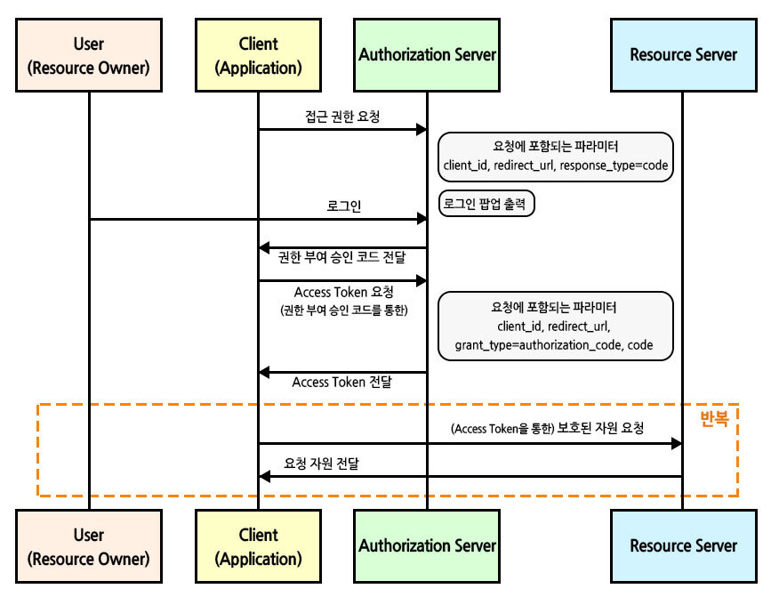

# Spring Security - OAuth 2.0

  - **OAuth**
    - 인터넷 사용자들이 비밀번호를 제공하지 않고,
    - 다른 웹사이트 상의 자신들의 정보에 대해 웹사이트나 애플리케이션의 접근 권한을 부여할 수<br> 있는 공통적인 수단으로써 사용되는, 접근 위임을 위한 개방형 표준
    - 다양한 클라이언트 환경에 적합한 인증 및 인가의 부여(위임)방법을 제공하고,
    - **그 결과로 클라이언트에 접근 토큰(`Access Token`)을 발급하는 것에 대한 구조**

    - **구성요소**
      - **Client**
        - 우리가 개발하는 Service
      - **Resource Owner**
        - 사용자
      - **Authorization Server & Rosource Server**
        - Google, Kakao 등
    - **인증 방식 및 동작 과정**
      - **Authorization Code Grant** : 권한 부여 코드 승인 방식 
        > (가장 기본이 되는 방식)
        - 권한 부여 코드 요청 시, 자체 생성한 `Authorization Code`를 전달하는 방식이다
        - **response_type = code, grant_type = authorization_code의 형식으로 요청**

        
        
        - 1. 권한부여 코드 요청 시, `response_type=code`로 요청하게 되면 클라이언트는 권한 서버(`Authorization Server`)에서<br> 제공하는 로그인 페이지를 브라우저에 띄워 출력한다
        - 2. 해당 페이지를 통해 사용자가 로그인을 하면 `Authorization Server`는 <br>권한 부여 코드 요청 시 전달받은 `redirect_uri`로 `Authorization Code`를 전달한다
        - 3. `Client`는 전달받은 `Authorization Code`를 `Authorization Server`의 API를 통해 `Access Token` 으로 교환하게 된다

      - **Implicit Grant** : 암묵적 승인 방식
      - **Resource Owner Password Credentials Grant** : 자원 소유자 자격 증명 방식
      - **Client Credentials Grant** : 클라이언트 자격 증명 방식


  - **Google, Facebook**
    - 승인된 리다이렉션 URI
      - `http://localhost:8080/login/oauth2/code/google`
      - 구글 로그인이 완료가 되고 나면 구글에서 우리쪽으로 인증된 `code`를 돌려준다
      - 우리는 이 `code`를 다시 돌려주면서 `token`을 요청한다
  
    - **Login && Sign up**
      ``` java
      // 1. 코드를 받는다 -> (인증을 하는 것)
      // 2. 코드를 통해서 엑세스 토큰을 받는다 -> (권한이 생기는 것)
      // 3. 사용자 프로필 정보를 가져와서
      // 4-1. 그 정보를 토대로 회원가입을 자동으로 진행시키기도 한다
      // 4-2. 그 정보가 부족하여 추가 정보를 받고 회원가입을 진행시키기도 한다
      
      .and()
                .oauth2Login()
                .loginPage("/login")   // 구글 로그인이 완료된 뒤의 후처리가 필요하다 
                //-> PrincipalOauth2UserService extends DefaultOAuth2UserService 에서 진행된다
                .userInfoEndpoint()
                .userService(PrincipalOauth2UserService);
                // Tip : 코드를 받는것이 아닌, (액세스 토큰 + 사용자 프로필 정보)를 한방에 받는다


        // Service

        @Service
        @Slf4j
        // 굳이 서비스를 extends를 하고 진행을 하는 이유는
        // 1. loadUse를 재정의하여 PrincipleDetails 타입으로 반환하기 위해서다
        // 2. OAuth(일반로그인 말고)로 로그인했을 때 강제 로그인 시키기 위해서다
        // 생성된 PrincipleDetails 는 Authentication에 담긴다
        // 함수 종료시 @AuthenticationPrincipal 어노테이션이 만들어 진다

        public class PrincipalOauth2UserService extends DefaultOAuth2UserService {
        //Config파일에서 말한 후처리가 이함수에서 진행이된다
        //구글로부터 받은 userRequest 데이터에 대한 후처리되는 함수

        @Autowired
        private UserRepository userRepository;

        @Override
        public OAuth2User loadUser(OAuth2UserRequest userRequest) throws OAuth2AuthenticationException {
          log.info("getAccessToken :" + userRequest.getAccessToken().getTokenValue());

        // 구글로그인 버튼 클릭 -> 구글 로그인 창 -> 로그인을 완료
        // -> code를 리턴(OAuth-Client 라이브러리가 받는다)
        // -> Access Token을 요청한다(라이브러리가)
        // 여기까지가 userRequest 정보
        // userRequest로 회원 프로필을 받는다(이때 사용되는 함수가 loadUser함수)
        // 즉, userRequest 정보 -> loadUser 함수 호출 -> 구글로부터 회원 프로필을 받아준다
          log.info("getAttributes :" + super.loadUser(userRequest).getAttributes());

          OAuth2User oAuth2User = super.loadUser(userRequest);

          OAuth2UserInfo oAuth2UserInfo = null;
          if(userRequest.getClientRegistration().getRegistrationId().equals("google")){
            oAuth2UserInfo = new GoogleUserInfo(oAuth2User.getAttributes());
          }else if(userRequest.getClientRegistration().getRegistrationId().equals("facebook")){
            oAuth2UserInfo = new FacebookUserInfo(oAuth2User.getAttributes());
          }

          // 회원가입을 강제로 진행할 예정
          String provider = oAuth2UserInfo.getProvider();
          String providerId = oAuth2UserInfo.getProviderId();
          String username = provider+"_"+providerId; // google_1293814782
          String email = oAuth2UserInfo.getEmail();
          String role = "ROLE_ADMIN";

          User userEntity = userRepository.findByUsername(username);

          if(userEntity == null){
            userEntity = User.builder()
                    .username(username)
                    .provider(provider)
                    .providerId(providerId)
                    .email(email)
                    .role(role)
                    .build();
            userRepository.save(userEntity);
          }
          return new PrincipalDetails(userEntity, oAuth2User.getAttributes());
        }
      }


      // Controller


      // 밑의 과정을 하나로 통합하자!!
      // 기본 로그인
      @GetMapping("/test/login")
      public @ResponseBody String testLogin(
            Authentication authentication,
            @AuthenticationPrincipal PrincipalDetails userDetails
      ){
        log.info("/test/login===========");
        PrincipalDetails principalDetails = (PrincipalDetails) authentication.getPrincipal();
        log.info("authentication : " + principalDetails.getUser());
        // 1. Authentication 을 DI받아 다운캐스팅을 통해 접근
        log.info("UserDetails : " + userDetails.getUser());
        // 2. @Authentication 을 통해 getUser를 찾을 수도 있다
        return " 새션 정보 확인하기 ";
      }

      // OAuth로 로그인
      @GetMapping("/test/oauth/login")
      public @ResponseBody String testOAuthLogin(
            Authentication authentication,
            @AuthenticationPrincipal OAuth2User oAuth)
      {
        log.info("/test/oauth/login===========");
        OAuth2User oAuth2User = (OAuth2User) authentication.getPrincipal();
        // PrincipalDetails 타입이 아닌 OAuth2User
        log.info("authentication : " + oAuth2User.getAttributes());
        log.info("UserDetails : " + oAuth.getAttributes());
        return " 새션 정보 확인하기 ";
      }


      // 통합한 메서드!
      @GetMapping("/test/lgoin")
      public @ResponseBody String testLogin(@AuthenticationPrincipal PrincipalDetails principalDetails)
      {
        log.info("UserDetails : " + principalDetails.getAttributes());
        return " 새션 정보 확인하기 ";
      }
      


      // OAuthUserInfo
      // google이랑 facebook이랑 ProviderId의 이름이 달라서 공통 인터페이스를 구현한다
      public interface OAuth2UserInfo {
        public String getProviderId();
        public String getProvider();
        public String getName();
        public String getEmail();
      }


      // GoogleUserInfo

      public class GoogleUserInfo implements OAuth2UserInfo{
        private Map<String, Object> attributes;
        public GoogleUserInfo(Map<String, Object> attributes){
          this.attributes = attributes;
        }

        @Override
        public String getProviderId() {
          return (String)attributes.get("sub");
        }

        @Override
        public String getProvider() {
          return "google";
        }

        @Override
        public String getName() {
          return (String) attributes.get("name");
        }

        @Override
        public String getEmail() {
          return (String) attributes.get("email");
        }
      }


      ```
      - **Authentication 정보 가져오기(참조)**
        - 로그인 사용자의 정보가 필요할 때 매번 서버에 요청을 보내 DB에 접근해서 데이터를 가져오는 것은 비효율적이다
        - 따라서 한번 인증된 사용자 정보를 **세션**에 담아놓고 **세션**이 유지되는 동안 사용자 객체를 DB로 접근하는 방법 없이 바로 사용할 수 있도록 한다
        - `Spring Security`에서는 해당 정보를 `SecurityContextHolder` 내부의 `SecurityContext`에 `Authentication` 객체로 저장해두고 있으며 이를 참조하는 방법은 크게 3가지가 있다.
          ``` java
          Authentication authentication = SecurityContextHolder.getContext().getAuthentication();
          User user = (User)authentication.getPrincipal();
          ```
          - **컨트롤러에서 Principal 객체를 주입받아 사용**
          - **컨트롤러에서 @AuthenticationPrincipal 선언하여 엔티티 객체 받아오기**
          - **컨트롤러에서 @AuthenticationPrincipal 선언하여 엔티티의 어댑터 객체 받아오기(가장 권장)**
            - OAuth와 UserDetails 모두를 상속받는 어댑터를 만들자
            

    - **PrincipleDetails**
      - `public class PrincipalDetails implements UserDetails , OAuth2User`
  

  - **Naver**
    - `Spring`에서 제공하는 `Provider(ex:google,facebook,etc..)`에는 `Naver`가 없다<br> 따라서 Provider에 Naver를 추가
      ``` groovy
      security:
        oauth2:
          client:
            registration:
              google: # /oauth2/authorization/google 이 주소를 동작하게 한다.
                client-id: 819863001320-dsvkklnabe2vro9aa8ts1sm5blftukr4.apps.googleusercontent.com
                client-secret: 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
                scope:
                  - email
                  - profile
              facebook: # /oauth2/authorization/facebook 이 주소를 동작하게 한다.
                client-id: 237180259002413
                client-secret: f746c8e186b844d0c7559f38e8c6d564
                scope:
                  - email
                  - public_profile
              naver:
                client-id: O2w1UEYfhVUS0jZq6h0K
                client-secret: Nco_mDcRAm
                scope:
                  - name
                  - email
                client-name: Naver
                authorization-grant-type: authorization_code
                redirect-uri: http://localhost:8080/login/oauth2/code/naver # 구글이나 페이스북에서는 기본으로 설정되어 있어 굳이 안적어주어도 된다

            provider:
              naver:
                authorization-uri: https://nid.naver.com/oauth2.0/authorize 
                // 네이버 로그인 버튼을 클릭하였을 때 이동할 '네이버 로그인' URL을 먼저 생성하여야 합니다.
                token-uri: https://nid.naver.com/oauth2.0/token 
                // Callback으로 전달받은 정보를 이용하여 접근 토큰을 발급받을 수 있습니다. 접근 토큰은 사용자가 인증을 완료했다는 것을 보장할 수 있는 인증 정보입니다.
                user-info-uri: https://openapi.naver.com/v1/nid/me 
                //사용자 로그인 정보를 획득하기 위해서는 프로필 정보 조회 API를 먼저 호출하여야 합니다.
                user-name-attribute: response 
                // 회원정보를 json으로 받는데 response라는 키값으로 네이버가 리턴해준다
      ```
      ```java
      // PrincipalOauth2UserService
      else if(userRequest.getClientRegistration().getRegistrationId().equals("naver")){
            oAuth2UserInfo = new NaverUserInfo((Map)oAuth2User.getAttributes().get("response"));  // Provider마다 리턴되는 형식이 다르다는 점 인지하자
        }
      ```

  